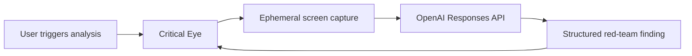

# Critical Eye

> A second pair of eyes for your thinking.

Critical Eye is a Windows desktop companion: an animated, slightly ominous eye
that sits anywhere on your desktop. When you ask (and only when you ask), it
captures the screen you are working on, sends the screenshot to the OpenAI
Responses API, and returns the single most important weakness or questionable
assumption in what you are working on, as a concise one-line challenge you can
expand for evidence and a recommendation.

*Demo screenshot placeholder: `assets/demo/screenshot.png`*

## Architecture



One Electron app, three processes: the main process owns the state machine,
screen capture, the OpenAI client and all secrets; a sandboxed preload exposes
a narrow typed bridge; a React renderer draws the eye (React Bits EvilEye,
WebGL) and the panels. There is no backend, no database and no telemetry.

## Prerequisites

- Windows 10 2004+ or Windows 11
- Node.js 20+
- An OpenAI API key

## Setup

```bash
npm install
copy .env.example .env
# edit .env and set OPENAI_API_KEY (and OPENAI_MODEL if needed)
npm run preflight   # verifies the key and model before you rely on them
npm run dev
```

### Environment variables

| Variable | Purpose |
|---|---|
| `OPENAI_API_KEY` | Required. Read only by the main process; never exposed to the renderer. |
| `OPENAI_MODEL` | Model for analysis. Defaults to `gpt-5.6`. |
| `OPENAI_REASONING_EFFORT` | Optional. Set to `low` on reasoning models to cut latency. Leave unset otherwise. |

For the packaged exe, either set system environment variables or place a
`.env` file next to `CriticalEye-*-portable.exe`.

## Commands

| Command | What it does |
|---|---|
| `npm run dev` | Launch the app with hot reload |
| `npm test` | Run the Vitest suite |
| `npm run typecheck` | Typecheck main, preload and renderer |
| `npm run preflight` | Verify the OpenAI key and model |
| `npm run build` | Production build to `out/` |
| `npm run package:win` | Build the portable Windows exe into `dist/` |
| `npm run package:dir` | Unpacked build (faster; fallback) |

## Using it

- Drag the eye anywhere by its outer ring (or the panel top strips).
- Click the eye (or press `Ctrl+Shift+R`) to analyse the display under your
  cursor. The eye blinks while capturing, pulses while thinking, then shows a
  one-line finding you can expand.
- Right-click the eye for the menu (analyse, text analysis, pause, hide, quit).
- The Text tab in the expanded panel analyses pasted text (up to 12,000
  characters) with the same structured output: the reliable fallback when a
  screen cannot be captured.
- Modes (General, Strategy, Security, Writing, Delivery) focus the critique
  and persist between runs.

### Keyboard shortcuts

| Shortcut | Action |
|---|---|
| `Ctrl+Shift+R` | Capture the current display and analyse it (global) |
| `Ctrl+Shift+Space` | Show or hide Critical Eye (global) |
| `Ctrl+Alt+P` | Pause or resume analysis (global) |
| `Esc` | Collapse the expanded panel |
| `Ctrl+Enter` | Submit the text tab |

Pause is deliberately not `Ctrl+Shift+P`: that would steal the VS Code command
palette system-wide.

## Privacy behaviour

- Capture happens only when you trigger it. There is no background capture,
  polling, audio, keylogging or clipboard monitoring.
- Screenshots are analysed in memory and are not saved. Nothing is written to
  disk and image bytes are never logged.
- The screenshot is sent to exactly one place: the OpenAI API call you
  configured. There is no telemetry and no history.
- The paused state is visible (the eye desaturates) and blocks all capture.

## Security notes

- `nodeIntegration: false`, `contextIsolation: true`, `sandbox: true`; the
  renderer sees only a narrow typed bridge, and every IPC argument is
  validated with zod in the main process.
- The API key lives only in the main process environment. It is never exposed
  through the bridge, logged, stored in renderer-accessible storage or
  bundled (no `VITE_` variables).
- Strict CSP, navigation and window-open denied, no remote content.

## Hackathon demo script

1. Open `assets/demo/flawed-proposal.html` in a browser. Position the eye
   beside it.
2. Say: "It only looks when I ask." Point at the Ready status.
3. Press `Ctrl+Shift+R`. Narrate the blink (capturing) and pulse (thinking);
   the elapsed counter fills the silence.
4. Read the one-line challenge aloud. Expand it: evidence, recommendation,
   confidence.
5. Switch mode to Security, open `assets/demo/insecure-snippet.ts` in an
   editor, press `Ctrl+Shift+R` again.
6. Open the Text tab, paste two paragraphs of the proposal, click "Red team
   this" (deliberately showing the fallback path).
7. Press `Ctrl+Alt+P`: the eye dims and triggers are refused. Resume.
8. Close: "Screenshots live in memory, go only to OpenAI, and are never
   saved."

## Manual test checklist

- [ ] App launches; transparent animated eye appears
- [ ] Eye drags by its ring; position survives a restart
- [ ] Eye tracks the cursor across all monitors
- [ ] `Ctrl+Shift+R` captures the display under the cursor on each monitor
- [ ] The eye is absent from its own screenshot
- [ ] A finding appears within ~30 s; expand shows evidence and recommendation
- [ ] Dismiss returns to the eye; Reanalyse works
- [ ] Text tab analyses pasted text; `Ctrl+Enter` submits
- [ ] Pause blocks triggers and dims the eye; resume restores
- [ ] Renaming `.env` produces the friendly missing-key message
- [ ] Disconnecting the network produces the friendly network message
- [ ] Right-click menu works; Quit exits cleanly
- [ ] Packaged exe repeats the core journey

## Known limitations

- Hackathon MVP: automated tests cover the pure decision logic (schema,
  prompts, error mapping, geometry, preferences, gating); Electron plumbing is
  verified manually with the checklist above. No coverage target today.
- The portable exe is unsigned, so SmartScreen may warn on first run.
- Single display capture per trigger (the display under the cursor).
- `Ctrl+Shift+R` is globally captured while the app runs, which overrides
  browser hard-reload; quit Critical Eye to restore it.
- The gaze anchor assumes the eye sits at the window's top-left region; in
  compact mode the aim is approximate.

## Attribution

The eye is the **EvilEye** background component from
[React Bits](https://reactbits.dev/backgrounds/evil-eye) by David Haz, vendored
and adapted under the MIT + Commons Clause licence. See `THIRD-PARTY.md` and
`src/renderer/src/components/EvilEye/REACT-BITS-LICENSE.md`.

## Roadmap (explicit non-goals today)

System tray icon, start with Windows, feedback counters, copy button, capture
display selector, richer eye animations, NSIS installer, continuous monitoring
(never without explicit consent), Office add-ins, browser extensions, team
features, auto-update.
