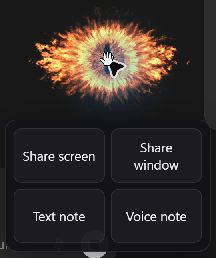
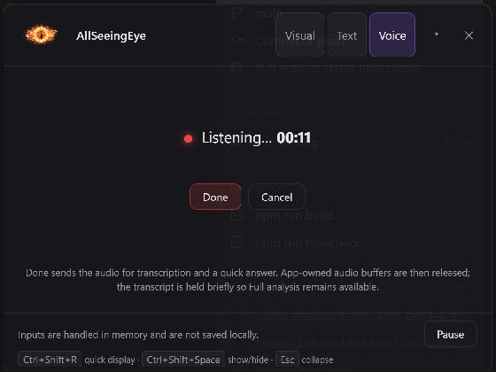
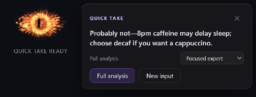
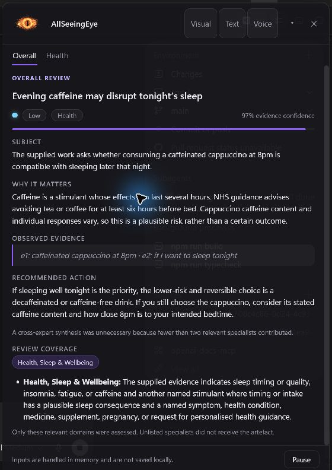

# AllSeeingEye

[](https://github.com/ShabalalaWATP/AllSeeingEye/actions/workflows/ci.yml)
[](https://github.com/ShabalalaWATP/AllSeeingEye/actions/workflows/codeql.yml)

> A second pair of eyes for your thinking.

AllSeeingEye is a local-first Windows desktop companion that challenges what you
show it. The animated eye stays out of the way until you deliberately share a
display, an application window, a text note or a voice note. Every input receives
a short general-model quick take first. A full analysis is optional and invokes
only the domain experts that are relevant to the supplied material.

It is designed for reviewing ideas, documents, interfaces, plans, policies,
technical designs and everyday decisions. It is decision-support software, not
an automated certification, legal opinion, financial recommendation, medical
diagnosis or security guarantee.

## Feature tour

### Choose exactly what to share



The eye remains visible while its four input actions open beneath it. Visual
inputs use a local preview picker, text accepts up to 12,000 characters, and
choosing Voice note begins recording immediately.

### Speak, then press Done



Done sends the audio for transcription and automatically requests the quick
take. There is no separate transcription editor or second Analyse action.

### Get the concise answer first



The first answer is a structured, unscored and uncited quick take of at most 96
characters. It uses one general-model call and does not load the router, expert
agents or knowledge packs.

### Expand only when deeper review is useful



Full analysis reuses the exact submitted input and exposes Overall plus only the
experts that contributed. Choose Focused expert for the best-fit specialist or
Combined experts for a bounded cross-domain review.

## What it does

- Reviews a selected display or top-level application window.
- Reviews pasted text and questions up to 12,000 characters.
- Records an audio-only voice note for up to 120 seconds or 10 MiB, transcribes
  it once, then analyses the transcript.
- Accepts an optional specific question for visual and text inputs. A voice note
  can ask the question naturally.
- Returns a one or two-sentence quick take before showing any expert analysis.
- Routes a full review to only the relevant specialists.
- Supports Focused and Combined full-review depths.
- Preserves expert disagreement, assumptions, evidence and validation needs.
- Keeps capture, routing, state and credentials in the Electron main process.
- Stores no analysis history and includes no telemetry or remote AllSeeingEye
  backend.

All model and transcription requests go directly from the local Electron main
process to the configured OpenAI API. Provider retention and account-level data
controls still apply.

## How the analysis works

### Quick take

Every input follows the same first stage:

1. Validate and bound the selected image, supplied text or voice transcript.
2. Send one independent structured request to the configured general model.
3. Return only a concise answer. No severity, confidence, expert label or
   citation is generated.
4. Retain the exact input in memory behind a UUID for up to five minutes so the
   user may choose Full analysis once.

The quick answer is deliberately not supplied to the full expert board, so it
cannot anchor or bias the deeper review.

### Full analysis

If Full analysis is chosen:

1. The main process atomically consumes the UUID-bound input.
2. An observation call converts the artefact into bounded evidence and typed
   routing signals.
3. A deterministic TypeScript policy selects relevant experts. The model cannot
   directly choose arbitrary agent IDs.
4. Selected agents run in parallel with their scoped evidence and versioned
   knowledge packs.
5. Outputs are schema-validated, citation allow-listed and filtered for
   relevance before presentation.
6. Combined mode invokes the chair only when two or more relevant specialists
   contributed. Otherwise Overall is assembled directly from the primary result.
7. The UI shows Overall followed by one tab per contributing expert.

Focused mode selects mandatory safety experts plus the strongest ordinary
specialist. Combined mode adds up to four ordinary specialists, with a hard cap
of six total agents. An Evidence & Research fallback handles genuine claims that
do not match another specialist. Partial expert success remains useful, and a
failed synthesis falls back to the validated individual results.

## Architecture

```mermaid
flowchart LR
    U["User selects screen, window, text or voice"] --> R["React renderer"]
    R -->|"Validated narrow IPC"| P["Sandboxed preload bridge"]
    P --> M["Electron main process"]
    M --> Q["General-model quick take"]
    Q -->|"Full analysis selected"| O["Observation and typed signals"]
    O --> D["Deterministic local router"]
    D --> E["Relevant expert agents only"]
    E --> V["Validation and relevance filtering"]
    V --> C["Optional Combined chair synthesis"]
    C --> UI["Overall and contributing expert tabs"]
```



### Electron main process

The main process is the local backend. It owns:

- API credentials and the OpenAI client.
- Screen/window enumeration and bounded capture.
- Voice transcription.
- The analysis gate, operation generation, cancellation and timeouts.
- UUID-bound pending inputs and their five-minute expiry.
- Observation, deterministic routing, expert execution and optional synthesis.
- Versioned knowledge packs, source allow-lists and output sanitisation.
- Application state, global shortcuts, window geometry and pause behaviour.

There is no database, server-side AllSeeingEye service, runtime web search,
analysis history or telemetry.

### Preload bridge

The sandboxed preload exposes a small typed API rather than raw Electron
primitives. The main process validates the sender, main frame and payload for
every privileged IPC operation.

### React renderer

The renderer owns presentation and interaction only:

- Animated WebGL eye and gaze behaviour.
- Input tray, source previews and input composers.
- Voice recording through `MediaRecorder`.
- Quick result and full-review workspaces.
- Overall and expert result tabs.

It cannot access Node.js, the API key, the OpenAI client or arbitrary IPC.

## Expert board

AllSeeingEye currently contains twelve specialist agents:

| Agent | What it challenges |
|---|---|
| Cyber Security & Privacy | Threats, abuse paths, data exposure, access control, operational security and privacy risk. |
| User Experience & Accessibility | Usability, accessibility, interaction costs, failure recovery and inclusive design. |
| Finance & Commercial Viability | Unit economics, cash flow, pricing, incentives, commercial assumptions and downside exposure. |
| Legal & Regulatory | Applicable legal duties, jurisdiction, contracts, data protection and verification needs. |
| Public Policy & Governance | Public-interest consequences, institutional incentives, enforceability and policy trade-offs. |
| Ethics & Societal Impact | Rights, fairness, autonomy, power, vulnerable groups and foreseeable social harm. |
| Technical Architecture | Boundaries, failure modes, data flow, scale, resilience, dependencies and maintainability. |
| Product & Differentiation | User need, alternatives, defensibility, positioning, adoption friction and uniqueness. |
| Writing & Editorial Quality | Structure, clarity, claims, tone, ambiguity and audience fit when editorial review is relevant. |
| Evidence & Research Quality | Claim quality, source strength, uncertainty, missing validation and unsupported inference. |
| Health, Sleep & Wellbeing | Proportionate everyday health and wellbeing reasoning without diagnosis or prescribing. |
| Delivery & Operations | Execution risk, ownership, sequencing, support, monitoring and operational readiness. |

### Knowledge packs

Each expert has a versioned pack containing its remit, exclusions, routing
signals, co-routing rules, adversarial rubric, jurisdictions, review date,
allow-listed source register and disclaimer. Health currently also contains
explicit source-linked factual notes. Other agents use their source registers
and stable model background knowledge, but model-only propositions cannot be
presented as pack citations.

Representative source families include:

- Cyber: OWASP, NIST, NCSC and ICO guidance.
- UX: WCAG, WAI-ARIA and GOV.UK service guidance.
- Legal: UK GDPR, the Data (Use and Access) Act 2025, Computer Misuse Act,
  Equality Act, EU AI Act and consumer protection material.
- Architecture and delivery: NIST, CISA, cloud reliability and operational
  guidance.
- Health: NHS, NICE, Food Standards Agency and EFSA material.

The packs are curated review aids, not live legal or regulatory databases.
High-stakes and time-sensitive conclusions must be independently verified.
See [Expert knowledge base](docs/EXPERT_KNOWLEDGE_BASE.md) for the complete
pack policy and source register.

## Requirements

- Windows 10 version 2004 or later, or Windows 11.
- Node.js 20 or later for development.
- An OpenAI API key with access to the configured analysis and transcription
  models.

## Setup for development

```powershell
git clone https://github.com/ShabalalaWATP/AllSeeingEye.git
cd AllSeeingEye
npm install
Copy-Item .env.example .env
```

Edit `.env` and set at least:

```dotenv
OPENAI_API_KEY=your_api_key_here
```

Then verify the model configuration and launch:

```powershell
npm run preflight
npm run dev
```

Never commit `.env`. If an API key is exposed in code, logs, screenshots or
chat, revoke and rotate it.

### Environment variables

| Variable | Required | Purpose |
|---|---:|---|
| `OPENAI_API_KEY` | Yes | Read only by the Electron main process. |
| `OPENAI_MODEL` | No | Analysis model. Defaults to `gpt-5.6-sol`. |
| `OPENAI_TRANSCRIPTION_MODEL` | No | Voice transcription model. Defaults to `gpt-4o-transcribe`. |
| `OPENAI_REASONING_EFFORT` | No | Full-review reasoning effort when supported by the selected model. |
| `OPENAI_QUICK_REASONING_EFFORT` | No | Quick-take reasoning effort. Defaults to `low`. |

For the portable build, set system environment variables or place `.env`
beside `AllSeeingEye-*-portable.exe`.

## How to use AllSeeingEye

### Open an input

- Hover or keyboard-focus the eye to reveal the four-option tray.
- Right-click the idle eye as a fallback.
- Select Share screen, Share window, Text note or Voice note.
- Use `Ctrl+Shift+R` for the direct display-under-pointer shortcut.

Clicking the eye opens the input launcher. It does not silently capture a
display.

### Screen and window

1. Choose a display or application-window preview.
2. Optionally open Ask something specific and enter a focus question.
3. Choose Get a quick take.
4. Review the concise answer.
5. Select Focused expert or Combined experts, then choose Full analysis if a
   deeper review is worthwhile.

Preview tokens expire after 60 seconds. Refresh the list if a selected source
expires or closes.

### Text

1. Open Text note.
2. Type or paste the material to review.
3. Optionally add a specific question.
4. Choose Get a quick take or press `Ctrl+Enter`.
5. Expand to Full analysis only when needed.

### Voice

1. Deliberately choose Voice note. AllSeeingEye immediately requests audio-only
   microphone access and begins listening.
2. Speak naturally, including the question you want answered.
3. Choose Done after at least half a second.
4. AllSeeingEye stops recording, transcribes once and automatically requests
   the quick take.
5. Expand to a full expert review if needed.

Cancel, Escape, Pause, dismissal and component teardown stop the recording and
release its main-process reservation.

### Keyboard shortcuts

| Shortcut | Action |
|---|---|
| `Ctrl+Shift+R` | Analyse the display under the pointer. |
| `Ctrl+Shift+Space` | Show or hide AllSeeingEye. |
| `Ctrl+Alt+P` | Pause or resume all analysis triggers. |
| `Esc` | Close a transient control or collapse the expanded panel. |
| `Ctrl+Enter` | Submit the text input. |

`Ctrl+Shift+P` is deliberately avoided because it would override the VS Code
command palette system-wide.

## Privacy and security model

- Capture and recording occur only after a deliberate user action. There is no
  background capture, polling, clipboard monitoring, keylogging or continuous
  listening.
- Visual input is scaled to at most 2560 pixels, encoded as JPEG at 75 quality
  and rejected above 8 MiB.
- Screenshots, audio, transcripts and analyses are not persisted by the app
  during normal operation.
- Local source previews are not sent to the model. The selected source is
  represented by an expiring, exact-match token.
- The AllSeeingEye window is hidden from display capture while the requested
  pixels are collected.
- Renderer audio is cleared after IPC hand-off. Main-process audio copies are
  cleared or released after transcription. Only the transcript is retained for
  the optional full-review window.
- Pending inputs are UUID-bound, actively expire after five minutes and can be
  consumed only once. Dismissal, pause, replacement and quit clear them sooner.
- The raw full-review artefact is dropped immediately after observation.
  Specialist agents receive only scoped evidence.
- Responses requests use `store: false`. The configured transport has a
  45-second timeout and at most one provider retry.
- Pause, dismissal, replacement and quit abort or invalidate late results.
- Electron uses `nodeIntegration: false`, `contextIsolation: true` and
  `sandbox: true`, with a restrictive content security policy.
- Navigation and new-window requests are denied.
- Permission handlers allow only audio-only microphone requests from the app's
  own main frame. Other media permissions are denied.
- The API key remains in the main process and is never exposed through the
  renderer bridge or a `VITE_` variable.

Because network failures can be ambiguous, full-review hand-offs fail closed
and are not replayed. Start a new input if a consumed full analysis fails.

## Development commands

| Command | Purpose |
|---|---|
| `npm run dev` | Start Electron with hot reload. |
| `npm test` | Run deterministic Vitest tests. |
| `npm run typecheck` | Type-check main, preload and renderer targets. |
| `npm run preflight` | Validate environment and configured OpenAI model access. |
| `npm run build` | Create production bundles in `out/`. |
| `npm run package:win` | Build `dist/AllSeeingEye-<version>-portable.exe`. |
| `npm run package:dir` | Build the unpacked Windows directory. |

The automated suite covers schemas, routing policy, pack integrity,
preferences, state, geometry, expiry, gates and session behaviour. Electron
capture, microphone and packaged UI journeys are verified manually because the
current suite does not include a renderer browser harness.

## Repository layout

```text
src/main/                 Electron backend, IPC, state and OpenAI orchestration
src/main/agents/          Observation, routing, expert and synthesis pipeline
src/main/knowledge/       Versioned expert packs and source registers
src/main/core/            Validation, sessions, prompts and pure state logic
src/preload/              Narrow typed renderer bridge
src/renderer/             React UI, animated eye and input/result components
src/shared/               Shared domain and IPC types
tests/                    Deterministic unit and policy tests
assets/demo/              Deliberately flawed demonstration material
assets/screenshots/       README feature screenshots
docs/                     Architecture, implementation and development records
```

## Packaging

```powershell
npm run package:win
```

The portable executable is written to `dist/`. The project does not currently
ship with a trusted code-signing certificate, so Windows SmartScreen may warn on
first launch. The renamed `appId` and product name mean Windows treats
AllSeeingEye as a new application identity; existing saved position and
microphone permission from earlier builds may not carry over.

## Known limitations

- Windows only.
- Region capture, visual redaction and automatic cropping are not implemented.
- Application-window capture selects one top-level window, not every window in
  an application.
- Knowledge packs are curated in the repository and are not refreshed through
  live browsing.
- Legal, policy, financial, health and security conclusions require qualified
  human verification where stakes are material.
- No installer, auto-update, system-tray icon or start-with-Windows flow yet.
- The global `Ctrl+Shift+R` shortcut overrides browser hard reload while the app
  is running.

## Attribution and licence

Original application code is available under the [MIT licence](LICENSE). The
eye uses the vendored **EvilEye** background component from
[React Bits](https://reactbits.dev/backgrounds/evil-eye) by David Haz. That
component has separate MIT plus Commons Clause terms. Review
[THIRD-PARTY.md](THIRD-PARTY.md) and
[`REACT-BITS-LICENSE.md`](src/renderer/src/components/EvilEye/REACT-BITS-LICENSE.md)
before redistribution or commercial use.

## Further documentation

- [Expert knowledge base](docs/EXPERT_KNOWLEDGE_BASE.md)
- [Master implementation plan](docs/MASTER_IMPLEMENTATION_PLAN.md)
- [Development story](docs/DEVELOPMENT_STORY.md)
- [Original hackathon plan, historical](docs/PLAN.md)
