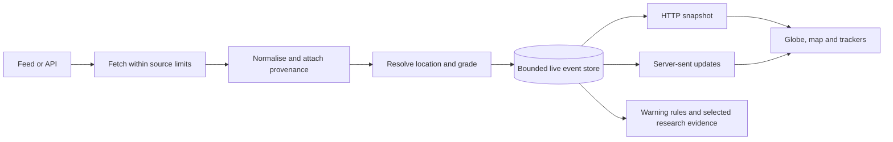
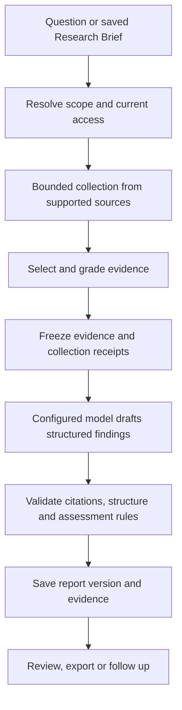

# Architecture

[Documentation](README.md) · [Setup](SETUP.md) · [Sources](02_DATA_SOURCES.md) · [AI](AI.md)

The All Seeing Eye is a modular monolith: one Python application owns collection,
research and saved work, and a React client provides the interface. External feeds
and model providers sit behind adapters. A relational database stores durable
records; a bounded in-memory store holds the live public event stream.

This keeps a self-hosted installation manageable while giving individual parts
of the code clear responsibilities.

## The stack

| Area | Technology | Role |
| --- | --- | --- |
| Browser | React 19, TypeScript, Vite, Tailwind CSS | Workspaces, forms and report readers |
| Maps | MapLibre GL, deck.gl | Globe, flat map, observations and overlays |
| Specialised graphics | Three.js; OGL | Selected 3D views; animated Eye branding |
| Client state and validation | Zustand, Zod | Shared session/live state and validated API responses |
| API | Python 3.12+, FastAPI, Pydantic | Typed HTTP endpoints and server-sent events |
| Persistence | SQLAlchemy, Alembic | Database access and schema migrations |
| Databases | SQLite for native development; PostgreSQL for Compose | Accounts, research, reports and configuration |
| Model access | OpenAI-compatible HTTP APIs; AWS Bedrock Converse | Configurable AI connections behind gateway ports |
| Serving | Caddy, Docker Compose | HTTPS, static files and API proxying |
| Tooling | uv, pnpm, pytest, Vitest, Ruff, mypy, ESLint | Locked dependencies, tests and static checks |

Exact versions are recorded in [backend dependencies](../backend/pyproject.toml),
[frontend dependencies](../frontend/package.json), their lockfiles and
[Compose](../docker-compose.yml). The Compose database uses a PostGIS image;
the application does not require a separate vector database.

## System context



## Application containers



These are logical C4 views, not a map of a particular server. Their source is
the [Structurizr workspace](diagrams/workspace.dsl); see
[diagram maintenance](diagrams/README.md) to validate or regenerate them.

The Compose stack separates the web server, API, database and file parser. The
parser has no network access and receives bounded extraction requests over a
local socket. Native development uses an isolated subprocess instead.

**Run one API process.** Live events, rate limits, model admission and parts of
background coordination are process-local. Adding HTTP workers requires a
shared-state design, not just a higher worker count. The parser is a separate
worker for untrusted files, not another API instance.

## From a feed to the map



Collectors preserve source identity, dates, location precision and grading
rationale. The browser loads a snapshot and then receives updates and expiries
through an authenticated stream. A stream gap triggers a new snapshot.

An empty map can mean no matching retained observations, a disabled layer or an
unavailable source. It does not prove that nothing happened in an area.

## From a question to a saved report



On-demand collection is private to the research operation. Selected evidence and
receipts are saved with the report; unselected results do not become a growing
shared archive. The report job records progress separately from a browser tab.
Retries reuse admitted work when the request identity is unchanged. A regenerated
report is a new version, with its requirements and brief provenance retained.

Subscriptions add scheduling, durable editions, retry controls and optional
comparison with the previous successful report. Pausing stops future admission;
it is not a promise to undo an external model call already made.

The [AI guide](AI.md) explains provider routing and which checks are deterministic.

## Code boundaries and SOLID

```text
backend/src/ase/
  domain/          Entities, values, assessment rules and pure calculations
  application/     Use cases and protocol ports
  adapters/        Persistence, feeds, AI, exports and other external systems
  api/             HTTP routes, transport schemas and request dependencies
  infrastructure/  Settings, logging and process services
  container/       Construction and wiring of concrete dependencies

frontend/src/
  app/             Routes, session boundaries and application shells
  features/        Individual workspaces and their interactions
  components/      Shared interface components
  lib/             API clients, schemas, shared policy and hooks
  stores/          Shared browser state
```

The project applies **SOLID principles pragmatically**. The goal is to make
behaviour easier to change and test without spreading one change across the app.

| Principle | How it is applied |
| --- | --- |
| Single responsibility | Routes handle HTTP, use cases own policy, adapters perform external work. UI hooks own asynchronous state while components render and handle interaction. |
| Open/closed | Source and model implementations plug into shared contracts. Adding a provider should not require rewriting report policy. Registration and configuration remain explicit. |
| Liskov substitution | Adapters must preserve the same result, failure and cancellation semantics. Contract and regression tests check behaviours such as model output exhaustion. |
| Interface segregation | Focused protocol ports and component inputs expose what a consumer needs. Capability metadata makes optional provider behaviour explicit. |
| Dependency inversion | Domain and application logic depend on inward-facing types and ports. The composition root supplies concrete persistence, network and model implementations. |

Import-linter enforces backend dependency rules. ESLint prevents frontend
features from importing one another directly; shared behaviour belongs in shared
modules. Strict typing and behaviour tests support these boundaries.

This is a design practice, not a certification of perfect separation. A small
explicit exception list remains for subscription read projections, and some
subscription coordination lives in the composition package. The enforced
contracts are the source of truth, rather than file size or a SOLID score.

## What is stored

| Data | Lifetime and location |
| --- | --- |
| Live public observations | Bounded in-memory retention; rebuilt after restart |
| Reports and selected evidence | Durable report versions with frozen provenance and assessments |
| Research Briefs, subscriptions, jobs and team work | Durable records with current access checks |
| Accounts, sessions, source and AI configuration | Database; sensitive connection values are encrypted |
| Supplied research files | Bounded, expiring private inputs; original-file retention requires the relevant explicit workflow |
| Satellite orbital inputs | Bounded replacement cache and request cooldowns; propagated positions are recomputed |
| Report search embeddings | Bounded index of selected saved reports, separate from raw live events |

Reference catalogues and small operational aggregates have their own bounded
storage. A saved excerpt or source URL is not proof of authenticity, and does not
imply that a complete original website was archived.

## Access and external work

Personal and team records have object-level access checks. Background work checks
the current owner, membership and team state too. Sensitive mutations serialise
authority checks with relevant account/team changes; long network and model
calls run outside those locks, followed by a fresh access check before release.

Feed URLs, document input and model output are untrusted. Outbound requests,
parsing and rendering use separate bounded adapters. See
[security and privacy](07_SECURITY_BY_DESIGN.md) for the relevant controls and
[self-hosting](DEPLOYMENT.md) for deployment requirements.
