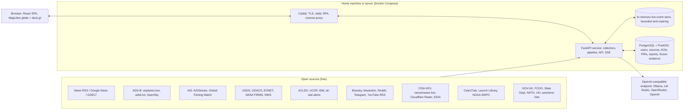
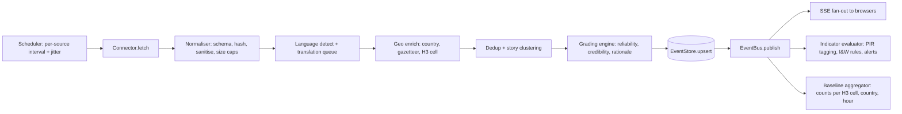

# The All Seeing Eye: Architecture Proposal

Status: proposal for review (2 September 2026). Nothing here is built yet.

This document describes the intended shape of the system. It is deliberately opinionated so that it can be argued with. Decisions that need Alex's input are collected in `06_OPEN_QUESTIONS.md`; the reasoning behind the bigger choices is in `docs/adr/`.

## 1. Design principles

1. **One fusion core.** Every feed, whatever its origin (RSS, GeoJSON, ADS-B, AIS, TLE, API), is normalised into a single `Event` model. The globe, the filters, the trackers, the grading engine and the report generator all consume `Event`s. Adding a source never touches the UI.
2. **Grade before generate.** Source reliability and information credibility are assigned deterministically, in code, before any LLM sees the material. The LLM is told the grades and must reason with them; it never invents them.
3. **Cache, do not hoard.** Live feed data is a bounded, expiring cache held in memory. Only three things are durable: accounts and configuration, AI reports, and the frozen evidence a report cites. The database cannot grow unless someone generates reports.
4. **Connectors are plugins; news sources are data.** Bespoke APIs get a small connector class. The hundreds of RSS/Atom feeds are rows in a source registry consumed by one generic connector.
5. **Everything from the internet is hostile.** Feed content, article text, social posts and LLM output are untrusted input. They are size-limited, sanitised, schema-validated and never executed, rendered as HTML, or treated as instructions.
6. **Modular monolith.** One FastAPI process, one database, one SPA. Clear internal boundaries (domain, application, adapters, API) so that the collectors could be split into a worker later without a rewrite. No message broker, no microservices, no cloud services.
7. **Doctrine shapes the domain.** The intelligence cycle (Direction, Collection, Processing, Dissemination) is the product's information architecture, not a slogan. Priority Intelligence Requirements, areas of interest, indicators, graded sources and structured products are first-class objects.
8. **SOLID, applied pragmatically.** Small modules (350 lines target, 400 hard ceiling), dependency inversion through `Protocol` ports, strategies for anything that varies by category or source.

## 2. System context



## 3. Runtime topology

| Container | Role | Notes |
|---|---|---|
| `caddy` | TLS termination, serves the built SPA, proxies `/api` and `/api/stream` | Automatic local HTTPS for LAN; Tailscale recommended for remote access rather than port forwarding |
| `api` | FastAPI app, background collectors, pipeline, scheduler, SSE fan-out | Single uvicorn worker on purpose (the live store is in-process). Vertical headroom is plenty for a handful of users |
| `db` | PostgreSQL 16 with PostGIS | Durable tier only. Daily `pg_dump` to a mounted folder |

The collectors run inside the API process as asyncio tasks. If it ever becomes necessary, the same code runs as a separate `worker` container by swapping the in-memory store for a Redis-backed implementation of the same port. That is an ADR-level change, not a rewrite.

## 4. Backend architecture (Python 3.12, FastAPI, uv)

### 4.1 Layering

```
backend/src/ase/
  domain/          Entities, value objects, enums, pure domain services. No I/O, no framework imports.
  application/     Use cases and ports (typing.Protocol). Orchestrates the domain. No framework imports.
  adapters/        Implementations of ports.
    feeds/         One module per bespoke connector, plus generic RSS/GeoJSON/CSV connectors.
    llm/           OpenAI-compatible gateway, prompt templates, output validators.
    persistence/   SQLAlchemy 2.0 async repositories, Alembic migrations.
    geo/           Country resolver (Natural Earth polygons), gazetteer geocoder (GeoNames dump), H3 helpers.
    archive/       Wayback Machine archiver.
    notify/        Email (SMTP) and webhook notifiers.
    translate/     LLM-backed translator, language detection.
  api/             FastAPI routers, request/response schemas, auth dependencies. Thin: validate, call use case, map result.
  infrastructure/  Settings, database session, scheduler, event bus, security primitives, structured logging.
```

Dependency rule: `api` and `adapters` depend on `application` and `domain`; `application` depends only on `domain`; `domain` depends on nothing. A lightweight composition root (the `ase.container` package: the core plus a feature-factory mixin) wires adapters to ports at startup. Tests substitute fakes at the port boundary.

### 4.2 Ports (the seams)

| Port (Protocol) | Responsibility | Initial adapter | Later alternative |
|---|---|---|---|
| `FeedConnector` | Fetch one source and return normalised `Event`s | About 15 bespoke connectors plus `RssConnector`, `GeoJsonConnector` | Any new source |
| `EventStore` | Bounded live store: upsert, query, prune, stats | `InMemoryEventStore` | `RedisEventStore` |
| `EventBus` | Publish pipeline output to subscribers (SSE, indicators) | In-process asyncio queues | Redis pub/sub |
| `LLMGateway` | Chat completion with optional JSON schema; optional embeddings | `OpenAICompatibleGateway` | Fake gateway for tests |
| `Translator` | Batch translate short texts | `LLMTranslator` | LibreTranslate |
| `Geocoder` | Resolve place names in text to coordinates and country | `GazetteerGeocoder` | LLM-assisted for high-value items |
| `CountryResolver` | Point in polygon to ISO country | Natural Earth + shapely STRtree | |
| `Archiver` | Preserve a URL for provenance | `WaybackArchiver` | archive.today |
| `Notifier` | Deliver alerts | `EmailNotifier`, `WebhookNotifier` | ntfy, Discord |
| Repositories | Durable persistence per aggregate | SQLAlchemy async on PostgreSQL | SQLite for tests |
| `Clock`, `IdGenerator` | Determinism in tests | System | Fixed |

### 4.3 The unified Event model

```python
@dataclass(frozen=True, slots=True)
class Event:
    id: EventId                 # sha256(source_id + stable upstream id or canonical URL)
    source_id: SourceId
    category: Category          # news | conflict | disaster | aviation | maritime | space | cyber | social | political | humanitarian | economic
    subtype: str                # e.g. "earthquake", "military_flight", "air_raid_alert", "ransomware_victim"
    title: str
    summary: str | None         # plain text, sanitised, bounded (2 KB)
    url: str | None
    published_at: datetime      # upstream time
    observed_at: datetime       # when we saw it
    language: str               # ISO 639-1, detected
    title_en: str | None        # translation when language != en
    geometry: Geometry | None   # point, polygon or None (WGS84)
    geo_confidence: GeoConfidence  # exact | city | admin1 | country | none
    country_iso: str | None
    entities: tuple[Entity, ...]   # people, orgs, places, aircraft, vessels (bounded)
    tags: frozenset[str]
    severity: float | None      # 0..1, category-specific scale
    reliability: Reliability    # A..F (from source registry)
    credibility: Credibility    # 1..6 (computed by grading engine)
    grade_rationale: str        # human-readable explanation of the grade
    story_id: StoryId | None    # cluster of corroborating events
    attributes: Mapping[str, JsonScalar]  # bounded, category-specific extras (aircraft hex, magnitude, FRP, mmsi)
    content_hash: str           # for change detection and provenance
```

`attributes` is the escape hatch that keeps the model closed for modification while categories extend it. Rendering rules, icons, colours and detail panels are looked up by `(category, subtype)` in a single registry shared between backend metadata and frontend styling.

### 4.4 Ingestion pipeline (the Processing phase)



Each stage is a small class implementing `PipelineStage` with a single `process(batch) -> batch` method, composed in order at startup. Stages are individually unit tested with fixtures. A stage failure isolates to the batch, never the process.

Connector execution rules:

- Each connector runs in its own asyncio task with a hard timeout and a per-source semaphore.
- A circuit breaker backs off exponentially after failures and marks the source `degraded`, then `disabled` after a configurable number of failures; the admin page shows why.
- HTTP fetches use conditional requests (`ETag`, `If-Modified-Since`) where supported, a descriptive `User-Agent`, response size caps, and a redirect policy that refuses private address space.
- Per-source health (last success, last error, items per poll, latency) lives in memory and is exposed on `/api/admin/sources/health`.

### 4.5 The live store and the "no huge database" rule

The live tier is an in-memory store with explicit budgets. Nothing in it is ever written to PostgreSQL.

| Category | Retention window | Item cap | Approx. memory |
|---|---|---|---|
| Aviation (ADS-B snapshot) | latest snapshot only; trail of 10 positions for tracked aircraft | 15,000 aircraft | ~10 MB |
| Maritime (AIS in subscribed boxes) | 30 minutes per vessel | 20,000 vessels | ~10 MB |
| Fires (FIRMS) | 48 hours | 150,000 hotspots | ~25 MB |
| Earthquakes / disasters | 7 days (mirrors upstream feed windows) | 5,000 | ~2 MB |
| News (RSS, Google News, GDELT GEO) | 72 hours, metadata plus a 2 KB summary, no full text | 40,000 items | ~80 MB |
| Conflict events (ACLED/UCDP) | 30 days for active conflict AOIs, 7 days elsewhere | 30,000 | ~15 MB |
| Social | 24 hours | 10,000 | ~15 MB |
| Cyber / political / economic | 7 days | 5,000 | ~5 MB |

Mechanics:

- `InMemoryEventStore` keeps a dict by `EventId`, per-category deques ordered by `observed_at`, and secondary indexes by `country_iso`, `story_id` and H3 cell (resolution 3 for globe heat maps, 6 for map-mode queries).
- A prune loop runs every 60 seconds: evict beyond the window, then beyond the cap, then beyond a global memory budget (default 512 MB, measured by sampled item size, displayed in the admin System page).
- An optional snapshot writes the store to `data/cache/live.parquet` every 5 minutes so a restart does not blank the globe. It is a cache file, not a database, and is safe to delete at any time.
- Historic questions ("conflict events in the last 90 days") are answered by querying the upstream API on demand with a short TTL cache, not by keeping history locally. ACLED, UCDP, GDELT DOC, USGS FDSN and ReliefWeb all support date-range queries.
- **Baselines, not history.** For Indicators and Warning the app needs "normal" levels (for example military flights over the Eastern Mediterranean per hour). It stores hourly counts per H3 cell and per country per category in a small `baseline_stats` table. That is a few megabytes per year, and it is enough to detect anomalies without storing a single raw event.
- **Evidence freezing.** When a report is generated, the specific events it cites are copied into `evidence` rows (title, summary, URL, grade, geometry, content hash, archive URL, fetched text extract for the top items). Reports stay verifiable after the live cache has moved on. Users may also pin individual events to a report draft or an investigation; pins are the only other path from live tier to durable tier.

Alternatives considered and rejected for the first version: PostgreSQL unlogged tables with a TTL sweep (write churn, bloat, vacuum), Redis (extra service; the right move only if the collectors become a separate process), SQLite/DuckDB file cache (good snapshot format, poor concurrent access). See `adr/0003`.

### 4.6 Realtime delivery

Server-Sent Events over `/api/stream` (one direction, reconnects for free, works through Caddy). The client subscribes with a filter (categories, bounding box or country, time window); the server sends `event.upsert`, `event.expire`, `alert`, `source.health` and `report.progress` messages. Heavy layers (fires, flights) are sent as compact JSON batches at most every few seconds. WebSockets are not needed because the browser never streams data to the server.

### 4.7 Durable data model (PostgreSQL)

| Table | Purpose |
|---|---|
| `users`, `account_requests`, `refresh_tokens`, `password_resets`, `totp_secrets` | Identity and sessions |
| `audit_log` | Auth events, admin changes, report generation, exports (append only) |
| `sources` | Source registry: id, name, org, parent org, category, kind (rss, api, ...), url, language, poll interval, default reliability, enabled, licence note |
| `source_credentials`, `llm_profiles` | API keys and endpoint configuration, encrypted at rest with a key from the environment |
| `aois` | User-defined areas of interest / named areas of interest (small polygons) |
| `collection_plans`, `pirs`, `indicators`, `alerts` | Direction and warning objects |
| `reports`, `report_versions`, `evidence`, `citations` | Products and their frozen provenance |
| `baseline_stats` | Hourly aggregates for anomaly detection |
| `saved_views` | Named globe/map states per user |
| `llm_usage` | Tokens and cost per request, per user, per profile |

PostGIS is used for AOI containment queries and for evidence geometry; pgvector is optional and only for semantic search across saved reports.

### 4.8 Configuration and secrets

Twelve-factor settings via `pydantic-settings` from environment variables and an optional `.env` (never committed). Feed keys and LLM keys entered in the Admin UI are encrypted with Fernet using `ASE_ENCRYPTION_KEY`; the UI only ever shows the last four characters. There is no way to read a secret back through the API.

## 5. Frontend architecture (React 19, TypeScript strict, Vite, Tailwind 4)

### 5.1 Structure (feature sliced)

```
frontend/src/
  app/          router, providers, layout shell, theme
  features/
    auth/       login, request account, forgotten password, reset
    globe/      map engine wrapper, layer registry, projection switch, base layers, time slider
    events/     live event store (SSE client), event cards, inspector drawer
    country/    country panel and nation filter
    trackers/   conflict, disaster, aviation, maritime, space, cyber, social
    direction/  AOIs, collection plans and PIRs, indicators and warnings board, alerts
    reports/    template gallery, generation wizard, streaming view, report reader, exports
    admin/      users, sources, LLM profiles, credentials, retention, system health, audit log
  components/   shared UI primitives (Radix-based), icons, charts
  lib/          generated API client and types, formatters (MGRS, OSGB, time), guards
  stores/       Zustand stores for UI and live data
```

### 5.2 Key libraries

| Concern | Choice | Reason |
|---|---|---|
| Globe and map | MapLibre GL JS 6 (globe projection, WebGL2 required) + deck.gl 9.3 via `MapboxOverlay` | One engine for globe and 2D map: the `globe` projection preset flattens to Mercator automatically between zoom 10 and 12; free (BSD); raster (OS Maps, satellite) and vector base layers, terrain and heat maps all work on the globe; deck.gl has supported the MapLibre globe since 9.1 and handles 100k-point layers. See `adr/0001` |
| Server state | TanStack Query | Caching, retries, invalidation |
| UI state and live buffer | Zustand | Small, testable, no boilerplate |
| Routing | React Router | Standard |
| Components | Radix primitives + Tailwind (shadcn-style, copied into repo) | Accessible, dark-first, no runtime dependency on a component library |
| Charts | ECharts (timelines, heat calendars, sparklines) | Excellent dark visuals, canvas performance |
| Animation | Motion (framer-motion) | Panel transitions, ticker |
| Forms and validation | react-hook-form + zod | Type-safe forms |
| API types | `openapi-typescript` generated from the FastAPI schema in CI | End-to-end typing, no hand-written DTOs |
| Coordinates | `mgrs`, `proj4` (EPSG:27700), `h3-js` | Military grid, OS grid, hex aggregation |
| Brand mark | The React Bits Evil Eye, exactly the component at https://reactbits.dev/backgrounds/evil-eye | See section 5.6 |

### 5.3 Globe engine abstraction

**The 3D globe is the default view.** The root route after login is the globe, for every user and every session, at a zoom that shows the whole planet with atmosphere. The projection is MapLibre's `globe` preset, which stays a sphere at every zoom below 10 and only flattens between zoom 10 and 12 when the user goes to street scale; "Map mode" is an explicit toggle that switches to Mercator and unlocks the OS Maps, satellite and hybrid base layers. Saved views, deep links and the ops-room idle mode may open elsewhere, but nothing changes the default: a fresh login lands on the globe. Lite mode keeps the globe and only drops atmosphere and animation.

The map library is wrapped behind a small `MapEngine` interface (`setProjection`, `setBaseLayer`, `addLayer`, `flyTo`, `on(event)`), and every data layer is described declaratively by a `LayerSpec` from the layer registry: category, subtype, deck.gl layer type, styling accessors, legend entry, min/max zoom, and which panel opens on click. The registry is the single source of truth for icons and colours, shared with legends and event cards. Swapping MapLibre for Cesium later would touch one folder.

Base layers (all free; details and terms in `02_DATA_SOURCES.md`):

| Base layer | Source | Notes |
|---|---|---|
| Dark vector (default) | OpenFreeMap `dark` style | Keyless, no limits, attribution only |
| OS Maps Road / Outdoor / Light | OS Maps API ZXY tiles, EPSG:3857 | Great Britain only, zoom 7 to 16 on the free OpenData plan (17 to 20 are premium); the Leisure style exists only in EPSG:27700 and is not used. Tiles are proxied and cached by the API so the key never reaches the browser; the switcher greys these out outside GB. The OS attribution line and logo are mandatory |
| Satellite | EOX Sentinel-2 cloudless (annual mosaic, CC BY-NC-SA) as the static base; NASA GIBS daily VIIRS true colour and night lights as date-driven alternatives | Esri World Imagery is permitted for non-commercial use but Esri is retiring legacy raster basemaps in phases from October 2026, so it is optional rather than the default |
| Hybrid | Satellite plus a labels-only vector layer (Protomaps `labelsOnly`) | MapLibre has no built-in labels overlay, so hybrid is composed in the style |
| Terrain (map mode, optional) | Mapterhorn or AWS Terrarium DEM tiles | Free with attribution |

Coordinates use `proj4` (which bundles MGRS) for WGS84, MGRS and OSGB36 grid references; OSTN15 precision is a later option via a nadgrid file.

### 5.4 Performance rules

- deck.gl layers receive typed arrays built in a web worker from the SSE buffer; React never re-renders per event.
- Server-side H3 aggregation for fires and news density at globe zoom levels; raw points only when zoomed in.
- A "lite mode" toggle drops atmosphere, halves point counts and disables animation for weak GPUs or the wall display.
- Route-level code splitting: the admin and report reader bundles are not loaded on the globe.

### 5.5 Theme

Dark by default, one accent. Palette: obsidian backgrounds (#07070b to #14141c), the "iris" accent taken directly from the Evil Eye colour (ember orange #FF6F37, the component's default, accepted on 3 September 2026), electric cyan for live data (#22d3ee), amber for warnings, muted slate text. Inter for UI, JetBrains Mono for coordinates, callsigns and grades. Grades and yardstick terms get their own consistent colour scales so a "B2" or "highly likely" reads the same everywhere.

### 5.6 Brand mark: the React Bits Evil Eye

The logo of The All Seeing Eye is the React Bits "Evil Eye" background component, specifically https://reactbits.dev/backgrounds/evil-eye, not an imitation of it.

| Aspect | Decision |
|---|---|
| Source | React Bits registry item `EvilEye-TS-TW` (TypeScript, Tailwind variant), installed with `npx shadcn@latest add @react-bits/EvilEye-TS-TW` or copied from `https://reactbits.dev/r/EvilEye-TS-TW.json` into `frontend/src/components/brand/EvilEye.tsx` with its licence header intact |
| Dependency | `ogl` only (a small WebGL library); no three.js |
| Licence | React Bits is MIT plus Commons Clause: using the component inside this product is permitted; selling or redistributing the component itself is not. The licence text ships in `frontend/THIRD_PARTY_NOTICES.md` |
| Brand instance settings | `eyeColor` #FF6F37 (default), `backgroundColor` matching the page ground, `pupilFollow` on for the login page and off for the small mark, the other props at their defaults so the mark looks exactly like the React Bits demo |
| Where it appears | Full-bleed on the login, request-account and password pages; as a small live mark (about 40 px) in the top-left of the app shell; on the loading screen; in the corner of the ops-room idle mode |
| Performance rule | The component renders a full-canvas fragment shader every frame. The login instance runs freely. The small shell mark runs at a capped frame rate, pauses when the tab is hidden, and renders a single static frame under `prefers-reduced-motion`. The globe and the login eye are never on screen together |
| Static derivatives | A PNG captured from the component (a build script renders it in headless Chromium) provides the favicon, PWA icons, the print and export header, and email images, so every static appearance is the real eye rather than a redrawn one |

Wordmark: "THE ALL SEEING EYE" set in the display face beside the mark; the eye alone is used where space is tight.

## 6. Cross-cutting concerns

| Concern | Approach |
|---|---|
| Testing | pytest + pytest-asyncio + respx (HTTP mocking) + hypothesis for the grading engine; recorded fixture files per connector; a `FakeLLMGateway` with canned structured outputs; Vitest + Testing Library + MSW for the SPA; Playwright smoke tests (login, globe renders, generate a report against the fake gateway). Coverage gate 90% for backend and frontend, higher on auth, grading and report validation |
| Static analysis | ruff, mypy strict, bandit, pip-audit; eslint (typescript-eslint strict, jsx-a11y), prettier, tsc, npm audit; semgrep and gitleaks in CI |
| CI | GitHub Actions: lint, type-check, test with coverage, build images, trivy scan. A file-length check fails the build above 400 lines |
| Observability | Structured JSON logs (structlog) with secret redaction; `/health` and `/ready`; optional Prometheus metrics; an admin System page showing feed health, live store budgets, LLM usage and the last 200 errors |
| Docs | README, this architecture, ADRs, `SECURITY.md`, `DEVELOPMENT_STORY.md`, `MASTER_IMPLEMENTATION_PLAN.md`, `SOURCES.md` (every feed with licence notes), `DOCTRINE.md` |
| Tooling | uv, ruff, pre-commit; pnpm; a `justfile` with `just dev`, `just test`, `just check`, `just up` |

## 7. Resource footprint (estimate)

| Component | RAM | Disk |
|---|---|---|
| API process with live store at default budgets | 400 to 800 MB | cache snapshot under 200 MB |
| Optional spaCy small model and gazetteer | +150 MB | 60 MB |
| PostgreSQL | 100 to 200 MB | roughly 100 to 300 KB per saved report including evidence; 10,000 reports is about 2 GB |
| Caddy | 30 MB | |

Nothing here needs a GPU. The LLM runs elsewhere (a local Ollama, a LAN box, or a hosted endpoint).
