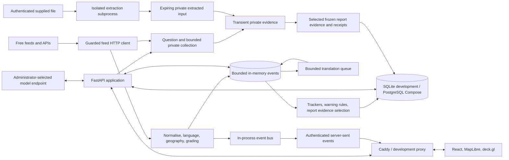

# The All Seeing Eye: Architecture

Status: current implementation and active automated-research integration,
6 September 2026. This replaces the initial proposal's descriptions of
components that were not built. Acceptance evidence and remaining work live in
[the automated-research plan](MASTER_AUTOMATED_RESEARCH_PLAN.md); earlier delivery
evidence remains in [the improvement plan](MASTER_FIX_IMPROVEMENT_PLAN.md). Deployment gates live
in [the Phase 6 security review](security/PHASE6_ASVS_REVIEW.md).

## 1. Design principles

1. **One fusion core.** Feed items become an `Event`; the globe, trackers, warning
   rules and report selection consume the same bounded live store.
2. **Grade before generate.** Source reliability and item credibility are computed
   before the model receives evidence. Doctrine validation checks its assessment.
3. **Cache, do not hoard.** Raw live events are never written to the database or a
   restart snapshot. Reports preserve their frozen evidence; configuration,
   accounts, operational records and small hourly aggregates are durable.
4. **Treat content as data.** External text, model output and imported content are
   bounded and validated. The browser renders structured text, never source HTML.
5. **One local application.** One API process runs collectors and background work,
   one relational database holds durable data, and one React application renders
   it. Untrusted document/media extraction uses short-lived bounded subprocesses. No message broker, vector service or new cloud dependency is required.
6. **Small explicit boundaries.** Protocol ports separate use cases from external
   systems. Composition stays in the `ase.container` package.

## 2. System context



The tracker-to-database path represents reports, alerts and small aggregate
samples, not the raw event stream. Source availability and key requirements are
recorded in [the data-source catalogue](02_DATA_SOURCES.md). Bluesky remains
unavailable from the development host; Telegram is excluded by the accepted
scope. Optional keyed feeds are not prerequisites for the core application.

## 3. Runtime topology

| Runtime | Responsibility | Operational boundary |
|---|---|---|
| Development API | FastAPI, SQLite, collectors and background loops | Port 8001; `.env` and relative SQLite paths resolve from its working directory |
| Development web | Vite on port 5173 | Same-origin `/api` proxy defaults to `127.0.0.1:8001` |
| Compose `api` | Same application, migrations at startup | One uvicorn process on internal port 8000, non-root, read-only root filesystem and temporary `/tmp` |
| Extraction subprocess | Parse one supplied document or media input | Shared two-slot admission, deadline and OS resource limits; no inherited application secrets or durable original files |
| Compose `db` | PostgreSQL 16 with PostGIS image | Durable tier, private Compose network and database volume |
| Compose `web` | Caddy TLS, static SPA and reverse proxy | Ports 80/443; local internal certificate by default |

The API and database ports are unpublished in Compose. Caddy terminates HTTPS;
changing exposure requires review of certificates, proxy trust, cookies and
headers. This document does not assert that the deployment is ready for public
access. See [security controls and gates](07_SECURITY_BY_DESIGN.md).

Application lifespan starts and stops the feed scheduler, aviation monitor,
indicator evaluator, scheduled report runner, translation queue and social
monitor. Rate limits, live events, stream admission, chat admission and search
locking are process-local. Adding API workers requires shared coordination and a
separate design decision. Parser subprocesses are isolated work units, not extra
HTTP workers. Current synthetic Windows checks exercise the Job memory boundary;
POSIX process-group/resource-limit logic has unit tests. The changed production
image and full cross-platform operational behaviour still need final verification.

## 4. Backend architecture

### 4.1 Layering and composition

```text
backend/src/ase/
  domain/          Entities, values, doctrine and pure calculations
  application/     Protocol ports, use cases and background orchestration
  adapters/        HTTP, persistence, model, geography, export and security adapters
  api/             Thin FastAPI routes, schemas and request dependencies
  infrastructure/  Settings, logging, rate limiter and process services
  container/       Composition root, shared instances and session factories
  resources/       Packaged country, conflict and watch-area data
```

`domain` depends on no outer layer. `application` imports domain types and ports;
adapters and API depend inward. Import-linter checks backend layering. Thin
routes validate the transport boundary and call use cases.

`container/__init__.py` builds shared services and auth/admin factories.
`features.py` holds feature factories; `reporting.py` holds report production,
export and search factories; `repositories.py` builds the session-scoped
repository bundle. Mixins declare borrowed attributes under `TYPE_CHECKING`.
Concrete wiring stays in this package; the split is not a new service boundary.

### 4.2 Ports and adapters

| Port or boundary | Current implementation |
|---|---|
| Private research and inputs | Budgeted provider collection, owner-bound expiring extraction store and isolated document/media runner |
| Feed connectors and HTTP | Dedicated feed adapters, shared RSS parsing, public-host validation and DNS pinning |
| Event store and bus | Bounded in-memory store and in-process subscriptions |
| Country resolution | Packaged Natural Earth boundaries with a pure point-in-polygon resolver |
| Model completion | OpenAI-compatible chat adapter selected by administrator-owned profiles |
| Translation | Batched title translation over the chat adapter, with usage records |
| Embeddings | Dedicated OpenAI-compatible embeddings adapter and bounded JSON-vector repository |
| Report rendering | Local PDF/DOCX renderer behind `ReportRenderer`; Markdown remains a stored export |
| Repositories | SQLAlchemy async adapters, SQLite locally and PostgreSQL under Compose |
| TOTP and credential encryption | `pyotp` and Fernet-backed adapters; no custom cryptographic protocol |
| Notifications and archiving | In-app alerts, optional webhook and Wayback preservation; email transport remains absent |

### 4.3 Event model and processing

`domain/events.py` defines immutable events with stable ids, source/category,
publication and observation timestamps, title, bounded summary, optional English
title, point, geographic confidence, nation, tags, severity, NATO grade,
rationale, story id and bounded scalar attributes. The current geometry field is
`point`; the initial proposal's polygon/entity model is not the implementation.

The pipeline normalises and sanitises feed data, fills missing language and
country context, clusters related stories and computes credibility. Source
reliability remains registry-owned. Country-only reporting can use a nation's
centroid with country-level confidence, distinguishing it from an exact location.

Collectors have intervals, timeouts, health state and backoff. Events and changed
grades are published after storage. Translation runs separately every thirty
seconds, handles up to twenty titles per batch and sixty model calls per hour,
and keeps a bounded cache. It merges only a still-current title translation, so a
slow reply cannot restore a removed event or overwrite newer grading.

Enabled collection plans supply Google News watchlist terms only while their
owner is active and, for team work, remains a member of an active team. The same
eligibility rule governs social keyword sampling. Private terms are visible to
the personal owner or current team members and administrators. Public feed
results remain shared; events do not carry private plan or PIR identifiers.
Google article
links are resolved lazily for cited report evidence through guarded requests.
The social board computes platform/instance counts, hashtags and bursts from
the live store and small hourly baselines. It does not persist a post archive.

### 4.4 Bounded live storage

The default estimated memory budget is 512 MiB, configurable through
`ASE_LIVE_STORE_MEMORY_MB`. The store indexes event ids by category and country,
and maintains an incremental byte estimate. That estimate is not a hard process
RSS limit. Retention defaults are defined in `application/feeds/budgets.py`:

| Category | Window | Item cap |
|---|---|---|
| Aviation | 10 minutes | 15,000 |
| Maritime | 6 hours | 20,000 |
| Disaster | 7 days | 150,000 |
| News | 72 hours | 40,000 |
| Conflict | 30 days | 30,000 |
| Social | 24 hours | 10,000 |
| Space, cyber, political, humanitarian, economic | 7 days each | 5,000 each |

Pruning removes expired and excess items; writes also evict oldest observations
to enforce the memory estimate. There are no raw-event database tables, Parquet
restart snapshots, historic feed archive or automatic historical API retrieval.
Only the evidence selected into a saved report becomes durable. `activity_samples`
holds small hourly aviation/social counts, not event payloads.

### 4.5 Durable data, reports and search

| Durable records | Purpose |
|---|---|
| Users, account requests, password/refresh tokens and administrator TOTP | Identity, session security versions and optional second factor |
| Teams and memberships | Named active/archived teams and explicit member/manager designations |
| LLM profiles and usage | Encrypted credentials, profile roles and model-call outcomes |
| AOIs, collection plans, indicators, alerts and schedules | Standing collection and warning configuration |
| Reports and report versions | Body, findings, selected frozen evidence, source rating/attributes, collection/citation/context/challenge metadata, Markdown and model usage |
| Activity samples | Small hourly counts for baseline comparisons |
| Report embeddings | One bounded vector per indexed report version |
| Audit log | Security and operator actions |

Report production selects and freezes evidence, computes information quality,
optionally plans the question, generates a structured assessment, validates its
doctrine and citations, and retries once on validation failure. Version history
preserves what was assessed and cited at that time. Optional devil's advocacy can
lower confidence; it cannot improve the grade or silently raise confidence.

Reports support Markdown, local PDF/DOCX export and structural comparison between
two versions of the same report. The browser presents structured React text and
validated links. It does not parse report Markdown into HTML or use DOMPurify.

Semantic search uses normalised JSON vectors with a shared storage cap of 1,000
reports and at most 4,096 dimensions. Each caller searches up to their latest
1,000 visible reports; counts and results are scoped before limits. Explicit
indexing embeds at most eight reports per call and requires an `embeddings`
profile. Capacity is checked before model calls. A full index refuses new slots
without evicting another team's vectors; global maintenance removes orphaned or
superseded versions independently of the caller's visible set. Vector validity
also requires the current model/profile fingerprint. Cosine comparison runs in
the application; there is no pgvector extension or raw-event index. See
[ADR 0008](adr/0008-bounded-report-search.md) for limits and trade-offs.

### 4.6 Private on-demand research and supplied inputs

`application/research` coordinates explicitly scoped collection outside database
locks. Quick/detailed budgets admit serial provider calls and produce completed,
empty, failed, timed-out, unavailable, unsupported or exhausted receipts. The
composition root selects free Google News/configured social, SEC, DNS, RDAP and
optional authenticated Companies House/SSLMate providers. Missing optional keys
produce unavailable receipts without a request. Quick DNS uses A; detailed uses
A, AAAA, MX and NS. A separate bounded private store feeds report evidence selection;
private collected results do not enter the shared globe store. Provider availability,
request limits and language coverage are recorded rather than assumed.

Selected evidence freezes source-rating policy and bounded scalar provenance.
The pure research-context projection keeps publication, observation and capture
separate, exposes captured identifiers/aliases as candidates, and labels declared
source links and possible-copy cautions. It never merges names into identities or
infers common ownership. Version JSON stores these disclosures; strict decoders
preserve historical method versions and legacy absence without rebuilding them.

Detailed research now has a bounded challenge stage: initial judgement queries
share one collection budget, selected new material can trigger redrafting, and
final judgements receive one batch challenge review. Provider/model failures and
missing review remain explicit. The challenge model is not another independent
source. Follow-ups reuse authorised frozen evidence and record new collection
separately. Upload, challenge and context handoffs are integrated; focused
production/SQL/export tests pass, with final combined acceptance still pending.

`POST /api/research/inputs` admits an authenticated raw upload before reading its
body. Its extracted input is bound to the exact user and security version for
15 minutes; administrators do not acquire another user's transient input. The
application rechecks authority around extraction and holds no administration lock
across parser work. Two parser slots and independent pending/ready input caps
bound work and storage. Originals are transient. Extracted text, locator/hash
metadata and sanitised previews stay in bounded memory; access expires after
15 minutes and physical removal occurs on the next store access. Only selected report
evidence and bounded input provenance are durable, without the transient input ID.
Frame bytes are separate from event and receipt JSON and appear only in the upload
preview response. Raw uploads are limited to 8 MiB.

Document/media extraction shares a subprocess protocol with deadlines, memory
limits, bounded JSON output and child termination. Limits and parser exclusions
are in [the active plan](MASTER_AUTOMATED_RESEARCH_PLAN.md). OCR is English-only
and fallible; image metadata, frame times and hashes are not authenticity checks.
This is a resource boundary, not an OS filesystem/network security sandbox.
Linux's 512 MiB address-space limit applies per process; a compromised native
parser could retain the service user's file access. Read-only container root and
no-new-privileges do not make the writable application-data mount inaccessible.
Private document/media focus does not send extracted terms to public providers.
One API process is required for the process-local admission and expiring stores.

Schedules persist saved questions/options in migration `0015`; `0016` adds opt-in
change summaries and a schedule-origin alert alternative to an indicator origin.
Comparisons use frozen evidence/assessment differences. They do not classify
semantic importance, verify a correction or establish that a claim became true.
Document/media focus cannot be scheduled because private uploads expire. Scoped
PostgreSQL/migration and schedule checks pass; final combined acceptance remains.

Generation is request-bound, not a background job queue. An optional client UUID
in `X-Research-Run-ID` supports exact-user/security-version progress polling for
30 minutes in one process. A 600-second deadline or disconnect cancels outstanding
work; cancellation during saving cannot guarantee that no commit occurred.
Clients must inspect Reports before retrying an uncertain result. See the
[automated research API](api/AUTOMATED_RESEARCH_API.md).
Long-running upload/report boundaries revalidate the current session; focused
logout/expiry regression checks return 401 before input/report retention.

`container/research_sources.py` supplies static capability profiles alongside live
connectors. Every known research event source ID has specific unassessed F context;
unknown news/social/upload origins have no asserted organisation independence.
Registry/resolver endpoints share collector organisations, not verified claim
origins. Selected evidence freezes the profile, including its policy and limits.

### 4.7 Authentication and access

The SPA holds access tokens in memory and refreshes through protected cookies.
Each JWT identifies its refresh family and the account's security version.
`CurrentUser` verifies expiry, active account, security version and live family
against the database. Logout revokes its family; password, TOTP, role and active
status changes invalidate affected sessions. Legacy access JWTs without these
claims are refused; an existing valid refresh cookie can obtain the new format.

Global roles are `user`, `manager` and `admin`. A manager can lead only teams in
which they also have the `manager` membership designation. Administrators manage
accounts, create/archive teams and assign leadership. Team managers can add or
remove ordinary members of their managed teams, without a global user directory,
account reset powers or authority over manager/administrator memberships.

Operational roots carry nullable `team_id`: null means personal creator access;
a team id means current membership access. Administrators have explicit access
to all scopes. This covers AOIs, plans, reports and historical versions, exports,
comparisons, semantic search, indicators, schedules and alerts. Ordinary team
members manage their own contributions; designated managers can manage others'
work in that team. Linked records must share the same team or personal owner,
including administrator-authored operations. Unauthorised direct ids return 404.
Any current member of an active team may acknowledge its alerts; ownership is
not required for this shared triage action.

`AccessPolicy` constructs fresh contexts; repositories apply a shared SQL
visibility predicate before counts and limits. Mutations acquire the shared
administration guard before account locks and authority checks. No-op updates
provide a real writer/row lock on SQLite/PostgreSQL. Report generation and
embedding work release database snapshots before outbound calls and recheck
current authority before persistence. Document downloads recheck after rendering.
Private operational responses prohibit caching. Background work requires an active owner
and current membership of an active team, including administrator-owned jobs.

Archived teams retain ordinary read access. Ordinary writes stop; administrators
retain a deliberate manual operational override. Roster edits require team
reactivation, including for administrators. Migration `0014` keeps existing roots
personal, preserves links and evidence, records `legacy_scope_conflict` audit
entries, and leaves orphan alerts administrator-only. See
[ADR 0010](adr/0010-teams-and-access.md) and the [scope API](api/SCOPED_WORK_API.md).

SSE revalidates the session and membership before each delivery and on a quiet
stream at intervals of at most 15 seconds, subject to service scheduling. It
filters alerts by scope, sends `access.changed` when membership/team state
changes, and closes revoked sessions or expired tokens. The frontend invalidates
scoped data and selections on access changes. Connection admission remains
bounded per user and globally. Optional administrator TOTP has encrypted secrets,
confirmed enrolment, replay protection and host-only recovery.

### 4.8 External model boundary

Administrators may configure private or loopback model endpoints deliberately.
That trust boundary is separate from the public-feed SSRF policy. Chat and
embedding adapters use streamed identity-encoded responses, byte caps, overall
deadlines and no redirects. Chat has a 4 MiB response cap, a 120-second default
deadline including admission, and two concurrent requests per shared gateway.
Embeddings have a 2 MiB cap and a 30-second endpoint deadline. Provider errors
never include response excerpts, credentials or request payloads.

### 4.9 Configuration and recovery

Settings use the `ASE_` prefix and optional working-directory `.env`. Profiles
encrypt keys under `ASE_ENCRYPTION_KEY`; the key must be preserved for recovery.
Compose uses a root `.env`; development started in `backend/` uses `backend/.env`.
Development databases need an explicit `uv run ase migrate` from the intended
working directory before running new code. No operator database or real `.env`
was migrated during implementation verification; backup and apply migrations
deliberately when updating that deployment.

[Backup and restore](BACKUP_RESTORE.md) provides online SQLite snapshots and
Compose PostgreSQL dumps, separately copied configuration, strict hash manifests
and fresh-target-only restores. Real `.env` inclusion requires explicit opt-in.
No backup schedule or automatic retention deletion is installed. A synthetic
SQLite/PostgreSQL 17 recovery drill through migration `0011` verified all 19
then-existing tables and encrypted values. That evidence does not establish
recovery of the operator's current database or the newer scope migrations.

## 5. Frontend architecture

### 5.1 Structure

`app/` owns routing and shell composition. Feature folders own focused pages and
hooks; shared UI, API clients, URL guards, formatting and stores live under
`components/`, `lib/` and `stores/`. Features do not import each other.

Administration lives under `/admin` in a dedicated, administrator-only shell.
Its overview and navigation cover account requests, users, teams, AI connections,
source controls, audit history and administrator security. The research shell
exposes one Administration entry only to administrators; ordinary users and team
managers do not receive that navigation. The administrator guard wraps the entire
administration shell, so denied routes do not mount its pages or data requests.
API authorisation remains the security boundary and rechecks current authority.

The globe remains the research root. An explicit requested route survives sign-in;
otherwise administrators start at the administration overview and other accounts
start in research. Administration has its own responsive navigation and a clear
return to research, without research view shortcuts or alert controls. Team
management reuses the existing scoped team feature under `/admin/teams`; `/teams`
remains available in research with its existing role permissions.

The question-first `/research` entry point and authenticated `/sources` catalogue
are implemented. Report metadata disclosures use frozen version data; the current
source catalogue never fills gaps in old reports. Upload/follow-up/context/challenge
controls, progress and contextual research actions are integrated. Basic personal/team sharing uses the existing
access policy, without cases, task allocation or mandatory reviewer queues.

### 5.2 Libraries

React 19, TypeScript strict and Tailwind 4 provide the UI. React Router handles
routes; Zustand holds shared UI and live-event state. Zod validates transport
data, and `openapi-typescript` generates DTOs from the exported FastAPI schema.
MapLibre GL 6 and deck.gl 9 provide the globe and overlays. Existing resource hooks
handle page data; TanStack Query, Radix, ECharts, Motion and react-hook-form were
proposal options and are not current dependencies.

### 5.3 Globe and map

The root route opens a 3D globe. Map mode explicitly selects Mercator; lite mode
reduces visual effects and movement. Layers use shared category colours, icons,
low-zoom grid clustering and time/nation filters. Aircraft icons can rotate by
track; GNSS interference is a separate computed layer. The ops-room view removes
the shell and rotates the globe when motion preferences allow it.

Current base layers include OpenFreeMap dark, light and streets, EOX satellite
and hybrid, plus server-proxied OS Road, Outdoor and Light when a key is
configured. Unavailable OS choices remain visible with their configuration and
coverage limits. Satellite imagery is a historical mosaic, not a live feed.
Coordinates display WGS84. Grids and other source-dependent overlays remain
separate capabilities; their appearance in a proposal does not prove delivery.

### 5.4 Performance and accessibility

MapLibre remains excluded from Vite development pre-bundling so its module worker
loads correctly. Production code splitting separates MapLibre and deck.gl
dependency groups. The live buffer is bounded, and the backend uses incremental
store accounting. These changes do not establish representative-load results.
Keyboard navigation, focus handling, reduced motion and accessibility checks are
part of the Phase 6 pass; remaining manual audit work stays recorded as a gate.

### 5.5 Theme

Dark surfaces, ember accent `#FF6F37`, cyan live data and amber warnings give the
globe and report views consistent visual meaning. Inter and JetBrains Mono are
bundled locally. Grade and confidence labels remain readable text as well as
colour cues.

### 5.6 Brand mark: the React Bits Evil Eye

The mark is the original React Bits `EvilEye-TS-TW` component in
`frontend/src/components/brand/EvilEye.tsx`, with its licence header intact.
`BrandMark` provides a small, frame-capped instance that pauses when hidden and
respects reduced motion. Auth screens use the full visual. Static icons derive
from the real component. Preserve the component and
`frontend/THIRD_PARTY_NOTICES.md`; never replace it with a redrawn imitation.

## 6. Checks and remaining evidence

Backend checks are pytest with SQLite by default, a 90 percent coverage gate,
ruff, strict mypy and import-linter. Frontend checks are Vitest/Testing Library/MSW
with coverage, ESLint, TypeScript and production build. Fixtures and scripted
model adapters keep tests offline. CI definitions include a PostgreSQL test job
and supply-chain/security checks, but no remote CI execution has been observed.

Follow the current plan and security review for outstanding real-model testing,
operator-backup recovery, deployment headers, staging security scanning and
representative load/accessibility evidence. Source files and workflow definitions
describe behaviour and intended checks; they do not prove those operational
checks have run.
