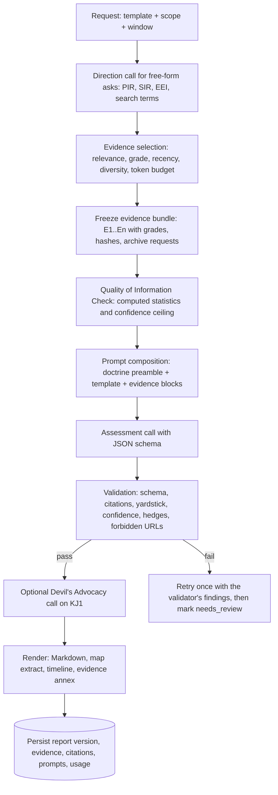

# Doctrine, Grading and Reporting Design

Status: proposal. Doctrine facts were verified against primary sources on 2 September 2026 (links in section 1). This file becomes `DOCTRINE.md` and the prompt preamble once building starts.

## 1. Doctrine the app follows

| Document | Edition | What the app takes from it |
|---|---|---|
| PHIA, *Explaining Uncertainty in UK Intelligence Assessment* (gov.uk, 24 March 2025) | current | The Probability Yardstick terms and bands; Analytical Confidence Ratings (High, Moderate, Low) and the three confidence factors |
| PHIA, *Common Analytical Standards* (gov.uk, 24 March 2025) | current | The eight standards: independent, clear, comprehensive, auditable, relevant, rigorous, objective, timely; Key Judgements up front; name the sources that matter, the gaps, the assumptions and what changed |
| UK JDP 2-00, *Intelligence, Counter-Intelligence and Security Support to Joint Operations* | 4th edition, August 2023 | The intelligence cycle (Direction, Collection, Processing, Dissemination); the NATO grading table (Table 3.1); product types (INTREP, INTSUM, SUPINTREP); indicators and warning terms (warning problems, warning reports, watch conditions); the rule that facts, assumptions and judgements are differentiated |
| NATO AJP-2, *Allied Joint Doctrine for Intelligence, Counter-Intelligence and Security* | Edition B v1, July 2020 | Cycle phases; processing as collation, evaluation, analysis, integration, interpretation; IRM&CM at the centre of the cycle; JIPOE in three steps |
| NATO AJP-2.1, *Allied Joint Doctrine for Intelligence Procedures* | Edition B v3, May 2022 | Requirements hierarchy (CCIR, PIR, SIR, EEI), named areas of interest, source reliability and information credibility rated independently, references to the NATO Intelligence Warning System |
| NATO AJP-2.7, *Joint ISR* | Edition A v2, October 2022 | TCPED (task, collect, process, exploit, disseminate) for sensor-type feeds |
| NATO OSINT Handbook (2001, v1.2 2002) and OSINT Reader (2002) | | Open Source Data, Open Source Information, OSINT and Validated OSINT; the four Ds (discovery, discrimination, distillation, dissemination); never separate sourcing pedigree from reporting; evaluate web sources for accuracy, authority, relevance, currency and objectivity |
| US ICD 203, *Analytic Standards* (2015, amended 2022) | | The nine tradecraft standards as a validation checklist; the rules never to mix likelihood terms and never to put a confidence level and a likelihood in the same sentence |
| CIA *Tradecraft Primer* (2009) | | Structured techniques the pipeline automates: Quality of Information Check, Key Assumptions Check, Indicators, Analysis of Competing Hypotheses, Devil's Advocacy |
| Berkeley Protocol on Digital Open Source Investigations (OHCHR / UC Berkeley, 2020, printed 2022) | | Evidence capture, hashing, preservation, verification and documentation standards for open-source material |

Primary sources: https://www.gov.uk/government/publications/explaining-uncertainty-in-uk-intelligence-assessment/explaining-uncertainty-in-uk-intelligence-assessment ; https://www.gov.uk/government/publications/phia-common-analytical-standards/phia-common-analytical-standards ; https://assets.publishing.service.gov.uk/media/653a4b0780884d0013f71bb0/JDP_2_00_Ed_4_web.pdf ; https://archive.dni.gov/files/documents/ICD/ICD-203.pdf ; https://www.cia.gov/resources/csi/static/Tradecraft-Primer-apr09.pdf ; https://www.ohchr.org/sites/default/files/2024-01/OHCHR_BerkeleyProtocol.pdf. The AJP texts were read from NATO-unclassified mirrors. Report paragraph templates live in APP-11, which is restricted, so the structures in section 8 are doctrine-consistent proposals rather than verbatim NATO formats.

## 2. The intelligence cycle as product structure

| Phase | In the app | Doctrine objects |
|---|---|---|
| Direction | Collection plans: a question set for a country, conflict, AOI or theme. Each plan holds Priority Intelligence Requirements, broken into Specific Intelligence Requirements and Essential Elements of Information, with named areas of interest, keywords, categories and preferred sources | CCIR, PIR, SIR, EEI, NAI (AJP-2.1 paras 3.4 to 3.11); Intelligence Collection Plan |
| Collection | The source registry and connectors. Each source declares category, kind, language, licence and default reliability. Sensor-like feeds (ADS-B, AIS, seismometers, satellites) follow TCPED; text feeds follow the OSINT four Ds | AJP-2 collection disciplines; AJP-2.7 TCPED; NATO OSINT Handbook |
| Processing | The pipeline: collation (normalise, dedupe, cluster), evaluation (grading), analysis and integration (geo, entities, PIR tagging, baselines), interpretation (the LLM assessment) | AJP-2 processing sub-steps; JDP 2-00 paras 3.40 to 3.45 |
| Dissemination | Products (section 8), alerts and warning reports, exports, the audit trail | JDP 2-00 Table 3.3; PHIA standards |

IRM&CM sits at the centre: every event is tagged against the EEIs it may answer, every report states which requirements it answers, and the gaps section is generated from EEIs with no or weak evidence.

## 3. From open source data to validated OSINT

The NATO OSINT Handbook's four levels map onto the states an item passes through:

| Level | App state | Rule |
|---|---|---|
| Open Source Data | Raw item as fetched | Held only transiently; hashed; never shown |
| Open Source Information | Normalised `Event` (sanitised, geolocated, language-detected, clustered) | Lives in the expiring live store; shown on the globe with its grade |
| OSINT | Graded evidence selected to answer a requirement, frozen into a report's evidence bundle | The only path from live tier to durable tier |
| Validated OSINT | A key judgement with credibility 1 or 2 evidence from independent sources, High or Moderate confidence, and no unresolved contradiction | Marked "corroborated" in the UI; the app never claims certainty beyond this |

The Handbook's rule that sourcing pedigree never leaves the reporting is implemented literally: an evidence item cannot be rendered without its source, grade, capture time and hash.

## 4. Source evaluation (NATO grading, the Admiralty Code)

### 4.1 The scale

Reliability of the source and credibility of the information are assessed separately and must not influence each other (AJP-2.1 paras 3.32 to 3.33; JDP 2-00 Table 3.1). Ratings need not match: B5 and E1 are valid, and F6 does not make an item worthless.

| Reliability | Meaning | | Credibility | Meaning |
|---|---|---|---|---|
| A | Completely reliable | | 1 | Confirmed by other sources |
| B | Usually reliable | | 2 | Probably true |
| C | Fairly reliable | | 3 | Possibly true |
| D | Not usually reliable | | 4 | Doubtful |
| E | Unreliable | | 5 | Improbable |
| F | Reliability cannot be judged | | 6 | Truth cannot be judged |

### 4.2 Reliability comes from the registry

Reliability is a property of the source, set by the admin, shipped with documented defaults by source kind:

| Source kind | Default | Flags |
|---|---|---|
| Instrument feeds (USGS, EMSC, FIRMS, GDACS, ADS-B networks, AIS, CelesTrak, SWPC, NWS, MeteoAlarm) | A | `spoofable` for ADS-B and AIS |
| Wire agencies and public-service broadcasters | B | |
| Research institutes and event databases (ISW, ACLED, UCDP, Bellingcat, Airwars, Crisis Group) | B | |
| Official government and military channels | B | `interested_party` (reliable about their own actions, not about adversaries) |
| Tier 1 international press | B | |
| National and regional press | C | |
| State-controlled media | C | `state_controlled`; adversary claims capped at credibility 3 unless independently corroborated |
| Aggregators (Google News, GDELT) | inherit the outlet where known, otherwise C | |
| Social accounts and channels | E | admin may raise named OSINT accounts to C or D |
| Unknown | F | |

Per-subject nuance, which the literature says static per-source ratings lack, is handled with the flags above and with admin overrides per source and topic (for example an outlet rated B on domestic politics and D on a rival state's military).

### 4.3 Credibility is computed per item

Credibility is computed from the information and its relationship to other information, never from the reliability of its own source, which keeps the two axes independent and avoids the well-documented clustering on A1, B2 and C3.

| Grade | Rule |
|---|---|
| 1 Confirmed | Two or more independent sources (different `parent_org`, not near-identical text) report the same story within the corroboration window; or two instruments agree (USGS and EMSC on one earthquake); or an official claim is matched by instrument or imagery data |
| 2 Probably true | One independent corroboration; or instrument data with no anomaly flags |
| 3 Possibly true | Single source, consistent with the existing picture (same category and area within the window) and plausible; or any claim by an interested party about an adversary; or a state-controlled outlet's uncorroborated claim |
| 4 Doubtful | Contradicted by one source with credibility 1 or 2; or instrument anomaly flags (impossible speed, teleporting track, implausible fire radiative power) |
| 5 Improbable | Contradicted by two or more independent sources or by instrument data |
| 6 Cannot be judged | Single source with no corroboration, no contradiction and no consistent context; or content that could not be assessed (untranslated, truncated) |

Every grade carries a rationale string ("B2: corroborated by AP 38 minutes after Reuters; no contradiction") and the identifiers of the corroborating and contradicting items. Grades are recomputed as new items arrive, so an item can move from 6 to 1 over an hour; the report freezes the grade at generation time and records it.

Independence is approximated: syndicated copies (near-identical text across outlets) count once; different wording from different parent organisations counts as independent. This is stated in the sourcing statement of every report.

## 5. The Probability Yardstick

The PHIA yardstick (2025) is the only vocabulary the app uses for likelihood. The bands are deliberately discontinuous so that judgements do not read as spuriously precise; the app stores the band, never a point estimate, and shows the range only as metadata.

| Term | Range |
|---|---|
| Remote chance | above 0 to about 5 percent |
| Highly unlikely | about 10 to about 20 percent |
| Unlikely | about 25 to about 35 percent |
| Realistic possibility | about 40 to under 50 percent |
| Likely or probable | about 55 to about 75 percent |
| Highly likely | about 80 to about 90 percent |
| Almost certain | about 95 to under 100 percent |

Enforcement:

- Every key judgement contains exactly one yardstick term, and every other sentence in the report contains none. The validator rejects judgements with two terms or with a term plus a US ICD 203 term (for example "very likely", "roughly even chance").
- The words "may", "might", "could", "possible" and "possibly" are treated as hedges: banned in key judgements, allowed elsewhere only when the sentence is explicitly describing capability rather than likelihood (the validator flags them for review rather than rejecting).
- Where the model wants a probability outside the vocabulary it must use the nearest band, per PHIA's rule that any alternative language has to be explained.
- Judgements use "we assess" or "we judge" followed by the term, in the Defence Intelligence style ("We assess it is highly likely that ...").

## 6. Analytical confidence

Confidence is separate from probability: probability is how likely the statement is; confidence is how sound and stable the foundations of that judgement are. The app uses PHIA's Analytical Confidence Ratings, High, Moderate or Low, each with a supporting statement covering the three PHIA factors:

| Factor | What the engine measures and passes to the model |
|---|---|
| Information base | Count of evidence items by grade, number of independent parent organisations, share of instrument data, recency, presence of contradicting items |
| Analytical rigour | Which structured techniques ran (section 9), whether alternative hypotheses were considered, whether assumptions are explicit |
| Complexity and volatility | Category defaults (an active conflict is volatile, a seismic sequence is not), rate of change in the underlying story clusters |

Rules: the confidence rating is a separate field on every key judgement; the statement names the specific source of remaining uncertainty and, where possible, what would raise confidence; a confidence word never appears in the same sentence as a yardstick term (adopted from ICD 203). The engine also sets a ceiling: if every supporting item is credibility 3 or worse, or all comes from one parent organisation, confidence cannot be High.

## 7. Analytic standards as a checklist

The prompt preamble states the PHIA standards; the validator and the report schema enforce the parts that can be checked mechanically.

| Standard (PHIA / ICD 203) | Mechanism |
|---|---|
| Clear: Key Judgements first, one term per judgement, plain language | Schema puts key judgements first; yardstick lint; sentence-length lint |
| Comprehensive: name the sources that matter, the gaps and the lynchpin assumptions | Each judgement lists supporting and contradicting evidence; assumptions object with `lynchpin` flag; gaps section generated from unanswered EEIs |
| Auditable: a fully referenced version with contradictory information footnoted | Citations must resolve to frozen evidence; unresolved citations are removed and the report is flagged |
| Rigorous: alternative hypotheses, structured techniques | Alternatives section mandatory when there are two or more key judgements; SAT stages recorded in report metadata |
| Objective and independent | Interested-party and state-controlled flags shown to the model and the reader; the model is told it must not adopt a source's framing |
| Explain change | Every judgement carries `change_from_previous` (new, unchanged, strengthened, weakened, reversed) computed against the previous version of the same product |
| Distinguish information from assumptions and judgements | Separate `reporting`, `assumptions` and `key_judgements` objects; yardstick terms are forbidden in `reporting` |
| Timely and relevant | Report header states the period covered, the data cut-off and the requirement answered |
| Visual information | Reports embed a map extract of cited evidence and a timeline; charts are generated from the evidence bundle, not by the model |

## 8. Product templates

Every template is a YAML file: sections, per-section guidance, the JSON schema for the model's output, the evidence selection strategy, token budget and default model role. Proposed set:

| Template | Trigger | Structure |
|---|---|---|
| INTSUM | Scheduled (daily or weekly) for an AOI, country, conflict or global | Header; Key Judgements; Situation update by theme (reporting, graded); Assessment; Indicators and warning (watch condition); Gaps and collection recommendations; Sourcing statement with confidence; Evidence annex |
| INTREP | One significant event (earthquake, strike, coup, major incident) | Header; What happened (reporting); Initial assessment with judgements; What we do not know; Next update criteria; Evidence annex |
| SUPINTREP / Ask the Eye | A free-form question | Direction call turns the question into PIR, SIRs and EEIs plus search terms; evidence selection shown to the user before generation; then Key Judgements; Answer by EEI; Assumptions; Alternatives; Gaps; Sourcing; Evidence |
| Country Brief | Nation filter | JIPOE-style: Environment (geography, infrastructure, hazards); Actors and relationships; Current situation (reporting); Assessed trajectories (judgements); Indicators; Travel and sanctions context; Gaps |
| Conflict Assessment | Conflict tracker | Belligerents and objectives; Recent activity by front or theme (reporting with ACLED/UCDP counts and trends); Assessed courses of action (most likely and most dangerous, with yardstick terms); Indicators and warning; Humanitarian picture; Gaps |
| Disaster SITREP | Disaster tracker | Event facts (instrument data); Impact and exposure (GDACS, EONET, FIRMS); Response (ReliefWeb, IFRC GO, Copernicus EMS); Forecast; Needs; Gaps |
| Warning Report | Indicators board | Warning problem; Indicators changed (with baseline versus observed); Watch condition (proposed change); Assessment; What would raise or lower concern |
| Aviation Activity Report | Aviation tracker | Notable military and interesting flights by region; Patterns versus baseline; GNSS interference; Emergencies; Assessment |
| Maritime Activity Report | Maritime tracker | Chokepoint counts versus baseline; Dark vessels and loitering; NAVAREA warnings and incidents; Assessment |
| Cyber Summary | Cyber tracker | New KEV entries; Ransomware activity by country and group; Outages and shutdowns; Assessment |
| Competing Hypotheses | Manual, from any tracker | Hypotheses; Evidence matrix (consistent, inconsistent, not applicable); Diagnosticity; Least-inconsistent hypothesis; What evidence would discriminate |
| Source Evaluation | Admin | Per-source corroboration rate, contradiction rate, latency, and a proposed reliability adjustment for the admin to accept or reject |

## 9. The generation pipeline



Structured techniques as stages:

- **Quality of Information Check** runs before drafting and is included in the prompt and the report annex: counts by grade, independence, recency, contradictions, flagged items.
- **Key Assumptions Check**: the schema requires an assumptions list with lynchpin flags when key judgements exist; the validator refuses a report whose judgements cite no assumptions and no evidence.
- **Indicators**: every key judgement lists what observable evidence would strengthen or overturn it; these can be turned into indicator rules with one click.
- **Analysis of Competing Hypotheses**: a dedicated template (section 8).
- **Devil's Advocacy**: an optional second call attacks the top judgement and is appended as a clearly labelled contrarian view; it can lower confidence, never raise it.

## 10. Report schema (abridged)

```json
{
  "header": {"template": "intsum", "scope": {"country": "SD"}, "period": {"from": "...", "to": "..."}, "data_cutoff": "...", "requirements": ["PIR-2", "SIR-2.1"]},
  "key_judgements": [
    {
      "id": "KJ1",
      "statement": "We assess it is highly likely that fighting around El Fasher will intensify over the next two weeks.",
      "probability": "highly_likely",
      "confidence": "moderate",
      "confidence_statement": "Information base: 14 items from 6 independent organisations, 3 graded B1. Rigour: alternatives considered. Volatility: high; front lines shift daily.",
      "supporting_evidence": ["E2", "E5", "E9"],
      "contradicting_evidence": ["E11"],
      "assumptions": ["A1"],
      "change_from_previous": "strengthened",
      "indicators": ["Reported RSF reinforcement columns on the Mellit road", "FIRMS hotspots north of the city above the 7-day baseline"]
    }
  ],
  "reporting": [{"theme": "Ground activity", "items": [{"text": "...", "evidence": ["E2"], "grade": "B1"}]}],
  "assessment": [{"heading": "...", "text": "...", "evidence": ["E2", "E5"]}],
  "assumptions": [{"id": "A1", "text": "...", "lynchpin": true}],
  "alternative_hypotheses": [{"text": "...", "why_less_likely": "...", "evidence": ["E11"]}],
  "indicators_and_warning": {"watch_condition": "elevated", "changes": ["..."]},
  "gaps": [{"eei": "EEI-2.1.3", "text": "No reporting on ..."}],
  "collection_recommendations": ["..."],
  "sourcing_statement": "..."
}
```

The evidence annex, map extract, timeline and Quality of Information statistics are generated by the engine from the bundle, not by the model.

## 11. Validation rules (the linter)

1. Output parses against the template schema; unknown fields are dropped.
2. Every citation identifier exists in the frozen bundle; unknown identifiers are removed and the report is flagged.
3. Every key judgement has exactly one yardstick term and none of the hedge words; `probability` matches the term in the statement.
4. Every key judgement has a confidence value and statement; no sentence contains both a yardstick term and a confidence word.
5. `reporting` items contain no yardstick terms and cite at least one evidence item.
6. No URL appears in model output unless it belongs to a cited evidence item.
7. Instruction-like text in evidence (prompt injection heuristics) is flagged before generation; flagged items are excluded by default.
8. Assumptions exist when key judgements exist; at least one alternative hypothesis when there are two or more judgements.
9. `change_from_previous` is present when a previous version exists.
10. Length limits per section; the whole report renders under the configured token and character budgets.

A report that fails after one retry is stored as `needs_review` with the validator's findings attached; the reader shows them inline.

## 12. Provenance and evidence handling (Berkeley Protocol, scaled to a hobby app)

| Protocol element | Implementation |
|---|---|
| Capture the best available version quickly | Evidence freezing at generation time; users can pin items earlier |
| Minimum record: URL, content, dated capture | Evidence row stores URL, title, summary, text extract for the top items (trafilatura), capture timestamp in UTC, collector version, source id |
| Hash at collection | SHA-256 of the normalised text and of the raw fetched body when available |
| Evidentiary copy versus working copy | `evidence` rows are immutable; reports reference them; edits produce new report versions |
| Preservation | Wayback Machine snapshot requested asynchronously for every cited URL; the archive URL is stored when it returns |
| Verification fields | Provenance (first seen where and when), geolocation confidence, chronolocation (published versus observed), corroboration and contradiction links |
| Documentation | Audit log records who generated what, with which template version, prompt version, model and endpoint |
| Data minimisation | Only cited items are kept; everything else expires from the live store |

Full-page screenshots and media capture are a later option (Playwright) and are not in the first six phases.

## 13. Worked example

Evidence: E2 Reuters (B) reports an artillery strike at 06:10; E5 Al Jazeera (B) reports the same strike at 06:48 with different wording; E9 FIRMS (A) shows three hotspots within 2 km at 05:30; E11 a state-controlled outlet (C, `state_controlled`) says the strike did not happen.

Grading: E2 and E5 corroborate each other and match E9, so all three are credibility 1 (B1, B1, A1). E11 is contradicted by two independent sources and instrument data: C5.

Key judgement: "We assess it is almost certain that an artillery strike hit the district at about 06:00 UTC." Probability: almost certain. Confidence: High, with the statement "Information base: three independent items including instrument data; the contradicting item is from a state-controlled interested party. Rigour: contradiction examined. Volatility: low for the fact of the strike, high for attribution." Attribution is a separate judgement with its own term, most likely "realistic possibility" until further evidence arrives.
