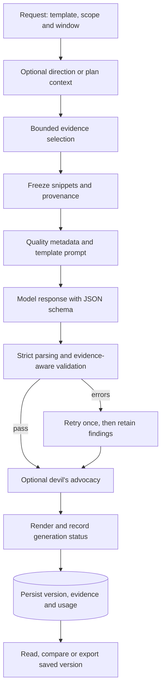

# Doctrine, Grading and Reporting

Status: current implementation and explicitly separated proposals, reviewed against code on 6 September 2026. The doctrine references below were recorded during the original 2 September 2026 design review. This document does not claim accreditation or that an automated report establishes the truth of its sources.

The app uses doctrine to organise questions, source metadata, judgements and uncertainty. It cannot verify an event merely because several headlines concern the same topic. See [ADR 0009](adr/0009-analytical-integrity.md) for the resulting engineering decisions.

13 September 2026 update: the professional reader, exports and briefing previews
now expose saved likelihood, confidence, item grades and assessment methodology.
See [Map news and evidence assessment](MAP_NEWS_AND_EVIDENCE.md) for the repaired
presentation, historical-data handling and current NATO AJP-2.9 catalogue
reference. The older NATO documents below remain design references, not a claim
of conformance to the current controlled edition.

## 1. Doctrine informing the app

| Document | Edition recorded in the design | Relevant concepts |
|---|---|---|
| PHIA, *Explaining Uncertainty in UK Intelligence Assessment* | 24 March 2025 | Probability Yardstick; High, Moderate and Low confidence; information base, rigour, complexity and volatility |
| PHIA, *Common Analytical Standards* | 24 March 2025 | Independent, clear, comprehensive, auditable, relevant, rigorous, objective and timely assessment |
| UK JDP 2-00 | Fourth edition, August 2023 | Intelligence cycle, reliability and credibility, reporting products, warning, separation of facts and judgements |
| NATO AJP-2 | Edition B v1, July 2020 | Direction, collection, processing and dissemination; requirements and collection management |
| NATO AJP-2.1 | Edition B v3, May 2022 | PIR, SIR and EEI hierarchy; separate reliability and credibility axes |
| NATO AJP-2.7 | Edition A v2, October 2022 | Task, collect, process, exploit and disseminate for joint ISR |
| NATO OSINT Handbook and OSINT Reader | 2001/2002 | Data, information, OSINT and validated OSINT; retaining source pedigree |
| US ICD 203, *Analytic Standards* | 2015, amended 2022 | Analytic standards, alternatives and uncertainty |
| CIA, *A Tradecraft Primer* | 2009 | Quality of Information Check, Key Assumptions Check, Indicators, Analysis of Competing Hypotheses and Devil's Advocacy |
| Berkeley Protocol on Digital Open Source Investigations | 2020, printed 2022 | Capture, preservation, verification and documented provenance |

Primary sources: https://www.gov.uk/government/publications/explaining-uncertainty-in-uk-intelligence-assessment/explaining-uncertainty-in-uk-intelligence-assessment ; https://www.gov.uk/government/publications/phia-common-analytical-standards/phia-common-analytical-standards ; https://assets.publishing.service.gov.uk/media/653a4b0780884d0013f71bb0/JDP_2_00_Ed_4_web.pdf ; https://archive.dni.gov/files/documents/ICD/ICD-203.pdf ; https://www.cia.gov/resources/csi/static/Tradecraft-Primer-apr09.pdf ; https://www.ohchr.org/sites/default/files/2024-01/OHCHR_BerkeleyProtocol.pdf. The AJP texts were read from NATO-unclassified mirrors. APP-11 product formats are restricted; the structures in section 8 are application designs rather than reproductions of those formats.

## 2. The intelligence cycle in the application

| Phase | Implemented behaviour | Limit |
|---|---|---|
| Direction | Collection plans hold requirements; Ask the Eye can use a direction model to derive PIR/SIR/EEI text, categories and search terms | Generated requirements do not prove comprehensive coverage |
| Collection | Registered feeds supply bounded normalised events and source metadata | Variable availability/coverage; no general crawling or full-page extraction |
| Processing | Normalisation, topic grouping, conservative grading, location metadata, optional translation and bounded tracker baselines | Topic grouping does not establish agreement, attribution or causation |
| Dissemination | Saved report versions, evidence annexes, Markdown/PDF/DOCX exports and separate indicator features | Mechanical validation is not human review |

Plans and direction inform selection and reporting. The application does not demonstrate that every live event answers an EEI, or that every requirement has adequate evidence. Gaps and collection recommendations in generated reports are model prose.

## 3. From source data to frozen evidence

| Stage | Representation | Assurance |
|---|---|---|
| Fetched data | Transient connector input | Receipt is not verification; raw source bodies are not a durable archive |
| Normalised information | Expiring in-memory `Event` | Bounded title/summary, metadata and provisional grade |
| Selected evidence | `EvidenceItem` snapshots in a report version | Recorded snippets and provenance remain after live events expire |
| Generated assessment | Structured body and engine findings | Citations, vocabulary and support ceilings can be checked; substantive accuracy is not certified |

There is no automatic transition to validated OSINT or a human sign-off state. Saved versions preserve the selected bundle, including selected items the model did not cite. The full live event stream remains in memory.

## 4. Source evaluation and the Admiralty Code

### 4.1 Separate axes

Reliability describes a source; credibility describes information. A reliable source can report an unverified claim. An unknown source is not automatically false.

| Reliability | Meaning | Credibility | Meaning |
|---|---|---|---|
| A | Completely reliable | 1 | Confirmed by other sources |
| B | Usually reliable | 2 | Probably true |
| C | Fairly reliable | 3 | Possibly true |
| D | Not usually reliable | 4 | Doubtful |
| E | Unreliable | 5 | Improbable |
| F | Reliability cannot be judged | 6 | Truth cannot be judged |

### 4.2 Registry metadata

Source specifications declare reliability, organisation/parent organisation, instrument status and flags such as `state_controlled`, `interested_party` or `authoritative`. These are editorial inputs, not measured reliability scores. Consult the registry and [source catalogue](02_DATA_SOURCES.md) for actual feeds. A source appearing in a doctrine example does not imply an implemented connector.

There is no per-topic reliability override workflow or automated source-quality adjustment. Instrument and authoritative-source metadata may inform provisional credibility; a source's A-F reliability letter does not determine its credibility digit.

### 4.3 Conservative runtime credibility

| Condition | Current treatment |
|---|---|
| Untranslated non-English item | Credibility 6; agreement is unassessed |
| Headline negation/qualification cue | Credibility 6; caution, not a finding that the claim is false |
| Related headlines with mixed qualification cues | Leave the topic group unassessed rather than promote either side as confirmed |
| State-controlled/interested-party source, without an earlier uncertainty condition | Credibility 3, explicitly uncorroborated |
| Instrument/authoritative metadata, without an earlier uncertainty condition | Provisional credibility 2, explicitly not independently verified |
| Other text, including repeated related headlines | Credibility 6; repetition and area/category context do not establish agreement |
| Grades 1, 4 and 5 | Retained in the vocabulary and historical evidence; not inferred automatically from topic similarity |

`domain/grading.py` computes grades and rationale; focused similarity and clustering modules identify related topics. Live grades can change on regrading; saved evidence retains its frozen grade.

Parent organisations and possible copied headlines/content are grouped transitively. Unknown provenance does not add another known organisation. These are **declared organisation groups**, not proven independent sources. Shared headlines may reflect common facts; different wording may depend on the same originating claim. Grouping is a conservative counting guard.

Automatic contradiction identification, instrument anomaly adjudication and claim-level verification are not implemented. New quality records store `contradictions: null`, meaning unassessed. Legacy values remain readable; current explanatory text does not present them as measured absence of contradiction.

## 5. The Probability Yardstick

The vocabulary uses the PHIA bands. Ranges are approximate and deliberately discontinuous; the model does not supply a calibrated numerical probability.

| Term | Approximate range |
|---|---|
| Remote chance | Above 0 to about 5 percent |
| Highly unlikely | About 10 to about 20 percent |
| Unlikely | About 25 to about 35 percent |
| Realistic possibility | About 40 to under 50 percent |
| Likely or probable | About 55 to about 75 percent |
| Highly likely | About 80 to about 90 percent |
| Almost certain | About 95 to under 100 percent |

Judgements are checked for one sentence, one yardstick-term occurrence, a matching probability enum, forbidden likelihood phrases and hedge words. The preferred opener is “We assess” or “We judge”. Reporting items cannot contain recognised yardstick terms. Hedges elsewhere prompt a warning; a matcher does not determine whether a word describes capability or likelihood.

Separating confidence and likelihood in prose is an application writing rule informed by the guidance. These checks do not enforce every rule in the source documents or fully interpret natural-language uncertainty.

## 6. Analytical confidence

The model supplies a rating and rationale. The engine constrains each judgement
using only its cited supporting and opposing evidence. The selected pool's quality
summary does not impose a whole-report confidence limit. Unrelated weak material
cannot suppress an otherwise better-supported judgement.

The versioned [evidence policy](REPORT_EVIDENCE_SCORING.md) combines the two grade
axes into Strong, Moderate, Limited or Unassessed contributions. It counts the
strongest eligible contribution per declared organisation/possible-copy group.
Unknown provenance cannot provide corroboration. A single strong contribution
can permit Moderate; weak or duplicate padding cannot improve the ceiling.

High requires at least two known groups with strong credibility-1 support and no
flagged support or model-cited opposition. Equally strong or stronger opposition
constrains confidence to Low; weaker opposition prevents High. These are product
limits, not statistical probabilities or the official PHIA evaluation tool. The
engine never raises a model's rating and does not change its likelihood term.

The model cannot author the evidence assessment. The engine freezes the method,
groups, per-judgement explanations, final confidence after advocacy, improvement
suggestions and validation counts with each new report version. Legacy versions
without the assessment remain explicitly unassessed under this policy. The reader
and Markdown/PDF/DOCX exports use the saved record. `GET /api/report-methodology`
provides the current matrix, rules, PHIA vocabulary and official references.

Supporting/opposing relationships remain model-assigned and source independence
is not verified. Separate devil's advocacy citations are not automatically
classified as opposing a particular judgement. Reporting displays the actual
distinct grades of cited frozen evidence without inventing an aggregate.

| Confidence factor | Available implementation |
|---|---|
| Information base | Frozen grades, declared groups, instrument share, publication times and model-supplied opposing labels |
| Analytical rigour | Required structure, findings and optional recorded devil's advocacy |
| Complexity and volatility | Prompt guidance/model explanation; no measured volatility or completeness score |

The engine-generated sourcing statement describes body-cited evidence and snippet limitations. Invented model claims of independent corroboration do not become the authoritative sourcing summary.

## 7. Standards and practical limits

| Aim | Mechanism | What it does not establish |
|---|---|---|
| Clear | Judgements first, sections, vocabulary and size checks | Sound reasoning in every sentence |
| Auditable | Known citations, exact grades, versioned evidence and findings | That a snippet entails a cited claim |
| Comprehensive | Assumptions, alternatives and gaps fields | Exhaustive collection or plausible alternatives |
| Objective | Source flags and uncertainty guidance | Freedom from model/source bias |
| Explain change | Previous judgements in prompt; change enum when previous judgements exist; deterministic version comparison | Verified reasons for a changed judgement |
| Timely | Requested window used for selection/header; period metadata persisted on regeneration | Complete feed coverage throughout the period |
| Provenance | Snippets, times, hashes, translation and location metadata | Authenticity or forensic full-page preservation |

## 8. Product templates

Templates are Python data objects in `application/reports/templates.py`, not YAML. They supply guidance, categories, default window, item/per-source caps, output token budget and role. They share one bounded body schema. A requested window override applies to both selection and header.

| Implemented template | Purpose |
|---|---|
| `intsum` | Periodic summary by theme |
| `intrep` | Initial reporting and assessment of a significant event |
| `ask` | Question-led report with optional direction model or plan |
| `country_brief` | National situation and assessed trajectories |
| `conflict_assessment` | Curated context, activity, courses of action and gaps |
| `disaster_sitrep` | Hazard facts, reported exposure/response and uncertainty |
| `aviation_activity` | Aviation reporting with available tracker/baseline context |
| `maritime_activity` | Navigation warnings, exercises and security reporting |
| `cyber_summary` | Exploited vulnerabilities, ransomware claims and connectivity reporting |

Curated background is marked context, not citable evidence. Maritime reporting does not imply complete AIS coverage, dark-vessel detection or chokepoint counts. Source-specific figures appear only when available from actual inputs.

Dedicated Warning Report, Competing Hypotheses and Source Evaluation templates remain proposals. Indicator boards and prose alternatives are not a full ACH matrix or source-validation system.

## 9. The generation pipeline

Quality of Information computes descriptive metadata and safety ceilings, not contradictions or verified independence. Assumption/alternative fields enforce minimum structure, not a full Key Assumptions Check or ACH process. Indicators are model-written observations to watch; automatic conversion to validated rules is not claimed.

Optional devil's advocacy is a separate model call on the first judgement. Its usable cited view is retained and can lower confidence, never raise it. A failed call adds a finding without discarding the report. It is another model opinion, not independent source verification.

Selection uses scope, period, category, keyword relevance, grade, recency, severity and source caps. Matching includes translated titles; unmatched items can fill remaining places. Selection does not guarantee semantic relevance or balanced hypotheses. Instruction-like content, including translations, is excluded heuristically; prompts also treat evidence as untrusted data.

## 10. Report schema and compatibility

`domain/report_schema.py` is the new-response contract. `domain/report_input.py` checks the same schema before constructing the body: judgements, reporting, assessment, assumptions, alternatives, indicators, gaps, recommendations and sourcing.

Judgements contain identifiers, probability/confidence, support/opposition labels, assumption references, indicators and change metadata. The engine supplies the header and evidence; the model cannot create evidence rows.

New responses reject missing/unknown fields, wrong types, unsupported enums and excessive field/list sizes instead of silently coercing or truncating them. An empty response is not a usable assessment. Historical/failed persisted bodies still use tolerant `parse_body` decoding. Compatibility does not retrospectively certify those versions under current rules.

## 11. Validation and status

The current path checks:

1. Required body structure and bounded new-response types/values.
2. Nonempty, unique judgement and assumption identifiers.
3. Known evidence labels. Unknown labels are removed with errors, not silently accepted.
4. Actual supporting observations for judgements, known assumption references and no label used as both support and opposition for the same judgement without an error.
5. One-sentence judgements, one yardstick occurrence, matching probability and support-based confidence ceilings.
6. Reporting/assessment citations and reporting grades derived from frozen evidence.
7. Assumptions when judgements exist, and an alternative with multiple judgements.
8. Change metadata when preceding judgements exist, unapproved URLs, hedge warnings and character limits.

One retry is available. Unusable output produces `failed`; a parsed body with remaining errors produces `needs_review`; passing the checks produces `ready`. Warnings may accompany `ready`. These states describe generation and mechanical validation, not human approval. Neither model configuration nor test coverage proves analytic truth.

## 12. Provenance and exports

New frozen evidence retains original title/summary, available machine-translated title, recorded language, source identifiers/metadata, publication/observation/capture times, coordinates and location precision, country, topic identifier, frozen grade/rationale, hash and available source/archive links. Missing historical metadata stays unknown.

The hash identifies recorded normalised source content; it is not a preserved-full-page hash, authenticity signature or chain-of-custody certificate. Translation is labelled unverified and does not replace the original title. Country-level coordinates do not identify an exact incident location.

Archive requests are optional and best effort. A snapshot does not guarantee the exact snippet or original page as observed at collection. Failed attempts leave the item unarchived. Bounded source URL resolution applies to cited items; unresolved modern Google links retain their original URLs. The app does not scrape source pages for evidence text.

Exports use saved versions and selected evidence. PDF/DOCX share a structured projection and fetch no remote assets during rendering. Presentation, script support and visual QA are covered in [operations](PHASE5_PHASE6_OPERATIONS.md); a map, timeline or complete multilingual typography must not be claimed without separately implemented and verified functionality.

Stored model/profile identifiers, usage, attempts and findings support tracing. Exact historical prompts, endpoint/configuration snapshots and template versions are not all retained as a complete reproducibility bundle. Safe capture of these is future work, not an existing audit guarantee.

## 13. Worked example and proposals

Two outlets report an artillery strike, another denies it, and FIRMS records nearby thermal detections. The app may group related headlines and freeze source flags and instrument reporting. Heat does not establish an artillery strike, its timing, its perpetrator or outlet independence. Proximity alone is insufficient attribution evidence.

Conflicting wording requests caution. The grader does not choose the truthful account, promote all affirmative headlines to grade 1 or assign grade 5 to the denial. The assessment should distinguish observed thermal detections, attributed claims and unresolved explanations, with actual frozen grades and the additional evidence needed to distinguish hypotheses.

| Proposed capability | Required evidence before claiming implementation |
|---|---|
| Claim-level corroboration/contradiction assessment | Defined relations, retained provenance and validated contradictory examples; topic similarity is insufficient |
| Full ACH and structured technique records | Evidence matrix, diagnosticity rules and recorded execution |
| Measured volatility/source performance | Defined observations, methods, validation and uncertainty |
| Human review/publication workflow | Review states, permissions, decisions and audit trail; current `ready` is not approval |
| Full source capture/media verification | Explicit scope, preservation and verification consistent with the no-scraping constraint |
| Reproducible generation bundle | Safe frozen template/prompt/configuration versions and retention rules |

These proposals neither change the live-data retention rule nor authorise additional collection services.
