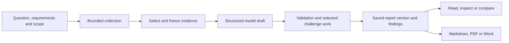

# Reading reports and evidence

The All Seeing Eye separates what a source reports from what an assessment concludes.
A report brings together selected evidence, key judgements, uncertainty, assumptions,
alternative explanations and collection gaps. Its automated checks help make those
parts traceable; they do not establish that the assessment is true.

## Four different questions

| Measure | Question it answers | Shown as |
| --- | --- | --- |
| Source reliability | How is this source assessed? | A-F |
| Information credibility | How is this particular item assessed? | 1-6 |
| Likelihood | How likely is the judgement or event? | A named probability band |
| Analytical confidence | How strong are the foundations for that judgement? | High, Moderate or Low, with a rationale |

These measures are not interchangeable. A reliable publisher can repeat an unverified
claim. An event can be assessed as likely while confidence remains low because the
available information is thin.

The distinction between likelihood and confidence follows the UK PHIA
[uncertainty guidance](https://www.gov.uk/government/publications/explaining-uncertainty-in-uk-intelligence-assessment/explaining-uncertainty-in-uk-intelligence-assessment).
The app's specific evidence matrix and confidence limits are application rules,
not an official scoring formula or a claim of accreditation.

## Source reliability and information credibility

The reader and evidence panels use these labels:

| Reliability | Meaning | Credibility | Meaning |
| --- | --- | --- | --- |
| A | Completely reliable | 1 | Confirmed by other sources |
| B | Usually reliable | 2 | Probably true |
| C | Fairly reliable | 3 | Possibly true |
| D | Not usually reliable | 4 | Doubtful |
| E | Unreliable | 5 | Improbable |
| F | Reliability cannot be judged | 6 | Truth cannot be judged |

F and 6 mean **unknown**, not false. Source reliability is recorded with its basis
and limitations. Registry labels, organisation names and instrument flags are inputs
to the application, not measured accuracy scores. New research material without an
assessed source basis remains explicitly unassessed.

Automatic credibility grading is conservative:

- Instrument or authoritative-source metadata can support provisional grade 2,
  without claiming independent verification.
- State-controlled or interested-party reporting can receive grade 3, explicitly
  uncorroborated.
- Untranslated material, qualifying or conflicting headline wording, and ordinary
  text without claim-level verification remain grade 6.
- Topic similarity and repetition do not automatically produce grades 1, 4 or 5.

Uncertainty conditions take precedence over provisional source-category treatment.
Read the item's rationale rather than relying on its badge alone.

The engine groups declared organisations and possible copies so repeated material
cannot inflate the contribution count. Unknown provenance does not add another known
organisation. Different organisation labels still do not prove independent reporting
chains. See [sources and evidence](02_DATA_SOURCES.md) for the collection limits.

## Likelihood

Judgements use the following vocabulary and approximate ranges:

| Term | Approximate range |
| --- | --- |
| Remote chance | Above 0 to about 5% |
| Highly unlikely | About 10 to 20% |
| Unlikely | About 25 to 35% |
| Realistic possibility | About 40 to under 50% |
| Likely or probable | About 55 to 75% |
| Highly likely | About 80 to 90% |
| Almost certain | About 95 to under 100% |

These are the [PHIA Probability Yardstick](https://www.gov.uk/government/publications/explaining-uncertainty-in-uk-intelligence-assessment/explaining-uncertainty-in-uk-intelligence-assessment#phia-probability-yardstick)
bands. They deliberately avoid a precise numerical probability for an individual
judgement. The model does not calculate a calibrated percentage.

The validator requires a judgement's wording to match its saved probability band
and keeps likelihood language separate from factual reporting and the confidence
rationale. Wording checks cannot interpret every use of natural language.

## Confidence and evidence strength

The model proposes confidence and a reason. The engine then applies a deterministic
ceiling using that judgement's cited support and opposition. It does not give an
entire report one confidence level based on all selected material.

The versioned evidence policy maps reliability and credibility into **Strong**,
**Moderate**, **Limited** or **Unassessed** contributions. Only the strongest eligible
contribution in each declared organisation or possible-copy group counts.

- A strong contribution, or sufficient moderate contributions from separate known
  groups, can permit Moderate confidence.
- High requires at least two known groups with strong credibility-1 support, no
  source cautions in that support and no cited opposition.
- Opposition at least as strong as support limits confidence to Low. Weaker
  opposition prevents High.
- The ceiling can lower the model's confidence, but cannot raise it or change the
  selected likelihood band.

The engine saves the method, contributing groups, reasons and final confidence with
the report version. The report reader and exports use that saved assessment. The
[full evidence policy](REPORT_EVIDENCE_SCORING.md) explains the matrix and edge cases.

Supporting and opposing relationships are model-assigned. The engine does not
independently establish whether a passage supports a claim, whether an organisation
is independent, or whether unselected contrary evidence exists. Its information-base
checks are not a full measurement of analytical rigour, complexity or volatility.

## From research to a saved report

Research starts with a question or report template, destination, time window and
scope. A saved brief can also supply explicit requirements and a pinned revision.
Collection receipts record which providers ran and their results, including empty
responses, unavailable sources and exhausted budgets.

Report formats cover question-led research, intelligence summaries and reports,
country and area briefs, conflict assessments, disaster situation reports, aviation,
maritime activity and cyber summaries. They share a structured body, but ask for
different subject coverage. Choosing a template does not create missing evidence.

Selected evidence is frozen with the version, including items the final body may not
cite. The model writes against that bounded context. Deep and Advanced research
add challenge work; a further model opinion is not independent source verification.
Requirements without adequate support should remain visible as gaps or future
collection recommendations rather than being described as completed checks.

The structure reflects the emphasis on traceable judgements, assumptions, alternatives
and uncertainty in the [PHIA Common Analytical Standards](https://www.gov.uk/government/publications/phia-common-analytical-standards/phia-common-analytical-standards).
The presence of those sections does not prove exhaustive collection or sound analysis.

## Citations, checks and status

Evidence labels identify saved items. The application checks that cited labels exist,
that required sections and identifiers are present, and that reporting and judgement
citations follow the schema. It also checks confidence limits, requirement coverage,
source context, literal citation mismatches and relevant post-draft quality rules.

A citation or literal text match is not proof that a source supports the whole
judgement. Inspect the recorded excerpt, any selected original passages and their
locators, and the source itself when needed. The model cannot make an invented
evidence row legitimate by citing it.

| Status | Meaning |
| --- | --- |
| Ready | Required automated checks passed. Warnings can remain; analyst verification is not recorded by this status. |
| Needs review | A saved body has unresolved validation or evidence concerns, such as unsupported judgements, insufficient source context, strong contrary reporting or incomplete planned challenge work. |
| Failed | Generation did not produce a usable assessment. Recorded findings explain the failure. |

Read status and findings before using the key judgements. A completed model call is
not necessarily a ready report, and a ready report is not human approval.

## Evidence, versions and exports

Saved evidence retains available source identifiers, original title and excerpt,
translation, language, relevant dates, location precision, grades, rationale, hash
and source links. Missing information stays unknown. A country-level location does
not identify a precise incident site; a collection timestamp is not an event date.

Hashes identify recorded content, not authenticity. Selected passages and locators
provide traceability without implying a complete website archive. Optional archive
requests are best effort and do not establish that the preserved page exactly matches
what the collector saw.

Reports can be reopened, compared and exported as Markdown, PDF or Word from a saved
version. Exports carry its evidence and assessment findings rather than silently
reassessing it against today's catalogue. PDF and Word rendering use the structured
report projection and do not fetch remote assets during rendering. Exports remain
subject to the viewer's current access to the report.

For example, a thermal detection near a reported strike is evidence of detected heat.
It does not by itself establish a weapon, perpetrator or cause. A useful assessment
keeps the observation, attributed claims and unresolved explanations separate, then
identifies what further evidence could distinguish them.

See [AI in the app](AI.md) for model routing and privacy, and [source provenance](SOURCE_PROVENANCE_OPERATIONS.md)
for language and date handling.
