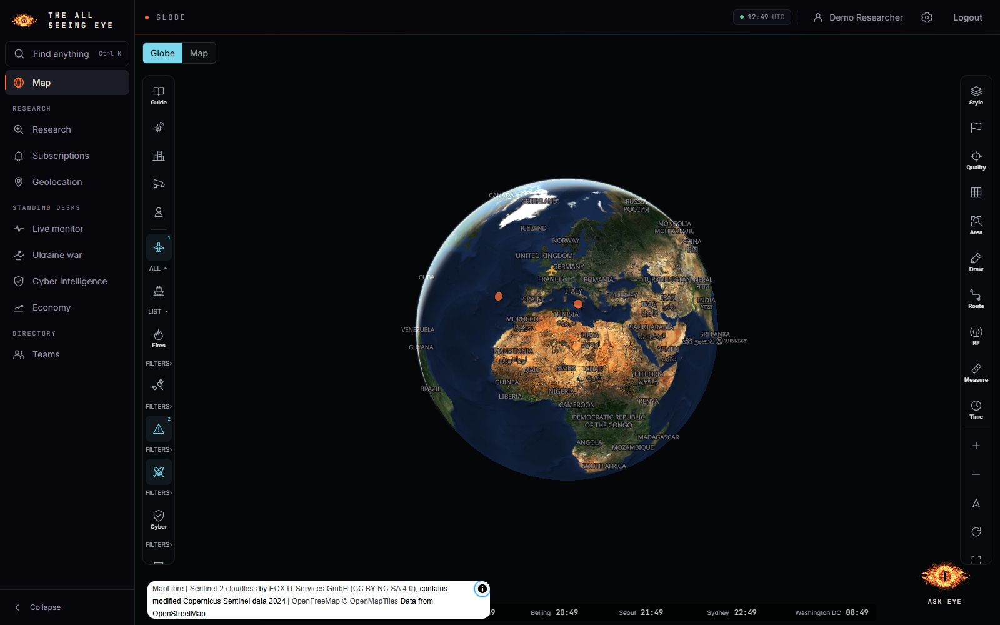
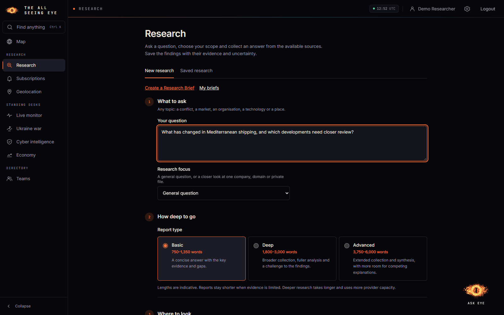

# Using the app

[Documentation](README.md) · [Setup](SETUP.md) · [Sources](02_DATA_SOURCES.md) · [AI](AI.md)

The app connects a live picture to research you can revisit. Use the map to notice
something, research a question, inspect the answer's evidence, then save or repeat
the work when it is useful.

## Find your way around

Ordinary users start on the globe. Administrators normally start in the separate
Administration workspace after completing MFA and can return to research from
there. A requested page can take precedence over that default destination.

| Workspace | Use it for |
| --- | --- |
| Map | Explore the globe or flat map, inspect observations and layers, select an area |
| Research | Ask a question, use a Research Brief, follow progress and read saved research |
| Subscriptions | Set up recurring research and review saved editions |
| Geolocation | Analyse supplied photos for possible locations and verification leads |
| Live monitor | Browse observations by subject and inspect specialist trackers |
| Ukraine war | Explore the conflict workspace and its dated source/reference material |
| Cyber intelligence | Review advisories, vulnerability and connectivity signals with source context |
| Economy | Explore economic series and supporting explanations |
| Teams | Manage membership and shared work within your authority |
| Administration | Approve accounts and manage users, sources, AI connections and audit activity |

The floating **Ask Eye** assistant is for shorter questions within the context and
tools available to it. A full research run has its own collection, saved evidence
and report workflow.

## 1. Explore an observation

*Local documentation session with an illustrative account and sample observations.*

Choose the globe or flat map, enable the layers you need and adjust the time or
country filters. Open an item to inspect its source, date, grade and location
precision before treating the marker as an exact event location.

The map combines several kinds of information. A news item, aircraft position,
reference facility and calculated satellite position do not mean the same thing.
Use the layer controls and [source guide](02_DATA_SOURCES.md) to understand each.
A source being live does not mean that it has matching observations in your view.

You can draw an area, measure distance or area, save a view and start research
from a selected scope. See [map tools](MAP_TOOLS_AND_LAYERS.md) and
[area research](AREA_RESEARCH.md) for the detailed controls.

## 2. Ask a bounded question

*The real form with an example question. No research or model request was submitted.*

In **Research**, write the question you want answered. Choose the research focus,
depth, countries or regions and time window. Basic, Deep and Advanced change
collection and analysis budgets; displayed word ranges are targets rather than
guaranteed output lengths.

Choose the destination before running: personal work is visible to you and
administrators; team work is visible to current team members and administrators.
That destination also determines the AI connection used.

Use a **Research Brief** when you want to retain explicit requirements and reuse
them. Brief revisions identify the instructions used for a run. Supported private
documents and media provide another input route; review the provider data-handling
implications in the [AI guide](AI.md) before uploading sensitive material.

Fresh web research is optional and requires a compatible configured destination
model. A long date window does not give every source a historical archive.
Collection receipts show what was attempted, returned, empty or unavailable.

## 3. Review the answer and evidence

Follow the research job's progress, then open the report. Read the main findings
alongside the citations, evidence annex, collection gaps and confidence limits.
Source reliability, information credibility, likelihood and analytical confidence
are separate concepts, explained in [reporting and assessment](03_DOCTRINE_AND_REPORTING.md).

A saved version keeps the selected evidence used for that assessment even after
live observations expire. It does not prove that the source was truthful or that
an entire original page was preserved. Original passage and asset views expose
what is actually available.

Use follow-up research to ask another question within the supported scope, or
start new research when the scope changes. Regeneration creates a new report
version. PDF, DOCX and other available exports carry report content and its
limitations; downloading a copy does not grant a recipient live app access.

## 4. Follow a subject over time

In **Subscriptions**, choose the question or brief, destination, reporting window
and schedule. Each edition has its own status. Compare it with the previous
successful edition where the workflow offers that option.

Pause a subscription to stop future work. Inspect the edition status when deciding
whether to retry or resume failed work; a provider error does not establish that
no model call was billed. Timing, source availability, provider limits and usage
allowances can affect delivery. See [subscription operations](SUBSCRIPTIONS_OPERATIONS.md).

## 5. Manage access and connections

An administrator approves accounts, configures source connections and tests AI
connections before assigning them. Source health and AI connectivity are different:
a working feed cannot make an unconfigured model generate a report.

Team membership controls shared access. Archived teams retain readable work while
ordinary writes stop. Reactivation requires an active manager; the administrator
recovery control can appoint an eligible manager as part of that action.

Use **Settings** for personal defaults and **Account security** for MFA and sessions.
Use the source and AI administration screens for the installation's current state,
rather than treating any documentation screenshot as a live status report.
