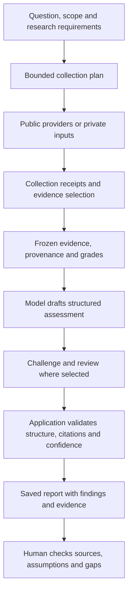

# AI in the app

AI helps plan research, turn collected material into a structured assessment and
challenge that assessment. The app keeps collection records, source grades and
validation separate from model output. A fluent answer is not proof that a claim
is true or that the research was complete.

The application does not require one fixed model. An administrator selects a
provider, model, reasoning setting and output allowance, tests the connection,
and assigns it to the appropriate audience. See [connection setup](AI_CONNECTIONS_OPERATIONS.md).

## Supported connections

| Connection | How it is used | Requirements |
| --- | --- | --- |
| OpenAI | Structured text and supported image requests through the OpenAI-compatible adapter; explicit Max reasoning at the official endpoint uses the Responses API | An API key and an account model that supports the requested structured output, reasoning and input types |
| Custom OpenAI-compatible endpoint | Chat Completions for text and supported image input; a separately configured embeddings route | The endpoint must implement the required contract. An endpoint being called compatible does not guarantee every feature works. |
| Amazon Bedrock | Native Converse requests with a Bedrock API key | A permitted regional model or inference-profile ID with compatible structured output and input support; provider-default reasoning only |

A local model server can be used through a compatible endpoint reachable by the
backend. Self-hosting the app alone does not make cloud model calls local.
Bedrock uses bearer API keys in this integration, not an AWS access-key pair,
instance role or automatic credential renewal. Explicit reasoning-effort settings are rejected for Bedrock; its provider default applies.

Model discovery lists account-visible IDs where supported. The connection test
checks a small structured response. Neither discovery nor a successful test is an
accuracy benchmark or a guarantee that a long report will complete.

## What uses AI

| Feature | Model's role |
| --- | --- |
| Research planning | Turn the question and requirements into bounded collection tasks and query variants |
| Report drafting | Write structured reporting, judgements, assumptions, alternatives, information gaps and follow-up recommendations from supplied context |
| Review and challenge | Examine alternative explanations and weaknesses; Deep and Advanced research add challenge work |
| Ask Eye | Answer questions using the context and tools made available to the assistant |
| Translation | Translate supported titles or query terms; translation does not improve a source's reliability grade |
| Conflict screening and tracker summaries | Classify relevant reporting and produce bounded summaries or explanations |
| Photo analysis | Suggest evidence-based location candidates from sanitised images and supplied context; these remain leads for review |
| Semantic search and evidence reranking | Use an optional, separate embeddings model to compare text |

Not every feature calls the model on every interaction. Feed polling, map rendering,
source-state checks, access control and deterministic report validation are ordinary
application code.

## From question to assessment

Collection has request, time and item limits. A plan is an intended set of actions;
the receipts record what actually ran. Saved briefs preserve authored requirements
and revision identity, while report versions retain the evidence used for that run.

The report validator checks citation labels, required structure, source-context
findings, probability wording and confidence rules. It can lower confidence when the
cited information cannot support the proposed level. Failed checks remain visible
and can result in a report needing review or failing production.

These checks cannot establish that a source is honest, a passage is correct, two
organisations are independent, or the model's reasoning is sound. Evidence
relationships proposed by the model also need scrutiny. Review the original sources,
event dates, contrary evidence and collection gaps before relying on an assessment.

## Which model a workspace uses

- **Personal work** uses the destination owner's personal assignment, if one exists,
  otherwise the global connection.
- **Team work** uses that team's assignment, otherwise the global connection. A
  user's personal override does not change the team's model.
- **Shared background text work**, such as live-feed translation, uses global routing.
- **Embeddings** have a separate global role and are not redirected by personal or
  team text assignments.

Assignments apply to the text roles together. An invalid assignment fails visibly
rather than silently borrowing another audience's provider. A run captures its
model configuration when it starts, so changing the default does not switch providers
partway through it. The saved routing record identifies the model and configuration
used. Installations with no assignments can resolve enabled role profiles; the
recommended setup is an explicit tested global assignment.

## Optional fresh web research

Fresh web research is an explicit switch for a public research question. It requires
the destination's official OpenAI connection and a model/account supporting the native
web-search tool. Bedrock and custom compatible endpoints do not gain this feature
through a fallback provider.

The result is saved as generated discovery context with the provider's citation
annotations. It does not become graded evidence merely because it contains links.
Private document and media research does not send its contents to this search tool.
The [fresh web guide](FRESH_WEB_RESEARCH.md) explains the saved record and limits.

## Data handling and cost

Questions, selected evidence and other context required by a model stage are sent
to that stage's configured endpoint. Analysis of private inputs can send extracted
text or sanitised images to the chosen model provider. Document/media collection
does not automatically send extracted terms to public research feeds, but this does
not make model analysis an offline operation.

Credentials are encrypted on the application server and are not returned as full
keys to the browser. Native OpenAI Responses requests set `store: false`; this does
not override the provider account's retention policy. Check the chosen provider's
terms before using sensitive material.

A report can involve several billed calls. Reasoning tokens, retries, optional web
search and embeddings can add cost. Administrators can inspect recorded usage,
set shared and individual allowances, and cap reasoning for mechanical tasks.
The app's monetary figures are estimates at configured prices, not provider bills.
See [AI cost controls](AI_COST_CONTROLS.md).

## Design boundaries

AI integration follows the same pragmatic SOLID approach as the rest of the app.
Application services depend on narrow model and embedding protocols; provider
adapters handle their own transport and response format. Routing, allowance
accounting, evidence selection and validation have separate responsibilities.
The composition root assembles them. This keeps provider-specific code out of report
rules and allows tests to use deterministic model responses without making paid calls.

For the wider structure, see [architecture](01_ARCHITECTURE.md). For the meaning of
source grades, probability and confidence, see [reporting and assessment](03_DOCTRINE_AND_REPORTING.md).
