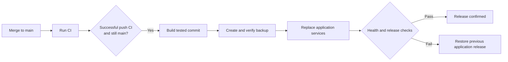

# Automatic deployment

A merge into `main` starts **CI**. When that push-triggered run succeeds, **Deploy VPS** can deploy its exact tested commit. Pull requests, unsuccessful CI runs and superseded commits do not deploy. A merge is live only when the deployment job succeeds.

The workflow and controller are configured for a particular installation. Reusing them on another host requires a reviewed configuration and controller installation. This page explains the release contract without listing live infrastructure addresses or recovery locations.

## Release flow

1. Confirm the tested revision is still the head of `main`.
2. Connect through a dedicated restricted deployment key with a pinned host key.
3. Take the deployment lock and check the checkout, release compatibility, backup key and free disk space.
4. Build images from the tested commit and probe them as their runtime users. Running services remain online during the build.
5. Create and authenticate a database backup, then verify the bundle.
6. Recheck the revision, fast-forward the checkout and replace application services. Preserve the database, persistent volumes and environment file.
7. Verify image identities, service health, HTTPS health/readiness, frontend assets and anonymous access rejection for administration.

Deployments are serial. A newer merge can queue but does not cancel an active deployment. The service restarts briefly; this is not a zero-downtime release. Live data warms up again and research jobs can be interrupted.

## Changes that need an operator

Changes to Compose configuration, Alembic configuration, migrations or the migration runner/CLI require a reviewed manual rollout. The API applies migrations at startup, so reverting application images cannot undo a schema change.

The deployment controller scripts also require operator installation. Their installed contents must match the target commit before the controller accepts that change. A repository update cannot replace the installed controller by itself.

Ordinary application, frontend, dependency and Caddy changes can use the automatic path once CI passes. Infrastructure and migration changes should include a specific verification and recovery plan.

## Access and configuration

The workflow uses a GitHub `production` environment, a dedicated `VPS_DEPLOY_KEY` secret and a `VPS_KNOWN_HOSTS` variable. Keep the environment's branch rules and any required approvals aligned with your release policy.

The host-side key is restricted to the controller's `check` and `deploy` commands with a full commit SHA. It does not provide an interactive shell, file transfer or forwarding. The installed controller should be administrator-owned and protected from modification by the deployment account.

Keep database credentials, application encryption keys and backup authentication material on the host or in your private secret store. They are not supplied by the GitHub deployment workflow. Merged application code and Dockerfiles remain trusted production code, so review and branch protection still matter.

The privileged workflow does not check out pull-request code or consume CI build artefacts. Disabling **Deploy VPS** stops automatic triggers; removing its deployment credential removes that route of host access.

## Failure and recovery

A build or backup failure leaves the running release in place. A cutover failure attempts to restore the previous checkout and application images, then verifies them. The Actions run remains failed even when rollback succeeds. Automatic deployment never restores or downgrades the database.

Each attempted release records the previous and target revisions, rollback image identities and a verified backup in private recovery storage. Retain and copy recovery material off-host according to your policy. The controller does not automatically prune backups or images.

A lost connection can leave the outcome uncertain. Inspect the deployment record and running release before retrying. If rollback fails, investigate through the operator's normal access path; do not discard local changes or restore a database blindly. See [backup and restore](BACKUP_RESTORE.md).

For a transient failure, rerun the successful **push-triggered CI** run for the current `main` commit. A manually dispatched CI run does not trigger deployment. Retrying an already deployed revision checks image revision labels and health.

Manual releases must honour the same deployment lock. Keep its location and the host's recovery procedure in your private operator runbook.
