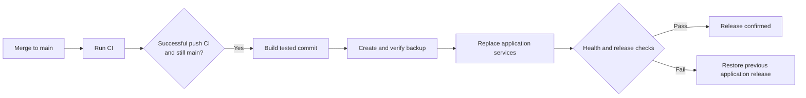

# Automatic deployment

A merge into `main` starts **CI**. When that push-triggered run succeeds, **Deploy VPS** can deploy its exact tested commit. Pull requests, unsuccessful CI runs and superseded commits do not deploy. A merge is live only when the deployment job succeeds.

The workflow and controller are configured for a particular installation. Reusing them on another host requires a reviewed configuration and controller installation. This page explains the release contract without listing live infrastructure addresses or recovery locations.

## Release flow


```mermaid
flowchart LR
    Merge[Merge to main] --> CI[Run CI]
    CI --> Gate{Successful push CI\nand still main?}
    Gate -->|Yes| Build[Build tested commit]
    Build --> Backup[Create and verify backup]
    Backup --> Release[Replace application services]
    Release --> Verify{Health and release checks}
    Verify -->|Pass| Live[Release confirmed]
    Verify -->|Fail| Rollback[Restore previous application release]
```

1. Confirm the tested revision is still the head of `main`.
2. Connect through a dedicated restricted deployment key with a pinned host key.
3. Take the deployment lock and check the checkout, release compatibility, backup key and free disk space.
4. Build images from the tested commit and probe them as their runtime users. Running services remain online during the build.
5. Create and authenticate a database backup, then verify the bundle.
6. Recheck the revision, fast-forward the checkout and replace application services. Preserve the database, persistent volumes and environment file.
7. Verify image identities, service health, HTTPS health/readiness, frontend assets and anonymous access rejection for administration.

Deployments are serial. A newer merge can queue but does not cancel an active deployment. The service restarts briefly; this is not a zero-downtime release. Live data warms up again and research jobs can be interrupted.

## Changes that need an operator

Changes to Compose configuration, Alembic configuration, migrations or the migration runner/CLI require a reviewed manual rollout. The API applies migrations at startup, so reverting application images cannot undo a schema change.

The deployment controller scripts also require operator installation. Their installed contents must match the target commit before the controller accepts that change. A repository update cannot replace the installed controller by itself.

Ordinary application, frontend, dependency and Caddy changes can use the automatic path once CI passes. Infrastructure and migration changes should include a specific verification and recovery plan.

## Access and configuration

The workflow uses a GitHub `production` environment, the `VPS_DEPLOY_KEY`, `VPS_HOST` and `VPS_PORT` secrets and a `VPS_KNOWN_HOSTS` variable. Keep the environment's branch rules and any required approvals aligned with your release policy.

The host-side key is restricted to the controller's `check` and `deploy` commands with a full commit SHA. It does not provide an interactive shell, file transfer or forwarding. The installed controller should be administrator-owned and protected from modification by the deployment account.

Keep database credentials, application encryption keys and backup authentication material on the host or in your private secret store. They are not supplied by the GitHub deployment workflow. Merged application code and Dockerfiles remain trusted production code, so review and branch protection still matter.

The privileged workflow does not check out pull-request code or consume CI build artefacts. Disabling **Deploy VPS** stops automatic triggers; removing its deployment credential removes that route of host access.

## Failure and recovery

A build or backup failure leaves the running release in place. A cutover failure attempts to restore the previous checkout and application images, then verifies them. The Actions run remains failed even when rollback succeeds. Automatic deployment never restores or downgrades the database.

Each attempted release records the previous and target revisions, rollback image identities and a verified backup in private recovery storage. Retain and copy recovery material off-host according to your policy. The controller does not automatically prune backups or images; see [pruning old releases](#pruning-old-releases).

A lost connection can leave the outcome uncertain. Inspect the deployment record and running release before retrying. If rollback fails, investigate through the operator's normal access path; do not discard local changes or restore a database blindly. See [backup and restore](BACKUP_RESTORE.md).

For a transient failure, rerun the successful **push-triggered CI** run for the current `main` commit. A manually dispatched CI run does not trigger deployment. Retrying an already deployed revision checks image revision labels and health.

Manual releases must honour the same deployment lock. Keep its location and the host's recovery procedure in your private operator runbook.

## Deployment endpoint changes

Provision `VPS_HOST` (DNS hostname or IPv4 address) and `VPS_PORT` (1 to 65535)
in the protected production environment before manually rolling out this workflow.
Empty or malformed settings stop before SSH. Changing the destination subsequently
requires updating these secrets and the pinned `VPS_KNOWN_HOSTS` value together.
The previously published endpoint remains disclosed in Git history; review SSH
exposure privately with the operator. This change neither moves the host nor
rotates its credentials. Confirm the next authorised deployment reports `DEPLOYED`.

## Image inventories

The advisory **Image SBOMs** workflow builds API and web images for each main push
and PR. Its CycloneDX JSON artefacts include the commit SHA in their names and an
image inspection record, retained for 90 days. A failure does not block CI or merges;
inspect failed inventory runs before relying on this evidence. These inventories
identify the CI builds. The deployment controller rebuilds on the host, so retain
an inventory of the actual deployed image separately when exact deployed-package
provenance is required.

## Pruning old releases

Every attempted release leaves a release record (with its pre-deployment database
backup) in the controller's state directory, plus `ase-*:release-<sha>` and
`ase-*:rollback-<sha>` image tags. The controller never removes them, so disk use
grows with each deployment. `scripts/prune_deployments.py` is a separate,
operator-run script for the deployment account on the host. The controller,
the workflow and CI never run it.

```bash
python3 scripts/prune_deployments.py              # dry run: list what would go
python3 scripts/prune_deployments.py --apply      # remove exactly that list
python3 scripts/prune_deployments.py --keep 8 --apply
```

A dry run is the default and only reads Docker and Git state. `--keep` sets how
many of the newest release records stay (default 5, minimum 2), ordered by when
each record was written, whether or not that release succeeded. The script always
keeps:

- the newest successful release record, even when it is older than the kept ones;
- every image tag for the target or previous revision of a kept record, so each
  kept release still has its rollback images;
- every tag for the checkout's current `HEAD`;
- every tag whose image any container (running or stopped) still uses.

It removes only directories whose names match the controller's record pattern
and that hold a valid `release.json`. It never follows a symbolic link, never
touches `deployment.lock` or any `manual-*` or `env-*` file, and leaves a record
alone if it still holds a leftover `source` worktree (remove that with
`git worktree remove` first). Image tags are removed one by one with
`docker image rm`, never with `--force`, so Docker refuses an image still in use.
Other image names and tags, including `ase-*:latest`, are not considered.

`--apply` takes the deployment lock without creating it and stops when a
deployment is running, then recomputes the list under the lock. A failed removal
is reported and the rest continue; the exit status is then non-zero. The default
locations match the installed controller; `--state-dir` and `--checkout` override
them on another installation.

Pruning deletes the pre-deployment backups of the removed records. Keep your
scheduled, off-host backups independent of these records, and copy any record you
need for an investigation elsewhere before pruning.
