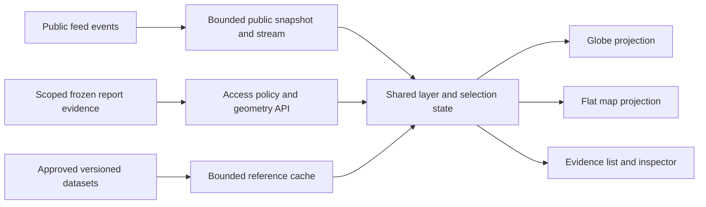

# Globe and flat-map research implementation

Prepared 6 September 2026 against `60f57e4`. Proposed work, not delivered layers.
Companion to [the expansion plan](RESEARCH_EXPANSION_IMPLEMENTATION_PLAN.md) and
[regional sources](REGIONAL_SOURCE_EXPANSION.md).

## 1. Extend the existing shared engine

Both views already exist. `MapEngine.ts` exposes `globe | mercator` and
`MapLibreEngine.ts` implements them with MapLibre 6 and an overlaid deck.gl canvas.
`useGlobeEngine.ts` handles the toggle; `stores/globe.ts` starts sessions in globe
mode. Keep these seams and default behaviour. Do not build a second map product.

Existing category points, selected markers, aircraft/cyclone/volcano icons,
low-zoom clustering, terminator and GNSS cells are shared. Existing base maps
include OpenFreeMap, labelled 2024 EOX imagery and authenticated OS tiles for GB.
EOX background imagery is not live imagery. Public events load up to 2,000 initially
and the browser mirror caps at 5,000 with shared SSE updates/expirations. Existing
snapshot loading can replace concurrent stream changes; reconciliation is required
as part of E4, not assumed correct because both transport paths already exist.

Map libraries have real projection-specific behaviour. Follow the installed-version
interfaces and verify each layer with actual WebGL, not just mocked engine tests.
[deck.gl MapLibre integration](https://deck.gl/docs/developer-guide/base-maps/using-with-maplibre),
[MapLibre globe custom-layer example](https://maplibre.org/maplibre-gl-js/docs/examples/add-a-simple-custom-layer-on-a-globe/).
These references describe integration options, not proof of this app's visual parity.

## 2. What the operator sees

A single layer drawer, grouped into Live events, This research, Public records,
Regional datasets, Connectivity and Imagery. Every entry shows its source, data
period, freshness, geographic precision, legend, visibility and available actions.
Source health and evidence confidence use separate indicators.

A country preset moves the camera and suggests relevant layers; it does not hide
contradictory evidence, auto-enable every source or grade a country politically.
Live-layer legends distinguish loaded records from total retained server records,
with the snapshot limit, active filters and mirror cap visible. Counts and density
never imply complete coverage. The operator can select a feature, inspect evidence, add it to research, draw an
area, compare dates, save a private view or export a permitted map with its report.

Use a desktop evidence panel and accessible mobile bottom sheet. A keyboard list
provides equivalent selection/actions. Unlocated evidence has a visible count and
list, never a fake point at 0,0 or a capital city. Loading, partial, empty, stale,
unavailable, permission-denied and WebGL-unavailable states have different wording.

Map colours identify data type. Dashed boundaries, marker shapes and labels express
approximation/dispute in addition to colour. Heatmaps show observed-record density,
not danger, population sentiment or confidence. Basemap boundaries are cartographic
references; contested claims are dated, separately attributed overlays.

## 3. Proposed layers, delivered to both projections

| Layer | Geometry / interaction | Source and interpretation | Stage |
| --- | --- | --- | --- |
| Precision-aware events | Exact points, city/admin/country approximations and unlocated list | Existing sources; fix centroid false precision first | E4 |
| Selected research evidence | Bounded points/areas linked to exact excerpts | Private/team frozen report evidence, never shared public event store | E5 |
| Research areas | Draw/select polygon or bounded box; launch query and save view | Operator-defined AOI, source capabilities determine actual collection support | E5 |
| Organisation locations | Registered office, project site and other location roles differentiated | Company/GLEIF/procurement records; office is not operations footprint | E6 |
| Relationship display | Select entities to open Connections; optional cited geographic links | Only dated supported relationships; a straight line is not a shipment route | E6 |
| Connectivity observations | Country/admin/ASN aggregates plus time chart | OONI/IODA; ASN may have no defensible physical area, so show list/chart | E8 |
| Chinese overseas projects | Points/areas with reported coordinate precision and project status | Approved AidData release; financial/project history, not current asset ownership | E8 |
| Taiwan activity context | Reported daily counts by supported area, linked methodology | Approved ChinaPower data; no manufactured flight path from aggregate counts | E8 |
| Maritime claims and geographic features | Separate dated outlines, physical features and assessed-control polygons | Approved AMTI/other primary releases; contested claims not sovereignty assertions | E8 |
| Russia/Ukraine historical assessments | Versioned attributed polygons and uncertainty | ISW/other permitted releases only; no presumption of current service or rights | E8 |
| Thermal observations | Dated sensor points with sensor resolution/quality metadata | FIRMS; thermal detections are not automatically incidents or causes | E8 |
| Dated satellite imagery | Footprints, cloud/date filters, selected before/after rasters | Copernicus catalogue then authorised bounded imagery delivery | E8/E10 |
| Verification annotations | Private points/areas/lines anchored to media frames and evidence | Operator-reviewed leads, cited conclusions distinguished | E10 |
| Changes between saved assessments | Added/removed/changed claims and geometry | Frozen selected evidence or retained permitted dataset versions only | E9/E11 |

Existing aviation/maritime/GNSS layers can be filtered with the same region/time
scope. Preserve their sensor gaps and current retention limits. Country presets
are Russia/Arctic and related context, China/Taiwan/South China Sea and overseas
projects, and Iran/Gulf plus relevant regional context. They are editable views,
not new permanent public datasets of every person or asset mentioned.

## 4. Geographic contract and false precision

Add a versioned EvidenceGeometry alongside existing optional `point` for gradual
compatibility. Proposed fields:

| Field | Meaning |
| --- | --- |
| `geometry` | Bounded WGS84 Point, MultiPoint, LineString, MultiLineString, Polygon or MultiPolygon; null allowed |
| `location_role` | Incident, reported area, registered office, project site, publisher location, observation footprint or analyst annotation |
| `precision` | Existing exact/city/admin1/country/none, extended only when a real need exists |
| `uncertainty` | Source-backed radius/area or null; never a fabricated kilometre value |
| `method` | Provider coordinates, registry address geocode, gazetteer area, manual annotation or model candidate |
| `original_crs` | Source CRS if supplied, plus declared normalisation; unsupported CRS rejected initially |
| `source_refs` | Frozen evidence/record IDs and exact locator supporting this geometry |
| `valid_from/to` | Observation/assessment validity interval, with time precision |
| `published_at`, `collected_at` | Different timestamps, never substituted silently for event time |
| `review_state` | Source-supplied, proposed, reviewed or disputed; reviewer/action history when applicable |
| `schema_version` | Allows older reports to retain known limitations |

CountryStage currently fills missing locations with a country centroid. Change
rendering and collection semantics: keep the country reference, show country-area
context or a clearly approximate symbol, and exclude it from exact-incident spatial
counts. Do not silently backfill old evidence with today's geocoder.

Use canonical geometry for analysis and export; simplified display geometry is a
derivative carrying its tolerance. Locationless evidence remains usable in reports.
Entity identity confidence, source confidence and coordinate precision are distinct.

## 5. Shared state and layer implementation

Extend MapEngine with viewport bounds, a camera snapshot and fit-to-geometry.
Keep projection as display state. Selected evidence ID, active source set, time
window, AOI and private overlay references live independently of projection.
Preserve filters and selection when toggling or changing basemap; no duplicate
engine instance, SSE connection or investigation run.

Add a LayerDescriptor registry for identifier, geometry family, source/version,
legend, supported dates, minimum zoom, visibility, selection handlers and renderer
capabilities. Shared adapters produce layers from the same canonical records.
Do not create one business-data transform per projection.

Use existing deck.gl layers for appropriate points/lines/areas; use native MapLibre
sources/layers when beneficial for raster or vector tiles. Prove globe support in
the pinned versions. If a representation fails parity, implement a tested alternative
or mark that optional representation unavailable, never silently omit evidence.
Avoid changing map libraries or integration mode without an isolated benchmark.

Move reusable geometry validation, selection state and inspector components to
shared modules. The research and globe features must not import each other.

## 6. API and storage seams

Proposed endpoints, to be refined through OpenAPI during E4/E5:
- `GET /api/map/layers`: available layer descriptors, capability and freshness metadata.
- `GET /api/map/features`: allowlisted layer IDs, bounded viewport/AOI, interval,
  scope, limit/cursor and source version; returns features plus coverage/truncation.
- `GET /api/reports/{id}/map`: authorised frozen report geometry and provenance.
- `POST /api/map/views`, `GET/PATCH/DELETE /api/map/views/{id}`: scoped saved view.
- `POST /api/map/exports`: authorised permitted export from an explicit saved view/version.

Separate public event data, scoped investigation geometry and reference datasets.
Private records never enter the public SSE stream or globally shared event cache.
Filter by AccessPolicy before counts, limits, bounding-box summaries or tile creation.
Cache keys include effective scope and source version; sensitive responses stay
private/no-store unless an explicitly reviewed scoped cache design is used.

Do not persist all incoming coordinates or raw event history. Live sliders cover
only the retained window. Historical modes require frozen selected report evidence
or an explicitly retained permitted reference-dataset version. Display missing dates.

Reference cache proposal: allowlisted versioned releases, validated in a bounded
worker, atomically replace active version, retain only quota-limited selected prior
versions. Cache loss is recoverable; saved report geometry remains independently
reproducible. E0 ADR establishes storage quotas and backup responsibilities.

Initially support validated GeoJSON imports with supported CRS and explicit scope.
Reuse isolated import controls, file/vertex bounds and sanitised properties. KML,
KMZ, arbitrary shapefiles and remote layer URLs wait for separate parser/SSRF review.

## 7. Antimeridian, poles and measurement

- [ ] Split wrapped query bounds into valid intervals without missing or counting
  twice the same ID. Test polygons, AOIs and paths crossing +/-180 degrees.
- [ ] Clip/tessellate display geometry safely at the seam, preserving rings and holes.
  Geodesic connections use intended paths, not long lines across the opposite world.
- [ ] Replace or adapt current degree-grid clustering for seam-aware grouping and
  distortion at high latitudes. Preserve counts and stable cluster identities.
- [ ] Precision-aware clusters do not mix approximate country locations into exact
  incident counts. Cluster count means records, never independent sources.
- [ ] Preserve true polar coordinates. Mercator cannot show the poles: disclose the
  limit and offer globe view without moving the underlying record southwards.
- [ ] Test Russia's Arctic, Alaska/Russia seam and South Pacific multi-polygons.
- [ ] Distances/areas use a reviewed geodesic implementation and consistent units,
  not screen-space measurement. Choose a dependency only after examining existing
  tooling and verifying its source/licence; no hand-rolled geodesic formula suite.

## 8. Imagery and map exports

Discover footprints first using spatial/date/cloud filters; request imagery only
for a selected bounded extent/resolution. Provider credentials remain server-side.
Display acquisition time, publication time, resolution, clouds and processing
version separately. Optical cloud cover and sensor limitations constrain comparison.
No promise of live, high-resolution coverage or automatic attribution from changes.

Saved map views include camera, projection, layers, filters, source versions and
selected evidence, but no secrets. Each save produces an immutable revision ID;
PATCH creates a new revision rather than rewriting a revision already used by a
report/export. An export request resolves exactly one authorised immutable revision
with canonical AOI, time filters and layer/source/evidence versions. Edits during
rendering cannot change its contents. Missing older datasets are disclosed, not
substituted with current versions. Export legend, scale, source attribution,
observation period and uncertainty. Historic overlays on a modern basemap must be
labelled; never imply the basemap itself depicts the historical date.

Implement an in-app image export and report attachment only after testing tile CORS,
canvas capture and licence constraints. Skip restricted layers with explicit notice
or disable that export, rather than removing attribution. Recheck session/object
access after rendering and before download; avoid a public screenshot service.

Direct public tiles can disclose the viewed area and client network address to the
provider. An application proxy can remove client identity/credentials from upstream
requests but still requests geographic tiles. Document this and provide approved
local/cached base layers for sensitive work; never promise zero geographic disclosure.

## 9. Performance and accessibility acceptance

Initial proposed delivery bounds, to validate against E0 reference hardware:
- Keep the 5,000-event client cap; at most 2,000 selected research/reference features
  per response and at most 100,000 display vertices per active overlay set.
- Enforce feature/property/byte caps before parsing and rendering; start with a
  5 MiB decoded feature-response ceiling. Return explicit truncation/LOD receipts.
- Cancel stale viewport requests, debounce movement and incrementally apply SSE
  bursts. Reconcile initial snapshots with concurrent upserts/expirations and reconnects
  using a version/watermark or bounded-buffer protocol; a late snapshot must not
  erase newer stream changes. Simplify polygons by zoom and avoid rebuilding unchanged layer data.
- Benchmark desktop integrated GPU and a mobile device at recorded viewport sizes.
  Proposed targets: p95 selection-to-inspector under 200 ms for loaded data, no
  repeated >200 ms main-thread stalls during ordinary panning, and no monotonic
  retained-memory growth after 20 projection/style/filter cycles.
- These are test targets, not measured results. Revisit limits transparently after
  measurement; do not introduce PostGIS/vector tiles merely because maps are added.
- If bounds/LOD are insufficient, add server-side aggregation or scoped vector tiles
  behind the same access model and test them before raising client caps.

Every feature has keyboard/list access, visible focus and a meaningful label.
Selection survives projection changes and the list mirrors map filters. Honour
reduced motion, stop rotation while inspecting and preserve Lite mode. Test zoom,
contrast, 390-pixel layout, loading/error states and WebGL context loss/recovery.

## 10. Release fixtures and implementation order

E4 fixtures: exact incident, approximate city, country-only, unlocated, duplicated
publisher editions, polar point, wrapped bounds and malformed geometry. Include
slow initial snapshots interleaved with upserts/expirations, reconnect replay and
loaded-versus-retained count/truncation disclosure. Complete
backend/DTO changes and inspector/list first, then adapt current registry/clusters.

E5 fixtures: private report A, team report B, revoked member, saved AOI across the
seam, two projections and two basemaps. Implement authorised overlay API/store and
shared selection, followed by layer drawer, timeline and research-launch actions.

E8 fixtures: synthetic dated AidData projects, aggregate ADIZ counts, OONI/IODA
signals, historical assessment polygon and satellite footprint. Each adapter/layer
ships separately with source/permission receipts; no blocked provider holds up all.

E9/E10 fixtures: historical report with unavailable modern source, missing imagery,
restricted export, a saved-view edit during export, unavailable old source version,
RTL label, selected evidence package and expired session during
rendering. Verify real GPU screenshots alongside semantic feature/list assertions.

Release check: same selected IDs, scope, time and counts in globe/flat map; no
private SSE/cache leakage; correct seam/pole behaviour; no country centroid presented
as exact; original coordinates/citations survive report/export; measured rendering
budgets; old reports and existing layers remain usable. Mocked map tests alone do
not establish any of the real rendering claims.
