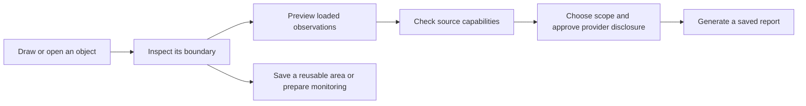

# Map workspace

Use the globe and map to draw an area, inspect observations and start research,
or to study terrain and radio links. The tools share map geometry; saved drawing
collections and radio studies keep work between visits.

## Find and arrange tools

Open **Tools** to search the tool list. Tools are grouped into drawing,
research, radio and terrain, and map settings. Pin up to four favourites for
quick access. Zoom, north and world-view controls stay separate from the tool
list. Global search can open a specific tool on the map.

On desktop, drag the inspector edge to resize it. Its keyboard resize control
supports arrow keys, Home and End. On a phone, the inspector becomes a bottom
sheet. Collapse it to expose more of the map, or close it to stop the active
input mode. The compact activity strip keeps drawing controls available while
the inspector is collapsed. Only one tool receives drawing or placement input
at a time.

**On this map** lists drawings and current results. Use it to reopen a tool,
hide a result or remove it. Hiding a result keeps its inputs. Clearing a result
does not delete a saved collection or study.

## Draw and save

1. Open **Draw on map** and choose a path, polygon, rectangle or circle.
2. Draw with map clicks. Rectangles and circles also support dragging.
3. Finish the sketch and choose **Add sketch to collection**.
4. Give the drawing a name, colour and notes. Set its visibility or lock it
   against edits. A collection can contain multiple drawings and named points.
5. Choose a collection title and personal or team workspace, then select
   **Save collection**.

The current sketch is temporary. Adding it to a collection does not save it to
the server until you save the collection. Personal collections are visible to
their owner and administrators; team collections follow current team access.
Updating a collection keeps its scope and checks the revision to avoid
overwriting another edit. **Browse saved** and **Load more collections** open
existing work. Opening a collection starts a fresh editing history.

Select a drawing to edit it. Drag individual vertex handles, move the sketch,
or use **Edit coordinates** to enter WGS84 longitude/latitude pairs. Paths and
polygons support inserting and removing vertices; circles accept a numeric
radius. **Apply sketch edits** updates the selected collection object. Saving
is blocked while a new sketch or changed geometry still needs applying.

Sketch and collection undo/redo histories each retain up to 50 operations.
Dragging commits one operation when released; Escape cancels its preview.
Collections support up to 50 objects and 32 anchors per path or polygon.
Circles have a maximum radius of 1,000 km and a sampled perimeter.

GeoJSON import adds WGS84 points, lines and single-ring polygons. Imports are
limited to 128 KiB and the collection limits above; holes, unsupported geometry
and invalid coordinates are rejected. Export writes the collection as GeoJSON.
Circles and rectangles export as polygons, so their specialised editing handles
are not retained when importing that export.

## Research and monitor the same boundary

Select an area drawing and choose **Research**. Named points can instead become
radio transmitter sites. Drawn paths, measurements and planned routes can supply
the corridor tool.

The area preview shows records currently loaded by the map, grouped by precise
membership, approximate location and unknown membership. Select a listed record
to inspect it on the map. This preview makes no provider or AI request. It is
limited by the map's loaded records, filters and retention; zero matches do not
establish that nothing happened there.

**Check sources** checks connector capabilities, not source results. Choose the
question, period, depth and supported sources, then approve disclosure before
generating a report. Your question and settings survive tool changes during the
signed-in session. Source checks and disclosure approval must be renewed after
reopening. **Continue on research page** carries the scope into the full research
workflow. Accepted report jobs continue when you leave the tool.

Saved reusable areas and shape-based monitoring retain the exact research
polygon. Approximate and country-level locations are not silently counted as
precisely inside it. A drawn sketch's geodesic display and a straight-edged
research polygon can differ: review the adopted research boundary. For an area
crossing 180° longitude, use a rectangle; unsupported crossing polygons and
circles are rejected instead of widened to a box.

See [area research](AREA_RESEARCH.md) for collection limits, time semantics and
monitoring rules.

## Plan a radio study

Open **Radio planning**. Place transmitter and receiver sites on the map or enter
named coordinates in decimal degrees or degrees/minutes/seconds. Sites can be
swapped. Configure the study, run an analysis, then inspect the profile and linked
map position. Planning constraints can limit the mast-height suggestions.

Under **Saved studies and comparison**, save a personal or team study or retain
a comparison baseline. A saved study contains its setup, a frozen result
summary and bounded terrain samples when available. Reopening restores the
setup; run analysis again to rebuild detailed profiles and overlays. Comparison
shows changed inputs and available planning-margin differences for matching
models. It does not make differently scoped studies equivalent.

Export and import use bounded study JSON. Imported scenarios are unverified
inputs, not measured evidence. Updating a saved study retains its access scope
and checks its revision.

The optional directional antenna setting is an **idealised horizontal pattern**
for terrain and free-space receiver links. It is not a measured antenna pattern
and does not represent vertical tilt or polarisation. Area and HF models require
this setting to be off.

Terrain results retain source attribution and nominal resolution. Denser samples
cannot recover detail absent from the terrain raster. Radio colours describe
modelled conditions; they do not guarantee reception. The existing native NTIA
LFMF groundwave model is separate from the sampled terrain/Fresnel screen.
ITM integration and higher-resolution terrain remain follow-up work requiring
validated inputs, reference checks and bounded execution. See
[radio modelling and terrain evidence](RADIO_MODEL_EVALUATION.md).

## Other tools

| Tool | Use and limits |
| --- | --- |
| Terrain profile | Enter two sites or reuse the first two drawing/measurement points. Follows their direct geodesic, up to 200 km, rather than every bend of a longer path. |
| Sampled viewshed | Inspect ground visibility within up to 50 km. Only marked samples are assessed; missing terrain stays unknown. Buildings, trees and atmospheric refraction are not included. This is not radio coverage. |
| Corridor research | Preview an approximate boundary around a path up to 200 km, using 2–32 points. For longer route geometries, review and explicitly accept simplification. Sharp turns, high latitudes and antimeridian crossings have limits; the generated polygon is the research boundary. |
| Coordinate workbench | Convert WGS84 decimal degrees, degrees/minutes/seconds and UTM. Centre the map or copy the result. UTM is unavailable outside its supported latitude range. |

The **Nuclear effects (education)** panel links to NUKEMAP, Alex Wellerstein's
external educational resource. Opening it contacts that site's operator. The
link does not include your drawing, selected coordinates or research question.
No nuclear-effects model runs inside this app, and educational scenarios are
not observed events or emergency-response guidance.

## Data and design boundaries

Save drawings and radio studies explicitly before leaving the map. Other
temporary analysis state is not a saved map session. Account, role, activity and
workspace-access changes clear transient data and prevent stale responses from
restoring it. The map does not provide an archive of all past live observations.

The implementation applies SOLID through separate responsibilities for tool
presentation, input ownership, geometry validation, analysis and authorised
document storage. A new tool can reuse those boundaries without turning the map
component into the owner of every workflow. See [architecture](01_ARCHITECTURE.md)
and [map tools and layers](MAP_TOOLS_AND_LAYERS.md) for engineering details.
