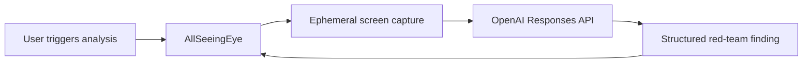

# AllSeeingEye: original 5-hour hackathon implementation plan (historical)

> Historical design record. The current architecture and behaviour are documented in the repository README and `MASTER_IMPLEMENTATION_PLAN.md`.

A second pair of eyes for your thinking.

This document is self-contained. It supersedes the v1 brief and is written to be handed directly to a build session (human or Claude Code) as the single source of truth. It keeps every product requirement from v1 that survived scrutiny, fixes the parts that would have burned demo time, and adds the two things v1 lacked entirely: a time budget and pre-agreed fallback decisions.

---

## Part A: What changed from v1 and why

Each item below is a defect or gap found in the original brief, with the resolution now baked into this plan.

1. **No time plan for a 5-hour hackathon.** v1 listed 18 P0 items and 16 delivery steps with no clock. v2 adds a phase schedule with three hard checkpoints and pre-agreed cut lines (Part C). The single most important line: the complete capture-to-finding flow must work by 2:50.

2. **The React Bits Evil Eye component was unverified.** Now verified (July 2026): it exists at `src/content/Backgrounds/EvilEye` in `DavidHDev/react-bits`, is served from the registry endpoint `https://reactbits.dev/r/EvilEye-TS-CSS`, depends only on `ogl@^1.0.11`, and consists of two files (`EvilEye.tsx`, `EvilEye.css`). Licence is MIT + Commons Clause (fine to use inside an app; do not resell the components themselves). Exact vendoring script is in T2.

3. **The Evil Eye shader is opaque.** Its OGL renderer is already created with `alpha: true, premultipliedAlpha: false`, but the fragment shader ends with `color += uBgColor;` and `vec4(color, 1.0)`, so it paints an opaque rectangle. v1 assumed transparency would just work. v2 specifies a two-line shader patch to derive alpha from brightness, with a timeboxed fallback (circular dark-orb mask) that still uses the real React Bits component (T2).

4. **The component's mouse tracking is container-local.** It listens for `mousemove` on its own container, which is useless for a 160px window on a large desktop. v2 specifies removing those listeners and driving the existing smoothed `uMouse` uniform from a `target` prop fed by main-process global cursor polling (T2). Electron has no global mouse-move event, so polling `screen.getCursorScreenPoint()` at 30 Hz is the correct mechanism.

5. **Transparent window resizing on Windows is a known risk.** Electron documents that transparent windows are not user-resizable, and programmatic `setBounds` growth on transparent windows has a history of glitches on Windows. v2 keeps the three-mode resize design as primary, but T1 includes a five-minute spike that proves `setBounds` works on the build machine before any UI is built on top of it, plus a fully designed fallback (single fixed-size window with click-through toggling) in Appendix H2. Also: `setBounds(bounds, true)` animation is macOS-only, so animate content in React and resize the OS window in one shot.

6. **Hiding the window for capture invites focus and flicker bugs.** v1 said hide, wait, capture, restore without stealing focus. v2 uses `win.setOpacity(0)` then restore, which never changes z-order, focus, or taskbar state, and keeps the renderer alive. `win.hide()`/`showInactive()` is the documented fallback, and `setContentProtection(true)` is noted as an optional refinement (it excludes the window from capture APIs entirely, but would also hide the eye from screen-share tools during a remote demo, so it is not the default).

7. **`.env` loading in the Electron main process was unspecified.** Vite env handling only covers the renderer, and putting the key in a `VITE_`-prefixed variable would bundle it into renderer code (a real leak trap). v2 adds `dotenv` in main, plus a packaged-app fallback that reads `.env` sitting beside the portable exe for demo machines (T4, Part E7).

8. **`electron-store` v10+ is ESM-only** and fights the CommonJS main bundle produced by electron-vite. v2 pins `electron-store@8.2.0` (CJS, stable, identical API surface for our needs).

9. **Zod and the OpenAI helper have a version compatibility matrix.** v2 pins `zod@^3.25` which satisfies `zodTextFormat` across openai-node versions (3.25 also exposes the `zod/v4` subpath if the installed SDK wants it). Structured outputs now accept string length keywords, but if the API ever rejects `maxLength`, the recovery is pre-decided: delete the `.max()` calls and rely on the local `sanitiseFinding()` pass, which truncates and clamps regardless (Part E4).

10. **`display_id` matching can fail on Windows.** `desktopCapturer` sources sometimes carry an empty `display_id`. v2 specifies a three-step match: by `display_id`, then by display index, then first source (Part E6). Thumbnails must be requested at `display.size * scaleFactor` or text will be captured blurry on scaled monitors.

11. **`Ctrl+Shift+P` is the VS Code command palette.** Registering it globally steals it system-wide, and the demo script itself opens VS Code. Pause moves to `Ctrl+Alt+P`. Note also that `Ctrl+Shift+R` globally steals browser hard-reload while the app runs; acceptable and intended (it is the trigger), but documented.

12. **A frameless, taskbar-less, always-on-top window with no quit affordance is a trap.** In eye mode, hover or focus opens the four-input renderer tray beneath the eye, with right-click as a fallback. Compact and expanded modes retain a native operational context menu with Pause, Show/Hide and Quit.

13. **Drag regions swallow clicks and right-clicks.** `-webkit-app-region: drag` areas do not deliver click or contextmenu events on Windows. v1 wanted "click the eye to analyse" and "right-click the eye for menu" plus a drag area. v2 specifies exact zones: the inner eye disc is `no-drag` (click and right-click live there), the outer annulus is the drag handle. In compact and expanded modes, a top strip is the drag handle (Part E9).

14. **v1 had internal contradictions.** Context menu was both required and P1; analysis modes were both required and P1; "Enter to submit" was ambiguous. Resolved: minimal context menu is P0 (see 12); all five modes ship in P0 because they are just prompt strings plus a select control, but General and Security are the protected core if time runs out; text submit is `Ctrl+Enter` (plain Enter inserts a newline).

15. **No demo insurance.** v2 adds three cheap artefacts: a `scripts/preflight.mjs` that validates the API key and model before the demo, and two planted demo assets in the repo (a flawed proposal HTML page and an insecure code snippet) so the model always has something juicy to find (Part G3). Also `app.requestSingleInstanceLock()` so a double-launch during a nervous demo cannot spawn two eyes.

16. **Model default.** `OPENAI_MODEL` stays env-driven and defaults to the latency-oriented `gpt-5.6-luna` tier. Preflight verifies access; the error mapper has a specific message for `model_not_found` telling the user to change `OPENAI_MODEL`. Optional `OPENAI_REASONING_EFFORT=low` is supported for reasoning models to cut latency, sent only when set (a 400 on non-reasoning models otherwise).

17. **Latency is a demo feature.** v2 adds an elapsed-seconds counter to the Thinking state, a 45 s hard timeout, `maxRetries: 1` on the SDK client, and a talk-track note in the demo script (you narrate while it thinks).

Everything else from v1 (product concept, schema, red-team instruction, privacy stance, security posture, non-goals) stands, and is restated below so this document works alone.

---

## Part B: Locked decisions

Do not re-litigate these during the build.

| Decision | Choice | Rationale |
|---|---|---|
| Scaffold | `electron-vite` react-ts template | Main/preload/renderer split, HMR, electron-builder config and scripts out of the box |
| Language/stack | Electron + React + TypeScript + Vite | Per brief |
| Styling | Plain CSS with CSS variables (design tokens), no Tailwind | Fastest for ~8 components; avoids toolchain setup |
| Renderer state | `useReducer` + context, no state library | Small state surface |
| Eye | React Bits EvilEye, vendored source, `ogl` dependency | Verified available; brief requires it |
| Screenshot hiding | `setOpacity(0)` dance, `hide()` fallback | No focus or z-order churn |
| Prefs | `electron-store@8.2.0` | CJS, avoids ESM trap |
| Validation | `zod@^3.25` everywhere (API schema, IPC args, prefs) | Compatible with `zodTextFormat` |
| OpenAI call | `client.responses.parse()` + `zodTextFormat`, image as base64 data URL `input_image` | Native structured outputs, no JSON scraping |
| Shortcuts | `Ctrl+Shift+R` analyse, `Ctrl+Shift+Space` show/hide, `Ctrl+Alt+P` pause | VS Code conflict avoided |
| Window modes | idle eye 216x120, eye plus tray 216x258, compact 520x200, expanded 560x620, main process owns the map | Keeps the idle eye clean and expands only for explicit input choices |
| Packaging | electron-builder, `portable` target | Single exe, no installer UI, fastest to demo |
| Tests | Vitest on pure modules in `src/main/core` only | No Electron mocking in a 5-hour window |
| File size | Target 350 lines per hand-written file, 400 hard ceiling | House standard |

Hackathon-scope note on quality: tests cover all pure decision logic (schema, prompts, error mapping, geometry, prefs, gating). Electron plumbing is verified manually via the checkpoint checklist. A 90 percent coverage target is explicitly out of scope today and recorded as a known limitation in the README.

---

## Part C: The clock

Total 300 minutes. Commit at the end of every phase (conventional commits). Timings assume one builder driving Claude Code or working solo.

| Phase | Window | Goal (deliverable you can see) |
|---|---|---|
| T0 | 0:00 - 0:25 | Scaffold runs; transparent frameless always-on-top window shows a placeholder circle; git initialised; `.env` ignored |
| T1 | 0:25 - 1:00 | Window service: drag, three modes resize correctly (spike proven), position persists and clamps, preload API skeleton, single instance |
| T2 | 1:00 - 1:40 | Real Evil Eye rendering transparent, tracking the desktop cursor, state-driven visuals, status label |
| T3 | 1:40 - 2:10 | Capture pipeline: correct display, eye absent from the JPEG, dev-only in-memory preview proves it |
| T4 | 2:10 - 2:50 | OpenAI service + schema + orchestrator: `Ctrl+Shift+R` produces a real validated finding in the compact bubble |
| T5 | 2:50 - 3:35 | Expanded panel, modes, manual text tab, pause, privacy first-run, context menu, error and no-issue states |
| T6 | 3:35 - 4:10 | Tests green, preflight script, demo assets, README with demo script, typecheck clean |
| T7 | 4:10 - 5:00 | Windows package built and smoke-tested, secret-leak sweep, demo rehearsal, buffer |

**Checkpoint A (1:40).** An animated transparent eye tracks the cursor across the desktop. If the shader transparency fight exceeds 20 minutes, switch to the dark-orb fallback (T2 step 5) and move on without guilt.

**Checkpoint B (2:10).** A captured JPEG of the correct display, without the eye in it, visible in the dev preview. If display matching is flaky, hardcode the primary display and file it as a known limitation.

**Checkpoint C (2:50). The demo line.** End-to-end capture to finding works. Everything after this point is enhancement. If C slips past 3:10, apply cut line 1 immediately.

**Pre-agreed cut lines, in order:**
1. Cut feedback buttons, copy button, and entrance animations (they are P1 anyway).
2. Collapse the expanded panel to a single scrolling detail view without fancy layout.
3. Reduce modes UI to General + Security (keep all five addenda strings; hide three options).
4. Package with `electron-builder --dir` (unpacked folder) instead of portable exe.
5. Reduce tests to `finding-schema`, `error-map`, and `window-modes` only.

**Never cut:** manual text tab (it is the demo fallback), pause, the missing-key message, the no-disk-writes guarantee, the quit menu item.

**Demo-ready definition (must all hold at 4:30):** app launches; eye tracks; `Ctrl+Shift+R` yields a finding on the demo display; expand works; text tab works; pause works; missing-key path verified once by renaming `.env`; README demo script written.

---

## Part D: Phase-by-phase build guide

### T0 (0:00 - 0:25): Scaffold and guardrails

```bash
npm create @quick-start/electron@latest allseeingeye -- --template react-ts
cd allseeingeye
npm install
npm i openai zod@^3.25 ogl electron-store@8.2.0 dotenv
npm i -D vitest
git init && git add -A && git commit -m "chore: scaffold electron-vite react-ts"
```

1. Confirm `npm run dev` opens the template window.
2. `.gitignore`: ensure `node_modules`, `dist`, `out`, `.env`, `*.local` are present. Create `.env.example`:
   ```env
   OPENAI_API_KEY=
   OPENAI_MODEL=gpt-5.6-luna
   # Optional, only for reasoning models:
   # OPENAI_REASONING_EFFORT=low
   ```
3. Replace the template window options with the companion window flags (Part E8) and render a placeholder `<div>` circle with a drag annulus to prove transparency and drag work.
4. Remove template cruft you will not use (electron-updater wiring if present).
5. Add `app.requestSingleInstanceLock()`; second instance focuses the first and exits.

Verify: transparent circle floats over the desktop, always on top, draggable, no taskbar entry, right-click does nothing yet, `Ctrl+C` in the terminal quits.

### T1 (0:25 - 1:00): Window service, prefs, preload skeleton

1. **Resize spike (do this first, 5 minutes).** Wire a temporary IPC or keyboard handler that calls `win.setBounds({width: 560, height: 620})` and back. If the transparent window resizes cleanly on this machine, proceed. If it glitches (blank content, stuck size), adopt Appendix H2 (fixed-canvas strategy) now, not later.
2. Implement `src/main/core/window-modes.ts` (mode map + pure `placeWindow()` clamp, Part E5).
3. Implement `src/main/prefs.ts` with `electron-store@8`, zod-validated on read (Part E10). Persist bounds on a debounced `moved` event. On startup, clamp saved position against current displays.
4. Implement `src/main/ipc.ts` with `window:set-mode`, `prefs:get`, `prefs:update`, `app:quit`, all args zod-validated.
5. Implement `src/preload/index.ts` exposing the typed `criticalEye` bridge (Part E2). Never expose raw `ipcRenderer`.
6. Renderer: three dummy views switched by mode with buttons that call `setWindowMode`, so resize and clamping are testable near screen edges.

Verify: drag near the right screen edge, expand, window stays inside the work area; restart, position restored; run a second instance, it exits.

### T2 (1:00 - 1:40): Evil Eye, transparency, desktop cursor tracking

1. **Vendor the component.** Create `scripts/vendor-evil-eye.mjs`:
   ```js
   import { mkdirSync, writeFileSync } from 'node:fs';
   const res = await fetch('https://reactbits.dev/r/EvilEye-TS-CSS');
   const json = await res.json();
   const dir = 'src/renderer/src/components/EvilEye';
   mkdirSync(dir, { recursive: true });
   for (const f of json.files) {
     const name = f.path.split('/').pop();
     writeFileSync(`${dir}/${name}`, f.content);
     console.log('vendored', name);
   }
   ```
   Run `node scripts/vendor-evil-eye.mjs`. Commit the vendored files with a header comment crediting React Bits and copy the repo licence into `THIRD-PARTY.md` (MIT + Commons Clause).
2. **Transparency patch.** In the vendored fragment shader, remove the background flood and emit alpha from brightness:
   ```glsl
   // color += uBgColor;   <- delete or comment out this line
   float alpha = clamp(max(color.r, max(color.g, color.b)), 0.0, 1.0);
   gl_FragColor = vec4(color, alpha);
   ```
   The renderer is already `alpha: true, premultipliedAlpha: false`. If glow edges show dark fringing, switch to premultiplied output: `gl_FragColor = vec4(color * alpha, alpha);` and `premultipliedAlpha: true`.
3. **External cursor target.** Delete the component's `mousemove`/`mouseleave` container listeners. Add props `targetX?: number; targetY?: number` (normalised -1..1) and write them into the existing smoothed `mouse.tx`/`mouse.ty` each render tick, preserving the built-in easing and `pupilFollow` behaviour.
4. **Cursor pipeline.** `src/main/cursor.ts`: `setInterval` at 33 ms reading `screen.getCursorScreenPoint()`; skip when the window is destroyed or not visible; send only when moved more than 2 px. Send window-centre-relative deltas: `{dx: cx - (b.x + b.width/2), dy: cy - (b.y + b.height/2)}`. Renderer hook `useCursor` normalises: `nx = clamp(dx / 600, -1, 1)` (600 px is the saturation radius; tune by eye; flip the y sign if the pupil moves the wrong way).
5. **Fallback if the shader fight exceeds 20 minutes:** keep the component untouched (opaque, default black background) inside a `border-radius: 50%; overflow: hidden` container. The result is a dark glass orb, which reads as intentional on any desktop. This still satisfies "use the real React Bits component".
6. **EyeShell wrapper** applies state visuals without touching WebGL internals: idle normal; capturing brief `scaleY` blink on the container; analysing raised `glowIntensity` prop or a CSS `drop-shadow` pulse; high-severity result stronger pulse; paused `filter: saturate(0.25) opacity(0.7)`; error a brief muted red `drop-shadow`. Status label under the eye: Ready, Capturing, Thinking (with elapsed seconds), Paused, Unable to analyse.

Verify (Checkpoint A): eye follows the cursor across both monitors and stops at a natural maximum deflection; corners of the window are fully transparent (or the orb fallback is active and looks deliberate).

### T3 (1:40 - 2:10): Ephemeral capture pipeline

Implement `src/main/capture.ts` exactly as specified in Part E6 (opacity dance, display matching, DPI-correct thumbnail, resize to max 2000 px long edge, JPEG quality 75, base64 data URL, references nulled in `finally`).

Dev-only proof: when not packaged (`is.dev` from `@electron-toolkit/utils`), send the data URL to the renderer over a `debug:capture` channel and render it in an `` inside a debug drawer. This never touches disk and the channel is not registered in packaged builds.

Verify (Checkpoint B): trigger capture with the cursor on each monitor; the preview shows the correct display, sharp text on scaled monitors, and no eye anywhere in the image.

### T4 (2:10 - 2:50): OpenAI service and the full flow

1. `src/main/core/finding-schema.ts`: schema + `sanitiseFinding` (Part E4).
2. `src/main/core/prompts.ts`: base instruction + mode addenda + builder (Part E3).
3. `src/main/core/error-map.ts`: error taxonomy (Part E7).
4. `src/main/openai-client.ts`: dotenv loading, client construction (`timeout: 45_000, maxRetries: 1`), `analyseImage(dataUrl, mode)` and `analyseText(text, mode)` both returning `RedTeamFinding` (Part E7 snippet).
5. `src/main/analysis.ts`: the orchestrator and state machine owner (Part E1). In-flight gate, pause check, state pushes to renderer, window mode set to `compact` when a result or error lands.
6. `src/main/shortcuts.ts`: register the three global shortcuts; `register()` returning false is logged and non-fatal; `globalShortcut.unregisterAll()` on `will-quit`.
7. Renderer `CompactFinding` bubble: severity dot, category chip, headline, Expand, Dismiss, Reanalyse.

Verify (Checkpoint C, the demo line): with a document visible, `Ctrl+Shift+R` blinks the eye, shows Thinking with a seconds counter, and lands a real one-line finding in the compact bubble. Rename `.env` and confirm the friendly missing-key message. Restore it.

### T5 (2:50 - 3:35): Full UI surface

1. `ExpandedPanel`: headline, severity, category, explanation, visible evidence, recommendation, confidence bar, mode selector, Analyse again, Pause, Collapse. Copy and feedback buttons only if ahead of schedule (they are P1).
2. `TextAnalysis` tab in the expanded panel: textarea (12,000 char limit with counter, enforced again in main), mode selector shared, "Red team this" button, `Ctrl+Enter` submits, plain Enter newlines.
3. Pause: `Ctrl+Alt+P`, context menu item, and a button; paused state blocks capture triggers with a status flash, dims the eye, persists across restarts via prefs.
4. Context handling (P0) in main via `webContents.on('context-menu')`: open the same four-input tray as a fallback in eye mode; retain Pause/Resume, Show/Hide and Quit in panel modes.
5. `Escape` collapses expanded to eye (renderer keydown, never a global shortcut).
6. Privacy first-run bubble (copy in Part E11), dismiss persisted. "No issue" state: calm, neutral styling, auto-collapse after a few seconds.
7. Visual design pass: tokens in `styles/tokens.css` (deep charcoal `#17171c` panels, glass blur, 1 px `#ffffff14` borders, purple `#8b5cf6` primary accent, amber `#f59e0b` medium, red `#ef4444` high, 12 px radii, soft shadows). Severity colours only on the severity elements, never the whole panel.

Verify: run the full journey end to end twice, including a deliberate error (disconnect network) and pause.

### T6 (3:35 - 4:10): Tests, preflight, demo assets, README

1. Vitest per the matrix in Part F. `vitest.config.ts` with `environment: 'node'`. All tested modules live in `src/main/core` and import nothing from `electron`.
2. `scripts/preflight.mjs`: loads dotenv, calls the Responses API with a text-only "Reply with the single word OK." against `OPENAI_MODEL`, prints model and latency, exits non-zero with the mapped friendly error otherwise. Add `"preflight": "node scripts/preflight.mjs"`.
3. Demo assets (Part G3): `assets/demo/flawed-proposal.html` and `assets/demo/insecure-snippet.ts`.
4. README per Part G2, including the Mermaid diagram, demo script, manual test checklist, React Bits attribution, and known limitations.
5. `npm run typecheck` clean.

### T7 (4:10 - 5:00): Package, sweep, rehearse

1. `electron-builder.yml`: set `appId: com.shabalalawatp.allseeingeye`, `productName: AllSeeingEye`, `win.target: portable`. Keep the template's `files` config. The default Electron icon is acceptable today.
2. Add `"package:win": "npm run build && electron-builder --win portable"`. First run downloads builder tooling; that is why this phase has 50 minutes. Fallback: `electron-builder --dir` and demo the unpacked exe; final fallback: demo from `npm run dev` (decide by 4:40, never demo a broken package).
3. Smoke-test the packaged exe: place a `.env` beside it (the main process reads it there when packaged, Part E7), run the full journey once.
4. Secret and artefact sweep: `git ls-files | findstr /i ".env"` returns only `.env.example`; search `dist` and `out` for `sk-`; confirm no screenshot files exist anywhere; `git status` clean.
5. Rehearse the demo script (Part G1) once against both demo assets.

---

## Part E: Reference specifications

### E1: State machine (owned by the main process)

```ts
type CompanionState =
  | "idle" | "capturing" | "analysing"
  | "result" | "no_issue" | "paused" | "error";
```

Main owns the state because triggers arrive from global shortcuts and the context menu even when the renderer is busy. Renderer receives `{state, finding?, error?, elapsedMs?}` pushes and renders. Transitions: `idle -> capturing -> analysing -> result | no_issue | error -> idle` (on dismiss); `paused` is entered from and returns to `idle`; any trigger while `capturing` or `analysing` is ignored by the gate; a trigger while `paused` flashes the Paused status. The active request times out at 45 s and lands in `error`.

### E2: Preload bridge and IPC contract

```ts
// preload: the ONLY surface the renderer sees
contextBridge.exposeInMainWorld('criticalEye', {
  analyseScreen: (): Promise<AnalysisResult> => ipcRenderer.invoke('analysis:screen'),
  analyseText: (text: string, mode: AnalysisMode): Promise<AnalysisResult> =>
    ipcRenderer.invoke('analysis:text', { text, mode }),
  setWindowMode: (mode: WindowMode) => ipcRenderer.invoke('window:set-mode', mode),
  getPreferences: () => ipcRenderer.invoke('prefs:get'),
  updatePreferences: (u: PrefsUpdate) => ipcRenderer.invoke('prefs:update', u),
  togglePause: () => ipcRenderer.invoke('app:toggle-pause'),
  quit: () => ipcRenderer.invoke('app:quit'),
  onCursor: (cb: (p: {dx: number; dy: number}) => void) => subscribe('cursor:pos', cb),
  onState: (cb: (s: StatePayload) => void) => subscribe('state', cb),
});
```

`subscribe` wraps `ipcRenderer.on` and returns an unsubscribe function. Every `invoke` handler in main validates its arguments with zod before acting. IPC results are discriminated unions, never thrown errors:

```ts
type AnalysisResult =
  | { ok: true; finding: RedTeamFinding }
  | { ok: false; error: { code: ErrorCode; message: string } };
```

### E3: Prompts

Base system instruction (unchanged from v1 apart from the final rule):

```text
You are AllSeeingEye, a concise and sceptical red-team reviewer.

Analyse only the material that is clearly visible in the supplied screenshot. Your purpose is to identify the single most important weakness in the user's current work.

Look for:
- unsupported assumptions;
- logical gaps;
- contradictions;
- missing evidence;
- security or privacy risks;
- unrealistic dependencies;
- unclear ownership;
- feasibility problems;
- stakeholder objections;
- ambiguous language;
- cognitive bias;
- conclusions that are stronger than the visible evidence supports.

Rules:
1. Return only one prioritised finding.
2. Prefer a specific, actionable issue over a generic warning.
3. Do not invent text or context that is not visible.
4. Clearly distinguish visible evidence from your inference.
5. Do not claim that something is definitely wrong when the screenshot only suggests a potential issue.
6. Do not criticise spelling, formatting or visual appearance unless it materially affects meaning.
7. Do not provide praise before the finding.
8. Keep the headline understandable without opening the expanded explanation.
9. The headline must be no longer than 180 characters.
10. If no material issue is visible, set hasMaterialIssue to false rather than manufacturing a criticism.
11. Never mention that you are analysing a screenshot.
12. Do not repeat sensitive strings, credentials, personal information or long passages of visible text.
13. Quote only the minimum fragment needed for visibleEvidence.
14. Focus on helping the user improve the work, not sounding clever or adversarial.
15. When hasMaterialIssue is false, the headline is one calm sentence confirming nothing material was found, severity is low and category is other.
```

Mode addenda, appended as a final paragraph (`Mode focus: ...`):

```ts
export const MODE_ADDENDA: Record<AnalysisMode, string> = {
  general:  'Consider the overall strength of the visible work.',
  strategy: 'Focus on assumptions, outcomes, dependencies, stakeholders and second-order effects.',
  security: 'Focus on trust boundaries, data exposure, authentication, authorisation, abuse cases, secrets and insecure defaults. Do not provide offensive exploitation steps. Identify the weakness and give defensive remediation.',
  writing:  'Focus on unsupported claims, ambiguity, missing context, unclear reasoning and statements readers may misinterpret.',
  delivery: 'Focus on ownership, dependencies, dates, sequencing, acceptance criteria and whether the visible plan can actually be executed.',
};
```

User message for screen analysis: `Review the currently visible work and return the single most important issue.` For text analysis, the same instruction with the pasted text as `input_text` and rule adjustments handled by the identical schema.

### E4: Response schema and sanitiser

```ts
export const RedTeamFindingSchema = z.object({
  hasMaterialIssue: z.boolean(),
  category: z.enum(["assumption","logical_gap","contradiction","missing_evidence",
    "security","privacy","feasibility","stakeholder","clarity","bias","other"]),
  severity: z.enum(["low","medium","high"]),
  headline: z.string().max(180),
  explanation: z.string().max(800),
  visibleEvidence: z.string().max(400),
  recommendation: z.string().max(800),
  confidence: z.number().min(0).max(1),
}).strict();
```

`sanitiseFinding(f)`: truncate every string to its cap (append an ellipsis), clamp confidence to [0,1], and when `hasMaterialIssue` is false force `severity: "low"`. Runs on every parsed response as defence in depth, and is the recovery path if the API ever rejects length keywords in the schema (delete the `.max()`/`.min()` calls, keep the sanitiser, behaviour unchanged).

### E5: Window modes and clamping

```ts
export const WINDOW_MODES = {
  eye:      { width: 216, height: 120 },
  // temporary hover/focus tray footprint: 216x258
  compact:  { width: 520, height: 200 },
  expanded: { width: 560, height: 620 },
} as const;

export function placeWindow(current: {x: number; y: number}, target: {width: number; height: number},
  workArea: {x: number; y: number; width: number; height: number}) {
  const x = Math.max(workArea.x, Math.min(current.x, workArea.x + workArea.width  - target.width));
  const y = Math.max(workArea.y, Math.min(current.y, workArea.y + workArea.height - target.height));
  return { x, y, ...target };
}
```

Main resolves the work area from `screen.getDisplayMatching(win.getBounds()).workArea`. The window grows right and down from the eye's top-left, so the eye stays put unless clamping shifts it. Resize is a single `setBounds` call (the animate flag is macOS-only); React animates the content appearing.

On startup: if the persisted bounds intersect no current display's work area, reset to the primary display's bottom-right quadrant.

### E6: Capture pipeline

```ts
export async function captureDisplayUnderCursor(win: BrowserWindow): Promise<string> {
  const point = screen.getCursorScreenPoint();
  const display = screen.getDisplayNearestPoint(point);
  try {
    win.setOpacity(0);                       // invisible to the compositor, no focus/z-order churn
    await delay(150);                        // let the compositor settle
    const sources = await desktopCapturer.getSources({
      types: ['screen'],
      thumbnailSize: {                       // DPI-correct, otherwise text is blurry
        width:  Math.round(display.size.width  * display.scaleFactor),
        height: Math.round(display.size.height * display.scaleFactor),
      },
    });
    const byId = sources.find(s => s.display_id === String(display.id));
    const byIndex = sources[screen.getAllDisplays().findIndex(d => d.id === display.id)];
    const source = byId ?? byIndex ?? sources[0];
    if (!source || source.thumbnail.isEmpty()) throw new CaptureError('empty capture');
    let img = source.thumbnail;
    if (img.getSize().width > 2000) img = img.resize({ width: 2000 });
    return `data:image/jpeg;base64,${img.toJPEG(75).toString('base64')}`;
  } finally {
    win.setOpacity(1);                       // restore BEFORE the OpenAI call so Thinking is visible
  }
}
```

Hard rules carried from v1: never write the image to disk, never log image bytes (log byte counts and durations only), null the data URL reference after the API call resolves, no video, no background audio, no polling, no destination except the configured OpenAI call. Voice notes now use explicit, bounded audio-only recording and automatic in-memory transcription and analysis after the user presses Done. Windows needs no OS screen-recording permission. If ghosting appears with the opacity dance, swap to `win.hide()` / `win.showInactive()`. Optional refinement, not default: `setContentProtection(true)` during capture (excluded from capture APIs on Windows 10 2004+, but also invisible to screen-share tools).

### E7: OpenAI service

Environment loading in main, before anything reads `process.env`:

```ts
import dotenv from 'dotenv';
dotenv.config();                                                    // dev: project root
if (app.isPackaged)
  dotenv.config({ path: join(dirname(process.execPath), '.env') }); // demo: .env beside the exe
```

The key must never appear in renderer code, the preload bridge, logs, errors, source control, or any `VITE_`-prefixed variable (Vite inlines those into the renderer bundle).

```ts
const client = new OpenAI({ apiKey: process.env.OPENAI_API_KEY, timeout: 45_000, maxRetries: 1 });
const model = process.env.OPENAI_MODEL ?? 'gpt-5.6-luna';

const response = await client.responses.parse({
  model,
  ...(process.env.OPENAI_REASONING_EFFORT
    ? { reasoning: { effort: process.env.OPENAI_REASONING_EFFORT } } : {}),
  input: [
    { role: 'system', content: buildInstruction(mode) },
    { role: 'user', content: [
      { type: 'input_text', text: 'Review the currently visible work and return the single most important issue.' },
      { type: 'input_image', image_url: dataUrl, detail: 'high' },
    ]},
  ],
  text: { format: zodTextFormat(RedTeamFindingSchema, 'red_team_finding') },
});
const finding = sanitiseFinding(response.output_parsed);
```

Error taxonomy (`error-map.ts`, pure, tested). Match `OpenAI.APIError` status/code first, then connection errors, then local errors:

| Condition | code | User message (UK English, no stack traces) |
|---|---|---|
| No key at startup | `missing_key` | "No OpenAI API key found. Add OPENAI_API_KEY to your .env file and restart." |
| 401 | `invalid_key` | "The OpenAI API key was rejected. Check OPENAI_API_KEY in your .env file." |
| 404 / model_not_found | `model_unavailable` | "The model '<model>' is not available on this account. Set OPENAI_MODEL to a model you can use." |
| 429 insufficient_quota | `quota` | "The OpenAI account is out of quota. Check billing." |
| 429 otherwise | `rate_limited` | "OpenAI is rate limiting requests. Wait a moment and try again." |
| Timeout | `timeout` | "The analysis took too long and was stopped. Try again." |
| Connection error | `network` | "Could not reach OpenAI. Check your internet connection." |
| Zod/parse failure | `bad_response` | "The model returned an unexpected format. Try again." |
| CaptureError | `capture_failed` | "Could not capture the screen. Try again, or use the text tab." |
| Anything else | `unknown` | "Something went wrong. Try again." |

No regex extraction of JSON anywhere; a parse failure is an error state, not a scraping opportunity.

### E8: Companion window flags and hardening

```ts
const win = new BrowserWindow({
  ...placeWindow(savedPos, WINDOW_MODES.eye, workArea),
  frame: false, transparent: true, resizable: false,
  alwaysOnTop: true, skipTaskbar: true, hasShadow: false,
  minimizable: false, maximizable: false, fullscreenable: false,
  webPreferences: {
    preload: join(__dirname, '../preload/index.js'),
    sandbox: true, contextIsolation: true, nodeIntegration: false, spellcheck: false,
  },
});
win.setAlwaysOnTop(true, 'screen-saver');   // above normal always-on-top windows
win.webContents.setWindowOpenHandler(() => ({ action: 'deny' }));
win.webContents.on('will-navigate', e => e.preventDefault());
```

CSP meta in `index.html` (the ws entry only matters for dev HMR and is inert when packaged):

```html
<meta http-equiv="Content-Security-Policy"
  content="default-src 'self'; script-src 'self'; style-src 'self' 'unsafe-inline';
           img-src 'self' data:; connect-src 'self' ws://localhost:5173">
```

No remote content, no `eval`, `webSecurity` stays on, DevTools only in dev (`mode: 'detach'`, since the window is transparent).

### E9: Drag zones

Drag regions swallow left-clicks and right-clicks on Windows, so zones are explicit:

- Eye mode: the outer annulus is `-webkit-app-region: drag`. The inner disc is `no-drag`: left-click triggers quick analysis; hover or focus opens the four-input tray below; right-click opens the same tray as a fallback (the `context-menu` event does not fire over drag regions).
- Compact and expanded modes: a 24 px top strip is the drag handle; every control is `no-drag`.

### E10: Preferences

Persisted via `electron-store@8`, validated with zod on read (fall back to defaults on any mismatch): `position {x, y}`, `displayId`, `mode` (analysis mode), `privacyNoticeDismissed`, `startPaused`, and P1 feedback counters. Never persisted: screenshots, base64 data, analysis input text, full API responses, the API key.

### E11: Privacy UX copy (final strings)

- First-run bubble: "AllSeeingEye only looks when you ask it to. Screenshots are analysed in memory and are not saved by this application." with a "Got it" button.
- Expanded panel footer: "Screenshots are analysed in memory and are not saved."
- Paused status label: "Paused". No hidden capture paths, no telemetry, no history.

### E12: Security checklist (verify at T7)

1. `nodeIntegration: false`, `contextIsolation: true`, `sandbox: true`.
2. Only the named bridge methods exposed; no raw `ipcRenderer` or generic invoke.
3. Every IPC handler validates arguments with zod (text length, mode enum, window mode enum, prefs shape).
4. API key absent from renderer bundle, preload, logs, errors, git, and build output (sweep for `sk-`).
5. `.env` gitignored; `.env.example` committed.
6. CSP present; navigation and window-open denied; no remote content; no `eval`.
7. No screenshot ever written to disk (search the codebase for `writeFile` uses).
8. Image bytes never logged.
9. Global shortcuts unregistered on quit.
10. Single-instance lock active.

---

## Part F: Test matrix (Vitest, `environment: 'node'`)

All targets are pure modules in `src/main/core` with zero `electron` imports.

| File | Cases |
|---|---|
| `finding-schema.test.ts` | valid finding parses; bad category and severity rejected; `.strict()` rejects extra keys; `sanitiseFinding` truncates a 300-char headline to 180, clamps confidence 1.4 to 1 and -0.2 to 0, forces low severity when `hasMaterialIssue` is false |
| `prompts.test.ts` | base rules present exactly once; each of the five modes appends its addendum; unknown mode falls back to general; security addendum contains the defensive-only sentence |
| `error-map.test.ts` | each taxonomy row maps to its code and message; no mapped message ever contains `sk-` or a stack trace; unknown errors map to `unknown` |
| `window-modes.test.ts` | mode map dimensions exact; `placeWindow` clamps off-right, off-bottom, negative multi-monitor coordinates, and a window larger than the work area |
| `prefs.test.ts` | corrupt stored blob falls back to defaults; invalid mode falls back to general; position round-trips |
| `gate.test.ts` | second trigger while in flight is rejected; gate releases after success and after failure |
| `state.test.ts` | legal transitions accepted; capture trigger while paused refused; error lands back at idle on dismiss |

Manual test checklist (goes in the README): launch, drag, restart-persists, track across monitors, `Ctrl+Shift+R` on each monitor, eye absent from capture, finding within 30 s, expand, dismiss, reanalyse, text tab with `Ctrl+Enter`, pause blocks trigger, missing key message, network-off message, quit from context menu, packaged exe repeats the core journey.

---

## Part G: Packaging, README, demo

### G1: Demo script (rehearse at T7)

1. Open `assets/demo/flawed-proposal.html` in a browser. Position the eye beside it.
2. Say: "It only looks when I ask." Point at the Ready status.
3. `Ctrl+Shift+R`. Narrate the blink (capturing) and the pulse (thinking) while it works; the elapsed counter fills the silence.
4. The one-line challenge appears. Read it aloud. Expand: evidence, recommendation, confidence.
5. Switch mode to Security. Open `assets/demo/insecure-snippet.ts` in VS Code. `Ctrl+Shift+R` again.
6. Open the text tab, paste two paragraphs of the proposal, "Red team this" (fallback path shown deliberately).
7. `Ctrl+Alt+P`: pause, eye dims, trigger refuses. Unpause.
8. Close: "Screenshots live in memory, are sent only to OpenAI, and are never saved."

If Wi-Fi dies on stage: the error message is friendly, and the text tab plus a pre-captured expanded finding screenshot in the README are the fallback story.

### G2: README requirements

What it does; demo screenshot placeholder; Mermaid architecture diagram (below); prerequisites (Node 20+, Windows 10 2004+); setup (`npm install`, copy `.env.example` to `.env`, add key); commands (`dev`, `test`, `typecheck`, `preflight`, `build`, `package:win`); keyboard shortcuts table; privacy behaviour; known limitations (single-user, no history, coverage scope, portable exe unsigned so SmartScreen may warn); demo script; manual test checklist; React Bits attribution (EvilEye, MIT + Commons Clause, link); future roadmap (the non-goals list).



### G3: Demo assets (write these at T6, commit them)

`assets/demo/flawed-proposal.html`: a one-page styled "Project Meridian: Metadata Migration Proposal" with planted flaws the model reliably finds: success "depends on accurate metadata" with no validation mechanism defined; "zero downtime guaranteed"; UAT compressed to two days before a fixed go-live; customer PII exported to a shared spreadsheet "for convenience"; no rollback plan; owner listed as "TBC".

`assets/demo/insecure-snippet.ts`: ~15 lines containing a hardcoded API secret, SQL built by string concatenation, JWT verification with algorithms `['none']` accepted, `isAdmin` defaulting to true, and an `http://` payments endpoint. (Deliberately non-functional snippet, defensive demo material only.)

---

## Part H: Appendices

### H1: Trap list (one-line fixes, keep visible during the build)

| Trap | Fix |
|---|---|
| `electron-store` v10 is ESM-only | Pin `8.2.0` |
| `zodTextFormat` vs zod version | Pin `zod@^3.25` |
| API rejects `maxLength` in schema | Delete `.max()` calls; `sanitiseFinding` already enforces |
| `VITE_` env vars | Never for the key; they compile into the renderer bundle |
| `.env` absent in packaged app | Main also reads `.env` beside the exe |
| Transparent window resize glitch | T1 spike; fallback H2 |
| `setBounds(b, true)` animation | macOS-only; do not rely on it |
| Blurry captures on scaled displays | `thumbnailSize = size * scaleFactor` |
| Empty `display_id` on Windows | Fall back to index match, then first source |
| Drag region eats clicks and right-clicks | Inner disc and all controls `no-drag` |
| `Ctrl+Shift+P` global | Stolen from VS Code; pause is `Ctrl+Alt+P` |
| Focus stolen on restore | `setOpacity`, or `showInactive()` if hiding |
| Reasoning-model latency | `OPENAI_REASONING_EFFORT=low`, only when set |
| `globalShortcut.register` returns false | Log and continue; UI buttons cover every action |
| Two instances during demo | `requestSingleInstanceLock` |

### H2: Fallback window strategy (only if the T1 spike fails)

Create the window once at 560x620, never resize it. Render the eye anchored top-left and let compact/expanded content appear within the canvas. Enable `win.setIgnoreMouseEvents(true, { forward: true })` so clicks pass through the transparent area to apps beneath; the renderer watches `mousemove` (forwarded) and asks main to `setIgnoreMouseEvents(false)` while the pointer is over visible content, re-enabling pass-through on leave. Drag via a `no-drag`-free annulus as before. This costs ~25 minutes and removes all resize risk; position persistence and clamping are unchanged.

### H3: P0 scope (must all be checked before any P1 work)

Launches on Windows; transparent animated Evil Eye; draggable with persistence and clamping; desktop-wide cursor tracking; always-on-top; global capture shortcut; correct-display capture with the eye absent; OpenAI structured analysis; validated one-line finding; expandable detail; all five mode addenda with selector; manual text analysis; pause; minimal context menu with Quit; friendly handling of missing key, bad key, network failure, timeout; no screenshot ever on disk; Windows package produced.

### H4: P1 (only after H3 is fully checked)

Full context menu with Settings; system tray icon; start with Windows; Helpful / Not useful counters (local aggregate only, category + verdict at most); copy-finding button (via main-process clipboard IPC); toast entrance animation; capture display selector; richer eye state animations; NSIS installer alongside portable.

### H5: Explicit non-goals today (unchanged from v1)

No continuous monitoring, background OCR, keylogging, clipboard monitoring, passive listening, accounts, cloud persistence, team features, vector databases, screenshot history, automatic document editing, Office add-ins, browser extensions, auto-update, enterprise deployment, UI Automation, or separate remote backend. The current local backend now orchestrates multiple relevant-only expert agents and explicit voice-note transcription.

### H6: Definition of done (amended v1 list)

1. Launches on Windows. 2. Transparent animated Evil Eye on the desktop. 3. Repositionable, position survives restart. 4. Eye tracks the mouse desktop-wide. 5. `Ctrl+Shift+R` captures the display under the cursor. 6. The eye is absent from its own screenshot. 7. Screenshot analysed via the OpenAI Responses API with structured output. 8. Validated one-line finding beside the eye. 9. Expandable evidence and recommendation. 10. Text analysis without capture. 11. Missing credentials and network failures handled with friendly messages. 12. No screenshot written to disk. 13. Vitest suite passes. 14. README contains setup, shortcuts, privacy, demo script, manual checklist, attribution. 15. Windows package produced and smoke-tested. 16. No key, secret, or screenshot in git history or build output. 17. No placeholder implementations or TODOs on the main flow.

### H7: Final report format

At the end, report: what was built; exact run and package commands; environment variables; tests run with results; security checks performed (E12 list); known limitations; the path of the generated Windows package. Do not claim anything that was not actually executed.
